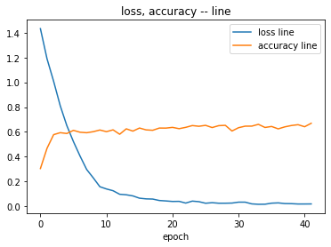

Files already downloaded and verified
Files already downloaded and verified
cifar10_train size: 50000 	 cifar10_test_size: 10000
/usr/local/lib/python3.7/dist-packages/torch/utils/data/dataloader.py:566: UserWarning: This DataLoader will create 6 worker processes in total. Our suggested max number of worker in current system is 2, which is smaller than what this DataLoader is going to create. Please be aware that excessive worker creation might get DataLoader running slow or even freeze, lower the worker number to avoid potential slowness/freeze if necessary.
  cpuset_checked))
launchTimestamp: 2022-10-22 07:52:05 epoch: 1, current epoch min loss: 1.4930264949798584
launchTimestamp: 2022-10-22 07:52:05 epoch: 1, accuracy: 0.2843
launchTimestamp: 2022-10-22 07:52:26 epoch: 2, current epoch min loss: 1.2149039506912231
launchTimestamp: 2022-10-22 07:52:26 epoch: 2, accuracy: 0.4726
launchTimestamp: 2022-10-22 07:52:45 epoch: 3, current epoch min loss: 1.0560431480407715
launchTimestamp: 2022-10-22 07:52:45 epoch: 3, accuracy: 0.5428
launchTimestamp: 2022-10-22 07:53:04 epoch: 4, current epoch min loss: 0.8909886479377747
launchTimestamp: 2022-10-22 07:53:04 epoch: 4, accuracy: 0.5636
launchTimestamp: 2022-10-22 07:53:24 epoch: 5, current epoch min loss: 0.7007642984390259
launchTimestamp: 2022-10-22 07:53:24 epoch: 5, accuracy: 0.5809
launchTimestamp: 2022-10-22 07:53:45 epoch: 6, current epoch min loss: 0.5863562822341919
launchTimestamp: 2022-10-22 07:53:45 epoch: 6, accuracy: 0.5883
launchTimestamp: 2022-10-22 07:54:05 epoch: 7, current epoch min loss: 0.45191821455955505
launchTimestamp: 2022-10-22 07:54:05 epoch: 7, accuracy: 0.607
launchTimestamp: 2022-10-22 07:54:25 epoch: 8, current epoch min loss: 0.35601064562797546
launchTimestamp: 2022-10-22 07:54:25 epoch: 8, accuracy: 0.5758
launchTimestamp: 2022-10-22 07:54:45 epoch: 9, current epoch min loss: 0.2747591435909271
launchTimestamp: 2022-10-22 07:54:45 epoch: 9, accuracy: 0.5567
launchTimestamp: 2022-10-22 07:55:05 epoch: 10, current epoch min loss: 0.21570903062820435
launchTimestamp: 2022-10-22 07:55:05 epoch: 10, accuracy: 0.6108
launchTimestamp: 2022-10-22 07:55:24 epoch: 11, current epoch min loss: 0.1636774241924286
launchTimestamp: 2022-10-22 07:55:24 epoch: 11, accuracy: 0.6108
launchTimestamp: 2022-10-22 07:55:44 epoch: 12, current epoch min loss: 0.1253311038017273
launchTimestamp: 2022-10-22 07:55:44 epoch: 12, accuracy: 0.6176
launchTimestamp: 2022-10-22 07:56:05 epoch: 13, current epoch min loss: 0.10788165032863617
launchTimestamp: 2022-10-22 07:56:05 epoch: 13, accuracy: 0.6322
launchTimestamp: 2022-10-22 07:56:24 epoch: 14, current epoch min loss: 0.09025520831346512
launchTimestamp: 2022-10-22 07:56:24 epoch: 14, accuracy: 0.6097
launchTimestamp: 2022-10-22 07:56:44 epoch: 15, current epoch min loss: 0.07371870428323746
launchTimestamp: 2022-10-22 07:56:44 epoch: 15, accuracy: 0.6189
launchTimestamp: 2022-10-22 07:57:05 epoch: 16, current epoch min loss: 0.06556153297424316
launchTimestamp: 2022-10-22 07:57:05 epoch: 16, accuracy: 0.6419
launchTimestamp: 2022-10-22 07:57:25 epoch: 17, current epoch min loss: 0.06853289902210236
launchTimestamp: 2022-10-22 07:57:25 epoch: 17, accuracy: 0.6153
launchTimestamp: 2022-10-22 07:57:45 epoch: 18, current epoch min loss: 0.06425289064645767
launchTimestamp: 2022-10-22 07:57:45 epoch: 18, accuracy: 0.6372
launchTimestamp: 2022-10-22 07:58:05 epoch: 19, current epoch min loss: 0.06007527932524681
launchTimestamp: 2022-10-22 07:58:05 epoch: 19, accuracy: 0.6296
launchTimestamp: 2022-10-22 07:58:25 epoch: 20, current epoch min loss: 0.050593141466379166
launchTimestamp: 2022-10-22 07:58:25 epoch: 20, accuracy: 0.6033
launchTimestamp: 2022-10-22 07:58:46 epoch: 21, current epoch min loss: 0.03803982213139534
launchTimestamp: 2022-10-22 07:58:46 epoch: 21, accuracy: 0.6656
launchTimestamp: 2022-10-22 07:59:06 epoch: 22, current epoch min loss: 0.04116823896765709
launchTimestamp: 2022-10-22 07:59:06 epoch: 22, accuracy: 0.6485
launchTimestamp: 2022-10-22 07:59:26 epoch: 23, current epoch min loss: 0.042123451828956604
launchTimestamp: 2022-10-22 07:59:26 epoch: 23, accuracy: 0.6231
launchTimestamp: 2022-10-22 07:59:47 epoch: 24, current epoch min loss: 0.03392215073108673
launchTimestamp: 2022-10-22 07:59:47 epoch: 24, accuracy: 0.6499
launchTimestamp: 2022-10-22 08:00:07 epoch: 25, current epoch min loss: 0.03954150900244713
launchTimestamp: 2022-10-22 08:00:07 epoch: 25, accuracy: 0.646
launchTimestamp: 2022-10-22 08:00:29 epoch: 26, current epoch min loss: 0.030977163463830948
launchTimestamp: 2022-10-22 08:00:29 epoch: 26, accuracy: 0.6584
launchTimestamp: 2022-10-22 08:00:49 epoch: 27, current epoch min loss: 0.027310393750667572
launchTimestamp: 2022-10-22 08:00:49 epoch: 27, accuracy: 0.6435
launchTimestamp: 2022-10-22 08:01:09 epoch: 28, current epoch min loss: 0.02596295438706875
launchTimestamp: 2022-10-22 08:01:09 epoch: 28, accuracy: 0.6487
launchTimestamp: 2022-10-22 08:01:30 epoch: 29, current epoch min loss: 0.029835809022188187
launchTimestamp: 2022-10-22 08:01:30 epoch: 29, accuracy: 0.6539
launchTimestamp: 2022-10-22 08:01:51 epoch: 30, current epoch min loss: 0.026249542832374573
launchTimestamp: 2022-10-22 08:01:51 epoch: 30, accuracy: 0.6605
launchTimestamp: 2022-10-22 08:02:11 epoch: 31, current epoch min loss: 0.02598530799150467
launchTimestamp: 2022-10-22 08:02:11 epoch: 31, accuracy: 0.6434
launchTimestamp: 2022-10-22 08:02:32 epoch: 32, current epoch min loss: 0.031439948827028275
launchTimestamp: 2022-10-22 08:02:32 epoch: 32, accuracy: 0.632
launchTimestamp: 2022-10-22 08:02:52 epoch: 33, current epoch min loss: 0.026151183992624283
launchTimestamp: 2022-10-22 08:02:52 epoch: 33, accuracy: 0.6356
launchTimestamp: 2022-10-22 08:03:13 epoch: 34, current epoch min loss: 0.026011040434241295
launchTimestamp: 2022-10-22 08:03:13 epoch: 34, accuracy: 0.6426
launchTimestamp: 2022-10-22 08:03:33 epoch: 35, current epoch min loss: 0.027763735502958298
launchTimestamp: 2022-10-22 08:03:33 epoch: 35, accuracy: 0.6423
launchTimestamp: 2022-10-22 08:03:53 epoch: 36, current epoch min loss: 0.025874100625514984
launchTimestamp: 2022-10-22 08:03:53 epoch: 36, accuracy: 0.6582
launchTimestamp: 2022-10-22 08:04:13 epoch: 37, current epoch min loss: 0.026257678866386414
launchTimestamp: 2022-10-22 08:04:13 epoch: 37, accuracy: 0.6599
launchTimestamp: 2022-10-22 08:04:33 epoch: 38, current epoch min loss: 0.019519811496138573
launchTimestamp: 2022-10-22 08:04:33 epoch: 38, accuracy: 0.6389
launchTimestamp: 2022-10-22 08:04:53 epoch: 39, current epoch min loss: 0.016576601192355156
launchTimestamp: 2022-10-22 08:04:53 epoch: 39, accuracy: 0.6274
launchTimestamp: 2022-10-22 08:05:13 epoch: 40, current epoch min loss: 0.021092373877763748
launchTimestamp: 2022-10-22 08:05:13 epoch: 40, accuracy: 0.6663
launchTimestamp: 2022-10-22 08:05:33 epoch: 41, current epoch min loss: 0.016858207061886787
launchTimestamp: 2022-10-22 08:05:33 epoch: 41, accuracy: 0.6503
launchTimestamp: 2022-10-22 08:05:52 epoch: 42, current epoch min loss: 0.022152381017804146
launchTimestamp: 2022-10-22 08:05:52 epoch: 42, accuracy: 0.6675
launchTimestamp: 2022-10-22 08:06:12 epoch: 43, current epoch min loss: 0.020058488473296165
launchTimestamp: 2022-10-22 08:06:12 epoch: 43, accuracy: 0.6644
launchTimestamp: 2022-10-22 08:06:32 epoch: 44, current epoch min loss: 0.016436751931905746
launchTimestamp: 2022-10-22 08:06:32 epoch: 44, accuracy: 0.65
launchTimestamp: 2022-10-22 08:06:53 epoch: 45, current epoch min loss: 0.012445809319615364
launchTimestamp: 2022-10-22 08:06:53 epoch: 45, accuracy: 0.6554
launchTimestamp: 2022-10-22 08:07:12 epoch: 46, current epoch min loss: 0.014121179468929768
launchTimestamp: 2022-10-22 08:07:12 epoch: 46, accuracy: 0.6657
launchTimestamp: 2022-10-22 08:07:32 epoch: 47, current epoch min loss: 0.017566166818141937
launchTimestamp: 2022-10-22 08:07:32 epoch: 47, accuracy: 0.649
launchTimestamp: 2022-10-22 08:07:52 epoch: 48, current epoch min loss: 0.027416756376624107
launchTimestamp: 2022-10-22 08:07:52 epoch: 48, accuracy: 0.6378
launchTimestamp: 2022-10-22 08:08:11 epoch: 49, current epoch min loss: 0.02563958428800106
launchTimestamp: 2022-10-22 08:08:11 epoch: 49, accuracy: 0.6174
launchTimestamp: 2022-10-22 08:08:31 epoch: 50, current epoch min loss: 0.026066476479172707
launchTimestamp: 2022-10-22 08:08:31 epoch: 50, accuracy: 0.6492

current_category: 0
0.439418 s
[0.002127728515625, 0.0010226243286132813, 0.0011914976806640626, 0.0011914976806640626, 0.0011914976806640626, 0.0011914976806640626, 0.0011914976806640626, 0.0011914976806640626, 0.0011914976806640626, 0.0011914976806640626, 0.0011914976806640626, 0.0011914976806640626, 0.0011914976806640626, 0.0011914976806640626, 0.0011914976806640626, 0.0011914976806640626, 0.0011914976806640626, 0.0011914976806640626, 0.0011914976806640626, 0.0011914976806640626]
0.432540 s
[0.002776248291015625, 0.0011841884765624998, 0.001127112060546875, 0.001127112060546875, 0.001127112060546875, 0.001127112060546875, 0.001127112060546875, 0.001127112060546875, 0.001127112060546875, 0.001127112060546875, 0.001127112060546875, 0.001127112060546875, 0.001127112060546875, 0.001127112060546875, 0.001127112060546875, 0.001127112060546875, 0.001127112060546875, 0.001127112060546875, 0.0011271121826171874, 0.0011271121826171874]
0.441658 s
[0.002104274169921875, 0.0010031680908203125, 0.0011819014892578126, 0.0011819014892578126, 0.0011819014892578126, 0.0011819014892578126, 0.0011819014892578126, 0.0011819014892578126, 0.0011819014892578126, 0.0011819014892578126, 0.0011819014892578126, 0.0011819014892578126, 0.0011819014892578126, 0.0011819014892578126, 0.0011819014892578126, 0.0011819014892578126, 0.0011819014892578126, 0.0011819014892578126, 0.0011819014892578126, 0.0011819014892578126]
0.434891 s
[0.0029590009765625004, 0.0010080012817382813, 0.0011393543701171875, 0.0011393543701171875, 0.0011393542480468751, 0.0011393543701171875, 0.0011393542480468751, 0.0011393543701171875, 0.0011393542480468751, 0.0011393543701171875, 0.0011393542480468751, 0.0011393542480468751, 0.0011393542480468751, 0.0011393542480468751, 0.0011393542480468751, 0.0011393543701171875, 0.0011393543701171875, 0.0011393542480468751, 0.0011393543701171875, 0.0011393542480468751]
0.435336 s
[0.003996309814453125, 0.0007629783325195313, 0.0011620177001953125, 0.0011620177001953125, 0.0011620177001953125, 0.0011620177001953125, 0.0011620177001953125, 0.0011620177001953125, 0.0011620177001953125, 0.0011620177001953125, 0.0011620177001953125, 0.0011620177001953125, 0.0011620177001953125, 0.0011620177001953125, 0.0011620177001953125, 0.0011620177001953125, 0.0011620177001953125, 0.0011620177001953125, 0.0011620177001953125, 0.0011620177001953125]
0.455233 s
[0.0030359077148437497, 0.0014608596191406252, 0.0011602686767578124, 0.0011602686767578124, 0.0011602686767578124, 0.0011602686767578124, 0.0011602686767578124, 0.0011602685546875, 0.0011602686767578124, 0.0011602686767578124, 0.0011602686767578124, 0.0011602686767578124, 0.0011602686767578124, 0.0011602686767578124, 0.0011602686767578124, 0.0011602686767578124, 0.0011602686767578124, 0.0011602686767578124, 0.0011602685546875, 0.0011602686767578124]
0.431911 s
[0.0032332668457031254, 0.0009022950439453126, 0.0011713505859375, 0.0011713505859375, 0.0011713504638671875, 0.0011713504638671875, 0.0011713504638671875, 0.0011713504638671875, 0.0011713505859375, 0.0011713504638671875, 0.0011713505859375, 0.0011713505859375, 0.0011713505859375, 0.0011713504638671875, 0.0011713505859375, 0.0011713505859375, 0.0011713505859375, 0.0011713505859375, 0.0011713505859375, 0.0011713504638671875]
0.419374 s
[0.002584376220703125, 0.001584950439453125, 0.0011646485595703125, 0.0011646485595703125, 0.0011646485595703125, 0.0011646485595703125, 0.0011646485595703125, 0.0011646485595703125, 0.0011646485595703125, 0.0011646485595703125, 0.0011646485595703125, 0.0011646485595703125, 0.0011646485595703125, 0.0011646485595703125, 0.0011646485595703125, 0.001164648681640625, 0.0011646485595703125, 0.0011646485595703125, 0.0011646485595703125, 0.0011646485595703125]
0.426569 s
[0.002811503662109375, 0.00151798583984375, 0.0011336269531250001, 0.0011336269531250001, 0.0011336269531250001, 0.0011336269531250001, 0.0011336269531250001, 0.0011336269531250001, 0.0011336269531250001, 0.0011336269531250001, 0.0011336269531250001, 0.0011336269531250001, 0.0011336269531250001, 0.0011336269531250001, 0.0011336269531250001, 0.0011336269531250001, 0.0011336269531250001, 0.0011336269531250001, 0.0011336269531250001, 0.0011336269531250001]
0.417528 s
[0.002008729248046875, 0.0010503204345703124, 0.001143393310546875, 0.001143393310546875, 0.001143393310546875, 0.001143393310546875, 0.001143393310546875, 0.001143393310546875, 0.001143393310546875, 0.001143393310546875, 0.001143393310546875, 0.001143393310546875, 0.0011433931884765624, 0.001143393310546875, 0.001143393310546875, 0.001143393310546875, 0.001143393310546875, 0.001143393310546875, 0.001143393310546875, 0.001143393310546875]
0.435063 s
[0.0018458287353515625, 0.0012225244140625, 0.001179301513671875, 0.001179301513671875, 0.001179301513671875, 0.001179301513671875, 0.001179301513671875, 0.001179301513671875, 0.001179301513671875, 0.001179301513671875, 0.001179301513671875, 0.001179301513671875, 0.001179301513671875, 0.001179301513671875, 0.001179301513671875, 0.001179301513671875, 0.001179301513671875, 0.001179301513671875, 0.001179301513671875, 0.001179301513671875]
0.437605 s
[0.002510153564453125, 0.0009091546630859375, 0.0011531661376953126, 0.0011531661376953126, 0.0011531661376953126, 0.001153166259765625, 0.0011531661376953126, 0.0011531661376953126, 0.0011531661376953126, 0.0011531661376953126, 0.0011531661376953126, 0.001153166259765625, 0.001153166259765625, 0.0011531661376953126, 0.0011531661376953126, 0.001153166259765625, 0.0011531661376953126, 0.0011531661376953126, 0.001153166259765625, 0.0011531661376953126]
0.426029 s
[0.0027938642578124997, 0.00118057275390625, 0.001143694580078125, 0.0011436947021484377, 0.0011436947021484377, 0.0011436947021484377, 0.0011436947021484377, 0.001143694580078125, 0.001143694580078125, 0.001143694580078125, 0.0011436947021484377, 0.0011436947021484377, 0.0011436947021484377, 0.0011436947021484377, 0.0011436947021484377, 0.0011436947021484377, 0.001143694580078125, 0.0011436947021484377, 0.0011436947021484377, 0.001143694580078125]
0.435964 s
[0.00216231396484375, 0.0010194920654296876, 0.0011332860107421876, 0.0011332860107421876, 0.0011332860107421876, 0.0011332860107421876, 0.0011332860107421876, 0.0011332860107421876, 0.0011332860107421876, 0.0011332860107421876, 0.0011332860107421876, 0.0011332860107421876, 0.0011332860107421876, 0.0011332860107421876, 0.0011332860107421876, 0.0011332860107421876, 0.0011332860107421876, 0.0011332860107421876, 0.0011332861328125002, 0.0011332860107421876]
0.442988 s
[0.00241796044921875, 0.00129071728515625, 0.0011777373046875, 0.0011777373046875, 0.0011777373046875, 0.0011777373046875, 0.0011777373046875, 0.0011777373046875, 0.0011777373046875, 0.0011777373046875, 0.0011777373046875, 0.0011777373046875, 0.0011777373046875, 0.0011777373046875, 0.0011777373046875, 0.0011777373046875, 0.0011777373046875, 0.0011777373046875, 0.0011777373046875, 0.0011777373046875]
0.427740 s
[0.0024119321289062497, 0.0010596132812500001, 0.001150618408203125, 0.001150618408203125, 0.001150618408203125, 0.001150618408203125, 0.001150618408203125, 0.001150618408203125, 0.001150618408203125, 0.001150618408203125, 0.001150618408203125, 0.001150618408203125, 0.001150618408203125, 0.001150618408203125, 0.001150618408203125, 0.001150618408203125, 0.001150618408203125, 0.001150618408203125, 0.001150618408203125, 0.001150618408203125]
0.448326 s
[0.0017948973388671875, 0.0009360000610351563, 0.0011437513427734376, 0.0011437513427734376, 0.0011437513427734376, 0.0011437513427734376, 0.0011437513427734376, 0.0011437513427734376, 0.0011437513427734376, 0.0011437513427734376, 0.0011437513427734376, 0.0011437513427734376, 0.0011437513427734376, 0.0011437513427734376, 0.0011437513427734376, 0.0011437513427734376, 0.0011437513427734376, 0.0011437513427734376, 0.0011437513427734376, 0.0011437513427734376]
0.418981 s
[0.0022677487792968753, 0.001110282470703125, 0.001185148193359375, 0.001185148193359375, 0.001185148193359375, 0.001185148193359375, 0.001185148193359375, 0.001185148193359375, 0.001185148193359375, 0.001185148193359375, 0.001185148193359375, 0.001185148193359375, 0.001185148193359375, 0.001185148193359375, 0.001185148193359375, 0.001185148193359375, 0.001185148193359375, 0.001185148193359375, 0.001185148193359375, 0.001185148193359375]
0.430153 s
[0.003760483154296875, 0.0009260626831054688, 0.0011478863525390625, 0.0011478864746093751, 0.0011478863525390625, 0.0011478864746093751, 0.0011478863525390625, 0.0011478863525390625, 0.0011478863525390625, 0.0011478863525390625, 0.0011478864746093751, 0.0011478864746093751, 0.0011478863525390625, 0.0011478864746093751, 0.0011478863525390625, 0.0011478863525390625, 0.0011478864746093751, 0.0011478863525390625, 0.0011478863525390625, 0.0011478864746093751]
0.557820 s
[0.0022600058593750002, 0.0008518832397460939, 0.0011404755859375, 0.0011404755859375, 0.0011404755859375, 0.0011404755859375, 0.0011404755859375, 0.0011404755859375, 0.0011404755859375, 0.0011404755859375, 0.0011404755859375, 0.0011404755859375, 0.0011404755859375, 0.0011404755859375, 0.0011404755859375, 0.0011404755859375, 0.0011404755859375, 0.0011404755859375, 0.0011404755859375, 0.0011404755859375]
0.435780 s
[0.0027024404296875, 0.0009486445922851563, 0.00116219873046875, 0.00116219873046875, 0.00116219873046875, 0.00116219873046875, 0.00116219873046875, 0.00116219873046875, 0.00116219873046875, 0.00116219873046875, 0.00116219873046875, 0.00116219873046875, 0.00116219873046875, 0.00116219873046875, 0.00116219873046875, 0.00116219873046875, 0.00116219873046875, 0.00116219873046875, 0.00116219873046875, 0.00116219873046875]
0.418146 s
[0.0019258636474609376, 0.0013563399658203126, 0.0011936171875, 0.0011936173095703124, 0.0011936171875, 0.0011936171875, 0.0011936171875, 0.0011936171875, 0.0011936173095703124, 0.0011936171875, 0.0011936171875, 0.0011936171875, 0.0011936171875, 0.0011936171875, 0.0011936173095703124, 0.0011936171875, 0.0011936173095703124, 0.0011936173095703124, 0.0011936173095703124, 0.0011936171875]
0.413446 s
[0.002093939453125, 0.0009710314331054688, 0.0010651734619140625, 0.0010651734619140625, 0.0010651734619140625, 0.0010651734619140625, 0.0010651734619140625, 0.0010651734619140625, 0.001065173583984375, 0.0010651734619140625, 0.001065173583984375, 0.0010651734619140625, 0.0010651734619140625, 0.0010651734619140625, 0.0010651734619140625, 0.0010651734619140625, 0.001065173583984375, 0.001065173583984375, 0.0010651734619140625, 0.0010651734619140625]
0.409883 s
[0.00272623095703125, 0.0010407774658203126, 0.00116129443359375, 0.00116129443359375, 0.00116129443359375, 0.00116129443359375, 0.00116129443359375, 0.00116129443359375, 0.00116129443359375, 0.00116129443359375, 0.00116129443359375, 0.00116129443359375, 0.00116129443359375, 0.00116129443359375, 0.00116129443359375, 0.00116129443359375, 0.00116129443359375, 0.00116129443359375, 0.00116129443359375, 0.00116129443359375]
0.454262 s
[0.002099591796875, 0.001167483642578125, 0.001186129150390625, 0.001186129150390625, 0.001186129150390625, 0.001186129150390625, 0.001186129150390625, 0.001186129150390625, 0.001186129150390625, 0.001186129150390625, 0.001186129150390625, 0.001186129150390625, 0.001186129150390625, 0.001186129150390625, 0.001186129150390625, 0.001186129150390625, 0.001186129150390625, 0.001186129150390625, 0.001186129150390625, 0.001186129150390625]
0.442500 s
[0.0024490148925781254, 0.0015423743896484374, 0.001090068603515625, 0.001090068603515625, 0.001090068603515625, 0.001090068603515625, 0.001090068603515625, 0.001090068603515625, 0.001090068603515625, 0.001090068603515625, 0.001090068603515625, 0.001090068603515625, 0.001090068603515625, 0.001090068603515625, 0.001090068603515625, 0.001090068603515625, 0.001090068603515625, 0.001090068603515625, 0.001090068603515625, 0.001090068603515625]
0.438347 s
[0.003828379150390625, 0.00159448779296875, 0.001173190673828125, 0.001173190673828125, 0.001173190673828125, 0.001173190673828125, 0.001173190673828125, 0.001173190673828125, 0.001173190673828125, 0.001173190673828125, 0.001173190673828125, 0.001173190673828125, 0.001173190673828125, 0.001173190673828125, 0.001173190673828125, 0.001173190673828125, 0.001173190673828125, 0.001173190673828125, 0.001173190673828125, 0.001173190673828125]
0.423607 s
[0.0019814969482421876, 0.0011085631103515624, 0.0011290135498046876, 0.0011290135498046876, 0.0011290135498046876, 0.0011290135498046876, 0.0011290135498046876, 0.0011290135498046876, 0.0011290135498046876, 0.0011290135498046876, 0.0011290135498046876, 0.0011290135498046876, 0.0011290135498046876, 0.0011290135498046876, 0.0011290135498046876, 0.0011290135498046876, 0.0011290135498046876, 0.0011290135498046876, 0.0011290135498046876, 0.0011290135498046876]
0.426522 s
[0.0022435732421874997, 0.0019213250732421877, 0.00116735986328125, 0.00116735986328125, 0.00116735986328125, 0.00116735986328125, 0.00116735986328125, 0.00116735986328125, 0.00116735986328125, 0.00116735986328125, 0.00116735986328125, 0.00116735986328125, 0.00116735986328125, 0.00116735986328125, 0.00116735986328125, 0.00116735986328125, 0.00116735986328125, 0.00116735986328125, 0.00116735986328125, 0.00116735986328125]
0.422580 s
[0.002247281494140625, 0.0009758751220703126, 0.0011674251708984375, 0.0011674251708984375, 0.0011674251708984375, 0.0011674251708984375, 0.0011674251708984375, 0.0011674251708984375, 0.0011674251708984375, 0.0011674251708984375, 0.0011674251708984375, 0.0011674251708984375, 0.0011674251708984375, 0.0011674251708984375, 0.0011674251708984375, 0.0011674251708984375, 0.0011674251708984375, 0.0011674251708984375, 0.0011674251708984375, 0.0011674251708984375]
0.448517 s
[0.0021120419921875004, 0.0011598333740234375, 0.0010855863037109374, 0.0010855863037109374, 0.0010855863037109374, 0.0010855863037109374, 0.0010855863037109374, 0.0010855863037109374, 0.0010855863037109374, 0.0010855863037109374, 0.0010855863037109374, 0.0010855863037109374, 0.0010855863037109374, 0.0010855863037109374, 0.0010855863037109374, 0.0010855863037109374, 0.0010855863037109374, 0.0010855863037109374, 0.0010855863037109374, 0.0010855863037109374]
0.461577 s
[0.0018005517578125, 0.001066731689453125, 0.00118081982421875, 0.00118081982421875, 0.00118081982421875, 0.00118081982421875, 0.00118081982421875, 0.00118081982421875, 0.00118081982421875, 0.00118081982421875, 0.00118081982421875, 0.00118081982421875, 0.00118081982421875, 0.00118081982421875, 0.00118081982421875, 0.00118081982421875, 0.00118081982421875, 0.00118081982421875, 0.00118081982421875, 0.00118081982421875]
0.434520 s
[0.001838287109375, 0.0010979868164062501, 0.001086307373046875, 0.001086307373046875, 0.001086307373046875, 0.001086307373046875, 0.001086307373046875, 0.001086307373046875, 0.001086307373046875, 0.001086307373046875, 0.001086307373046875, 0.001086307373046875, 0.001086307373046875, 0.001086307373046875, 0.001086307373046875, 0.001086307373046875, 0.001086307373046875, 0.001086307373046875, 0.001086307373046875, 0.001086307373046875]
0.427499 s
[0.0026945322265625, 0.0008397053833007812, 0.001164254150390625, 0.001164254150390625, 0.001164254150390625, 0.001164254150390625, 0.0011642542724609375, 0.001164254150390625, 0.001164254150390625, 0.0011642542724609375, 0.001164254150390625, 0.001164254150390625, 0.001164254150390625, 0.0011642542724609375, 0.001164254150390625, 0.001164254150390625, 0.001164254150390625, 0.001164254150390625, 0.001164254150390625, 0.0011642542724609375]
0.450890 s
[0.0027112219238281253, 0.001458226806640625, 0.0011587919921875, 0.0011587919921875, 0.0011587921142578125, 0.0011587919921875, 0.0011587921142578125, 0.0011587921142578125, 0.0011587919921875, 0.0011587919921875, 0.0011587919921875, 0.0011587919921875, 0.0011587919921875, 0.0011587921142578125, 0.0011587919921875, 0.0011587919921875, 0.0011587919921875, 0.0011587919921875, 0.0011587919921875, 0.0011587919921875]
0.424307 s
[0.00253277978515625, 0.0012433878173828126, 0.0011326663818359375, 0.0011326662597656249, 0.0011326662597656249, 0.0011326662597656249, 0.0011326662597656249, 0.0011326662597656249, 0.0011326662597656249, 0.0011326662597656249, 0.0011326662597656249, 0.0011326662597656249, 0.0011326662597656249, 0.0011326662597656249, 0.0011326663818359375, 0.0011326662597656249, 0.0011326662597656249, 0.0011326662597656249, 0.0011326662597656249, 0.0011326662597656249]
0.446229 s
[0.002628833984375, 0.0011369139404296875, 0.0011739875488281251, 0.0011739875488281251, 0.0011739875488281251, 0.0011739875488281251, 0.0011739875488281251, 0.0011739875488281251, 0.0011739875488281251, 0.0011739875488281251, 0.0011739875488281251, 0.0011739875488281251, 0.0011739875488281251, 0.0011739875488281251, 0.0011739875488281251, 0.0011739875488281251, 0.0011739875488281251, 0.0011739875488281251, 0.0011739875488281251, 0.0011739875488281251]
0.433883 s
[0.001887256103515625, 0.0011442918701171875, 0.001190691162109375, 0.001190691162109375, 0.001190691162109375, 0.001190691162109375, 0.001190691162109375, 0.001190691162109375, 0.001190691162109375, 0.001190691162109375, 0.001190691162109375, 0.001190691162109375, 0.001190691162109375, 0.001190691162109375, 0.001190691162109375, 0.001190691162109375, 0.001190691162109375, 0.001190691162109375, 0.001190691162109375, 0.001190691162109375]
0.434102 s
[0.0033282978515625002, 0.0012183170166015624, 0.0011752056884765626, 0.0011752056884765626, 0.0011752056884765626, 0.001175205810546875, 0.001175205810546875, 0.0011752056884765626, 0.0011752056884765626, 0.0011752056884765626, 0.0011752056884765626, 0.0011752056884765626, 0.0011752056884765626, 0.0011752056884765626, 0.0011752056884765626, 0.0011752056884765626, 0.0011752056884765626, 0.0011752056884765626, 0.0011752056884765626, 0.0011752056884765626]
0.429323 s
[0.00414249609375, 0.001228369873046875, 0.0011527398681640626, 0.0011527398681640626, 0.0011527398681640626, 0.0011527398681640626, 0.0011527398681640626, 0.0011527398681640626, 0.0011527398681640626, 0.001152739990234375, 0.001152739990234375, 0.0011527398681640626, 0.0011527398681640626, 0.0011527398681640626, 0.0011527398681640626, 0.0011527398681640626, 0.0011527398681640626, 0.001152739990234375, 0.0011527398681640626, 0.001152739990234375]
0.442498 s
[0.00273459033203125, 0.0010879819335937499, 0.0011169910888671874, 0.0011169912109375, 0.0011169912109375, 0.0011169912109375, 0.0011169912109375, 0.0011169912109375, 0.0011169912109375, 0.0011169910888671874, 0.0011169910888671874, 0.0011169912109375, 0.0011169912109375, 0.0011169910888671874, 0.0011169912109375, 0.0011169912109375, 0.0011169910888671874, 0.0011169912109375, 0.0011169912109375, 0.0011169912109375]
0.442649 s
[0.002068154541015625, 0.0010557276611328126, 0.001070069580078125, 0.001070069580078125, 0.001070069580078125, 0.001070069580078125, 0.001070069580078125, 0.001070069580078125, 0.001070069580078125, 0.001070069580078125, 0.001070069580078125, 0.001070069580078125, 0.001070069580078125, 0.001070069580078125, 0.001070069580078125, 0.001070069580078125, 0.001070069580078125, 0.001070069580078125, 0.001070069580078125, 0.001070069580078125]
0.436564 s
[0.0027466743164062503, 0.0009817902221679687, 0.001152838623046875, 0.001152838623046875, 0.001152838623046875, 0.001152838623046875, 0.001152838623046875, 0.001152838623046875, 0.001152838623046875, 0.001152838623046875, 0.001152838623046875, 0.001152838623046875, 0.001152838623046875, 0.001152838623046875, 0.001152838623046875, 0.001152838623046875, 0.001152838623046875, 0.001152838623046875, 0.001152838623046875, 0.001152838623046875]
0.430897 s
[0.00246563037109375, 0.0013637580566406252, 0.0011545360107421876, 0.0011545360107421876, 0.0011545360107421876, 0.0011545360107421876, 0.0011545360107421876, 0.0011545360107421876, 0.0011545360107421876, 0.0011545360107421876, 0.0011545360107421876, 0.0011545360107421876, 0.0011545360107421876, 0.0011545360107421876, 0.0011545360107421876, 0.0011545360107421876, 0.0011545360107421876, 0.0011545360107421876, 0.0011545360107421876, 0.0011545360107421876]
0.446879 s
[0.003067578369140625, 0.0011511822509765626, 0.0011919505615234376, 0.0011919505615234376, 0.0011919505615234376, 0.0011919505615234376, 0.0011919505615234376, 0.0011919505615234376, 0.0011919505615234376, 0.0011919505615234376, 0.0011919505615234376, 0.0011919506835937502, 0.0011919505615234376, 0.0011919505615234376, 0.0011919505615234376, 0.0011919505615234376, 0.0011919505615234376, 0.0011919505615234376, 0.0011919505615234376, 0.0011919505615234376]
0.427976 s
[0.002909427978515625, 0.0010130013427734374, 0.00117109912109375, 0.00117109912109375, 0.00117109912109375, 0.00117109912109375, 0.00117109912109375, 0.00117109912109375, 0.00117109912109375, 0.00117109912109375, 0.00117109912109375, 0.00117109912109375, 0.00117109912109375, 0.00117109912109375, 0.00117109912109375, 0.00117109912109375, 0.00117109912109375, 0.00117109912109375, 0.00117109912109375, 0.00117109912109375]
0.438663 s
[0.00201592041015625, 0.0012403580322265626, 0.0011588662109375, 0.0011588662109375, 0.0011588662109375, 0.0011588662109375, 0.0011588662109375, 0.0011588662109375, 0.0011588662109375, 0.0011588662109375, 0.0011588662109375, 0.0011588662109375, 0.0011588662109375, 0.0011588662109375, 0.0011588662109375, 0.0011588662109375, 0.0011588662109375, 0.0011588662109375, 0.0011588662109375, 0.0011588662109375]
0.434197 s
[0.002830387939453125, 0.001160419189453125, 0.0011769924316406251, 0.0011769924316406251, 0.0011769924316406251, 0.0011769924316406251, 0.0011769924316406251, 0.0011769924316406251, 0.0011769924316406251, 0.0011769924316406251, 0.0011769924316406251, 0.0011769924316406251, 0.0011769924316406251, 0.0011769924316406251, 0.0011769924316406251, 0.0011769924316406251, 0.0011769924316406251, 0.0011769925537109375, 0.0011769924316406251, 0.0011769924316406251]
0.427729 s
[0.00250187841796875, 0.001092469482421875, 0.001152640869140625, 0.001152640869140625, 0.0011526409912109375, 0.001152640869140625, 0.001152640869140625, 0.001152640869140625, 0.001152640869140625, 0.001152640869140625, 0.001152640869140625, 0.001152640869140625, 0.001152640869140625, 0.0011526409912109375, 0.0011526409912109375, 0.001152640869140625, 0.001152640869140625, 0.001152640869140625, 0.001152640869140625, 0.0011526409912109375]
0.452150 s
[0.00263092919921875, 0.001144462646484375, 0.0011602235107421874, 0.0011602235107421874, 0.0011602235107421874, 0.0011602235107421874, 0.0011602236328125, 0.0011602235107421874, 0.0011602235107421874, 0.0011602235107421874, 0.0011602235107421874, 0.0011602235107421874, 0.0011602235107421874, 0.0011602235107421874, 0.0011602235107421874, 0.0011602235107421874, 0.0011602235107421874, 0.0011602235107421874, 0.0011602235107421874, 0.0011602235107421874]
score_final: [0.12780781640625, 0.05751549279785156, 0.057632965942382805, 0.05763296630859374, 0.05763296606445312, 0.05763296630859375, 0.05763296630859375, 0.05763296582031249, 0.05763296606445312, 0.057632965942382805, 0.05763296618652343, 0.05763296630859374, 0.05763296594238279, 0.05763296618652343, 0.05763296630859374, 0.05763296630859374, 0.05763296618652343, 0.057632966430664054, 0.057632966430664054, 0.05763296630859374]
current_category: 1
0.450495 s
[0.001831832275390625, 0.0012388746337890625, 0.0011809638671875, 0.0011809638671875, 0.0011809638671875, 0.0011809638671875, 0.0011809638671875, 0.0011809638671875, 0.0011809638671875, 0.0011809638671875, 0.0011809638671875, 0.0011809638671875, 0.0011809638671875, 0.0011809638671875, 0.0011809638671875, 0.0011809638671875, 0.0011809638671875, 0.0011809638671875, 0.0011809638671875, 0.0011809638671875]
0.427322 s
[0.0018571737060546875, 0.0011530421142578124, 0.0011242691650390625, 0.0011242691650390625, 0.00112426904296875, 0.0011242691650390625, 0.0011242691650390625, 0.0011242691650390625, 0.0011242691650390625, 0.0011242691650390625, 0.0011242691650390625, 0.0011242691650390625, 0.0011242691650390625, 0.0011242691650390625, 0.0011242691650390625, 0.0011242691650390625, 0.0011242691650390625, 0.0011242691650390625, 0.0011242691650390625, 0.0011242691650390625]
0.445965 s
[0.00169697900390625, 0.0011402447509765625, 0.001173185302734375, 0.001173185302734375, 0.001173185302734375, 0.001173185302734375, 0.001173185302734375, 0.001173185302734375, 0.001173185302734375, 0.001173185302734375, 0.001173185302734375, 0.001173185302734375, 0.001173185302734375, 0.001173185302734375, 0.001173185302734375, 0.001173185302734375, 0.001173185302734375, 0.001173185302734375, 0.001173185302734375, 0.001173185302734375]
0.417603 s
[0.001752038330078125, 0.0010153531494140626, 0.0011350975341796875, 0.0011350975341796875, 0.0011350975341796875, 0.0011350975341796875, 0.0011350975341796875, 0.0011350975341796875, 0.0011350975341796875, 0.0011350975341796875, 0.0011350975341796875, 0.0011350975341796875, 0.0011350975341796875, 0.0011350975341796875, 0.0011350975341796875, 0.0011350975341796875, 0.0011350975341796875, 0.00113509765625, 0.0011350975341796875, 0.0011350975341796875]
0.448235 s
[0.002133402587890625, 0.0012700656738281252, 0.0011577037353515624, 0.0011577037353515624, 0.0011577037353515624, 0.0011577037353515624, 0.0011577037353515624, 0.0011577037353515624, 0.0011577037353515624, 0.0011577037353515624, 0.0011577037353515624, 0.0011577037353515624, 0.0011577037353515624, 0.0011577037353515624, 0.0011577037353515624, 0.0011577037353515624, 0.0011577037353515624, 0.0011577037353515624, 0.0011577037353515624, 0.0011577037353515624]
0.418286 s
[0.0025559873046875, 0.0013198612060546875, 0.001159947265625, 0.001159947265625, 0.001159947265625, 0.001159947265625, 0.001159947265625, 0.001159947265625, 0.001159947265625, 0.001159947265625, 0.001159947265625, 0.001159947265625, 0.001159947265625, 0.001159947265625, 0.001159947265625, 0.001159947265625, 0.001159947265625, 0.001159947265625, 0.001159947265625, 0.001159947265625]
0.442665 s
[0.0021179538574218754, 0.0011429271240234375, 0.0011695908203125, 0.0011695908203125, 0.0011695908203125, 0.0011695908203125, 0.0011695909423828125, 0.0011695908203125, 0.0011695908203125, 0.0011695908203125, 0.0011695908203125, 0.0011695908203125, 0.0011695908203125, 0.0011695908203125, 0.0011695908203125, 0.0011695908203125, 0.0011695909423828125, 0.0011695908203125, 0.0011695908203125, 0.0011695908203125]
0.437619 s
[0.00236222509765625, 0.0010043246459960937, 0.0011554642333984374, 0.0011554642333984374, 0.0011554642333984374, 0.0011554642333984374, 0.0011554642333984374, 0.0011554642333984374, 0.0011554642333984374, 0.0011554642333984374, 0.0011554642333984374, 0.0011554642333984374, 0.0011554642333984374, 0.0011554642333984374, 0.0011554642333984374, 0.0011554642333984374, 0.0011554642333984374, 0.0011554642333984374, 0.0011554642333984374, 0.0011554642333984374]
0.384486 s
[0.002869048583984375, 0.0008267573852539063, 0.001121642822265625, 0.001121642822265625, 0.001121642822265625, 0.001121642822265625, 0.001121642822265625, 0.001121642822265625, 0.0011216427001953125, 0.001121642822265625, 0.001121642822265625, 0.0011216427001953125, 0.001121642822265625, 0.001121642822265625, 0.001121642822265625, 0.0011216427001953125, 0.0011216427001953125, 0.001121642822265625, 0.001121642822265625, 0.001121642822265625]
0.380856 s
[0.0019778909912109375, 0.0009697512207031251, 0.0011480490722656249, 0.0011480490722656249, 0.0011480490722656249, 0.0011480490722656249, 0.0011480490722656249, 0.0011480490722656249, 0.0011480490722656249, 0.0011480490722656249, 0.0011480490722656249, 0.0011480490722656249, 0.0011480490722656249, 0.0011480490722656249, 0.0011480490722656249, 0.0011480490722656249, 0.0011480490722656249, 0.0011480490722656249, 0.0011480490722656249, 0.0011480490722656249]
0.389331 s
[0.002409341552734375, 0.001256525390625, 0.00117408544921875, 0.00117408544921875, 0.00117408544921875, 0.00117408544921875, 0.00117408544921875, 0.00117408544921875, 0.00117408544921875, 0.00117408544921875, 0.00117408544921875, 0.00117408544921875, 0.00117408544921875, 0.00117408544921875, 0.00117408544921875, 0.00117408544921875, 0.00117408544921875, 0.00117408544921875, 0.00117408544921875, 0.00117408544921875]
0.382279 s
[0.0025741848144531254, 0.0015056885986328126, 0.0011547332763671876, 0.0011547332763671876, 0.0011547332763671876, 0.0011547332763671876, 0.0011547332763671876, 0.0011547332763671876, 0.0011547332763671876, 0.0011547332763671876, 0.0011547332763671876, 0.0011547332763671876, 0.0011547332763671876, 0.0011547332763671876, 0.0011547332763671876, 0.0011547332763671876, 0.0011547332763671876, 0.0011547332763671876, 0.0011547332763671876, 0.0011547332763671876]
0.374542 s
[0.0027297568359375, 0.0012956917724609375, 0.0011473093261718749, 0.0011473094482421875, 0.0011473094482421875, 0.0011473093261718749, 0.0011473093261718749, 0.0011473094482421875, 0.0011473093261718749, 0.0011473093261718749, 0.0011473094482421875, 0.0011473093261718749, 0.0011473093261718749, 0.0011473094482421875, 0.0011473093261718749, 0.0011473093261718749, 0.0011473093261718749, 0.0011473093261718749, 0.0011473093261718749, 0.0011473093261718749]
0.383278 s
[0.0021358310546874997, 0.0012969080810546875, 0.00113325732421875, 0.00113325732421875, 0.00113325732421875, 0.00113325732421875, 0.00113325732421875, 0.00113325732421875, 0.00113325732421875, 0.00113325732421875, 0.00113325732421875, 0.00113325732421875, 0.00113325732421875, 0.00113325732421875, 0.00113325732421875, 0.00113325732421875, 0.00113325732421875, 0.00113325732421875, 0.00113325732421875, 0.00113325732421875]
0.430900 s
[0.002467807861328125, 0.0012633593750000002, 0.00118325439453125, 0.00118325439453125, 0.00118325439453125, 0.00118325439453125, 0.00118325439453125, 0.00118325439453125, 0.00118325439453125, 0.00118325439453125, 0.00118325439453125, 0.00118325439453125, 0.00118325439453125, 0.00118325439453125, 0.00118325439453125, 0.00118325439453125, 0.00118325439453125, 0.00118325439453125, 0.00118325439453125, 0.00118325439453125]
0.439978 s
[0.0016340462646484374, 0.001171130859375, 0.001143544189453125, 0.001143544189453125, 0.001143544189453125, 0.001143544189453125, 0.001143544189453125, 0.001143544189453125, 0.001143544189453125, 0.001143544189453125, 0.001143544189453125, 0.001143544189453125, 0.001143544189453125, 0.001143544189453125, 0.001143544189453125, 0.001143544189453125, 0.001143544189453125, 0.001143544189453125, 0.001143544189453125, 0.001143544189453125]
0.420967 s
[0.00169687109375, 0.001146093017578125, 0.0011470836181640624, 0.0011470836181640624, 0.001147083740234375, 0.001147083740234375, 0.0011470836181640624, 0.0011470836181640624, 0.0011470836181640624, 0.0011470836181640624, 0.0011470836181640624, 0.0011470836181640624, 0.0011470836181640624, 0.0011470836181640624, 0.0011470836181640624, 0.0011470836181640624, 0.0011470836181640624, 0.0011470836181640624, 0.0011470836181640624, 0.0011470836181640624]
0.543768 s
[0.0021861376953125, 0.0011012835693359375, 0.0011682279052734374, 0.0011682279052734374, 0.0011682279052734374, 0.0011682279052734374, 0.0011682279052734374, 0.0011682279052734374, 0.0011682279052734374, 0.0011682279052734374, 0.0011682279052734374, 0.0011682279052734374, 0.0011682279052734374, 0.0011682279052734374, 0.0011682279052734374, 0.0011682279052734374, 0.0011682279052734374, 0.0011682279052734374, 0.0011682279052734374, 0.0011682279052734374]
0.445354 s
[0.0020073316650390627, 0.0012846652832031252, 0.001145449951171875, 0.001145449951171875, 0.001145449951171875, 0.001145449951171875, 0.001145449951171875, 0.001145449951171875, 0.001145449951171875, 0.001145449951171875, 0.001145449951171875, 0.001145449951171875, 0.001145449951171875, 0.001145449951171875, 0.001145449951171875, 0.001145449951171875, 0.001145449951171875, 0.001145449951171875, 0.001145449951171875, 0.001145449951171875]
0.427257 s
[0.0021806718750000003, 0.0010864243164062498, 0.001141255615234375, 0.001141255615234375, 0.001141255615234375, 0.001141255615234375, 0.001141255615234375, 0.001141255615234375, 0.001141255615234375, 0.001141255615234375, 0.001141255615234375, 0.001141255615234375, 0.001141255615234375, 0.001141255615234375, 0.001141255615234375, 0.001141255615234375, 0.001141255615234375, 0.001141255615234375, 0.001141255615234375, 0.001141255615234375]
0.444144 s
[0.0022209599609375, 0.001338938232421875, 0.0011590672607421876, 0.0011590672607421876, 0.0011590672607421876, 0.0011590672607421876, 0.0011590672607421876, 0.0011590673828125, 0.0011590673828125, 0.0011590672607421876, 0.0011590672607421876, 0.0011590672607421876, 0.0011590672607421876, 0.0011590672607421876, 0.0011590672607421876, 0.0011590672607421876, 0.0011590672607421876, 0.0011590673828125, 0.0011590672607421876, 0.0011590673828125]
0.421517 s
[0.00171286474609375, 0.0011582149658203125, 0.0011731875, 0.0011731875, 0.0011731875, 0.0011731875, 0.0011731875, 0.0011731875, 0.0011731875, 0.0011731875, 0.0011731875, 0.0011731875, 0.0011731875, 0.0011731875, 0.0011731875, 0.0011731875, 0.0011731875, 0.0011731875, 0.0011731875, 0.0011731875]
0.431043 s
[0.0016699989013671875, 0.0009042769165039063, 0.00106618115234375, 0.0010661810302734376, 0.00106618115234375, 0.00106618115234375, 0.00106618115234375, 0.00106618115234375, 0.00106618115234375, 0.00106618115234375, 0.0010661810302734376, 0.00106618115234375, 0.00106618115234375, 0.00106618115234375, 0.00106618115234375, 0.00106618115234375, 0.00106618115234375, 0.0010661810302734376, 0.00106618115234375, 0.00106618115234375]
0.425871 s
[0.0022111630859375, 0.0009605320434570312, 0.001162680908203125, 0.001162680908203125, 0.001162680908203125, 0.0011626807861328126, 0.001162680908203125, 0.001162680908203125, 0.001162680908203125, 0.001162680908203125, 0.001162680908203125, 0.001162680908203125, 0.001162680908203125, 0.001162680908203125, 0.001162680908203125, 0.001162680908203125, 0.001162680908203125, 0.001162680908203125, 0.001162680908203125, 0.001162680908203125]
0.449320 s
[0.0016381728515625, 0.001117400146484375, 0.0011805404052734375, 0.0011805404052734375, 0.0011805404052734375, 0.0011805404052734375, 0.0011805404052734375, 0.0011805404052734375, 0.0011805404052734375, 0.0011805404052734375, 0.0011805404052734375, 0.0011805404052734375, 0.0011805404052734375, 0.0011805404052734375, 0.0011805404052734375, 0.0011805404052734375, 0.0011805404052734375, 0.0011805404052734375, 0.0011805404052734375, 0.0011805404052734375]
0.432597 s
[0.001786856689453125, 0.0011438286132812502, 0.00109042138671875, 0.00109042138671875, 0.00109042138671875, 0.00109042138671875, 0.00109042138671875, 0.00109042138671875, 0.00109042138671875, 0.00109042138671875, 0.00109042138671875, 0.00109042138671875, 0.00109042138671875, 0.00109042138671875, 0.00109042138671875, 0.00109042138671875, 0.00109042138671875, 0.00109042138671875, 0.00109042138671875, 0.00109042138671875]
0.418762 s
[0.001967990478515625, 0.0013718428955078125, 0.0011790452880859374, 0.0011790452880859374, 0.0011790452880859374, 0.0011790452880859374, 0.0011790452880859374, 0.0011790452880859374, 0.0011790452880859374, 0.0011790452880859374, 0.0011790452880859374, 0.0011790452880859374, 0.0011790452880859374, 0.0011790452880859374, 0.0011790452880859374, 0.0011790452880859374, 0.0011790452880859374, 0.0011790452880859374, 0.0011790452880859374, 0.0011790452880859374]
0.440866 s
[0.0019394241943359377, 0.00118071728515625, 0.0011320496826171876, 0.0011320496826171876, 0.0011320496826171876, 0.0011320496826171876, 0.0011320496826171876, 0.0011320496826171876, 0.0011320496826171876, 0.0011320496826171876, 0.0011320496826171876, 0.0011320496826171876, 0.0011320496826171876, 0.0011320496826171876, 0.0011320496826171876, 0.0011320496826171876, 0.0011320496826171876, 0.0011320496826171876, 0.0011320496826171876, 0.0011320496826171876]
0.443663 s
[0.0020891103515625004, 0.0013867924804687498, 0.0011623790283203125, 0.0011623790283203125, 0.0011623790283203125, 0.0011623790283203125, 0.0011623790283203125, 0.0011623790283203125, 0.0011623790283203125, 0.0011623790283203125, 0.0011623790283203125, 0.0011623790283203125, 0.0011623790283203125, 0.0011623790283203125, 0.0011623790283203125, 0.0011623790283203125, 0.0011623790283203125, 0.0011623790283203125, 0.0011623790283203125, 0.0011623790283203125]
0.427428 s
[0.0021159521484375, 0.0012174851074218751, 0.0011626593017578127, 0.0011626594238281249, 0.0011626593017578127, 0.0011626593017578127, 0.0011626593017578127, 0.0011626593017578127, 0.0011626593017578127, 0.0011626593017578127, 0.0011626593017578127, 0.0011626593017578127, 0.0011626593017578127, 0.0011626593017578127, 0.0011626593017578127, 0.0011626593017578127, 0.0011626593017578127, 0.0011626593017578127, 0.0011626593017578127, 0.0011626593017578127]
0.425829 s
[0.0020423211669921876, 0.0009753009643554688, 0.001078624267578125, 0.001078624267578125, 0.001078624267578125, 0.001078624267578125, 0.001078624267578125, 0.001078624267578125, 0.001078624267578125, 0.001078624267578125, 0.001078624267578125, 0.001078624267578125, 0.001078624267578125, 0.001078624267578125, 0.001078624267578125, 0.001078624267578125, 0.001078624267578125, 0.001078624267578125, 0.001078624267578125, 0.001078624267578125]
0.438337 s
[0.0016346998291015627, 0.001249091796875, 0.001180488525390625, 0.001180488525390625, 0.001180488525390625, 0.001180488525390625, 0.001180488525390625, 0.001180488525390625, 0.001180488525390625, 0.001180488525390625, 0.001180488525390625, 0.001180488525390625, 0.001180488525390625, 0.001180488525390625, 0.001180488525390625, 0.001180488525390625, 0.001180488525390625, 0.001180488525390625, 0.001180488525390625, 0.001180488525390625]
0.426561 s
[0.002145008056640625, 0.0012542198486328125, 0.0010908009033203125, 0.0010908009033203125, 0.0010908009033203125, 0.0010908009033203125, 0.0010908009033203125, 0.0010908009033203125, 0.0010908009033203125, 0.0010908009033203125, 0.0010908009033203125, 0.0010908009033203125, 0.0010908009033203125, 0.0010908009033203125, 0.0010908009033203125, 0.0010908009033203125, 0.0010908009033203125, 0.0010908009033203125, 0.0010908009033203125, 0.0010908009033203125]
0.442156 s
[0.002276995361328125, 0.0010739332275390625, 0.0011580443115234375, 0.0011580443115234375, 0.0011580443115234375, 0.0011580443115234375, 0.0011580443115234375, 0.0011580443115234375, 0.0011580443115234375, 0.0011580443115234375, 0.0011580443115234375, 0.0011580443115234375, 0.0011580443115234375, 0.0011580443115234375, 0.0011580443115234375, 0.0011580443115234375, 0.0011580443115234375, 0.0011580443115234375, 0.0011580443115234375, 0.0011580443115234375]
0.422491 s
[0.00181757421875, 0.0011854810791015625, 0.001162369384765625, 0.001162369384765625, 0.001162369384765625, 0.001162369384765625, 0.001162369384765625, 0.001162369384765625, 0.001162369384765625, 0.001162369384765625, 0.001162369384765625, 0.001162369384765625, 0.001162369384765625, 0.001162369384765625, 0.001162369384765625, 0.001162369384765625, 0.001162369384765625, 0.001162369384765625, 0.001162369384765625, 0.001162369384765625]
0.419534 s
[0.002232510986328125, 0.0009185469970703125, 0.0011189548339843752, 0.0011189548339843752, 0.0011189548339843752, 0.0011189548339843752, 0.0011189548339843752, 0.0011189548339843752, 0.0011189548339843752, 0.0011189548339843752, 0.0011189548339843752, 0.0011189548339843752, 0.0011189548339843752, 0.0011189548339843752, 0.0011189548339843752, 0.0011189548339843752, 0.0011189548339843752, 0.0011189548339843752, 0.0011189548339843752, 0.0011189548339843752]
0.435207 s
[0.00274572265625, 0.00125696240234375, 0.0011597823486328126, 0.0011597823486328126, 0.0011597823486328126, 0.0011597823486328126, 0.0011597823486328126, 0.0011597823486328126, 0.0011597823486328126, 0.0011597823486328126, 0.0011597823486328126, 0.0011597823486328126, 0.0011597823486328126, 0.0011597823486328126, 0.0011597823486328126, 0.0011597823486328126, 0.0011597823486328126, 0.0011597823486328126, 0.0011597823486328126, 0.0011597823486328126]
0.439434 s
[0.001737100830078125, 0.0011865671386718751, 0.0011782623291015626, 0.0011782623291015626, 0.0011782623291015626, 0.0011782623291015626, 0.0011782623291015626, 0.0011782623291015626, 0.0011782623291015626, 0.0011782623291015626, 0.0011782623291015626, 0.0011782623291015626, 0.0011782623291015626, 0.001178262451171875, 0.0011782623291015626, 0.0011782623291015626, 0.0011782623291015626, 0.0011782623291015626, 0.0011782623291015626, 0.0011782623291015626]
0.447235 s
[0.003075830810546875, 0.0011292506103515625, 0.001173209716796875, 0.001173209716796875, 0.001173209716796875, 0.001173209716796875, 0.001173209716796875, 0.001173209716796875, 0.001173209716796875, 0.001173209716796875, 0.001173209716796875, 0.0011732098388671874, 0.001173209716796875, 0.001173209716796875, 0.0011732098388671874, 0.001173209716796875, 0.001173209716796875, 0.001173209716796875, 0.001173209716796875, 0.001173209716796875]
0.444823 s
[0.0026977590332031252, 0.0011927025146484375, 0.0011496271972656251, 0.0011496270751953125, 0.0011496270751953125, 0.0011496270751953125, 0.0011496271972656251, 0.0011496271972656251, 0.0011496270751953125, 0.0011496271972656251, 0.0011496270751953125, 0.0011496270751953125, 0.0011496271972656251, 0.0011496270751953125, 0.0011496270751953125, 0.0011496270751953125, 0.0011496270751953125, 0.0011496270751953125, 0.0011496271972656251, 0.0011496271972656251]
0.437846 s
[0.0019738798828124998, 0.001169062744140625, 0.0011205667724609376, 0.0011205667724609376, 0.0011205667724609376, 0.0011205667724609376, 0.0011205667724609376, 0.0011205667724609376, 0.0011205667724609376, 0.0011205667724609376, 0.0011205667724609376, 0.0011205667724609376, 0.0011205667724609376, 0.0011205667724609376, 0.0011205667724609376, 0.0011205667724609376, 0.0011205667724609376, 0.0011205667724609376, 0.0011205667724609376, 0.0011205667724609376]
0.432712 s
[0.0018935858154296877, 0.0010541821289062501, 0.001077303466796875, 0.001077303466796875, 0.001077303466796875, 0.001077303466796875, 0.001077303466796875, 0.001077303466796875, 0.001077303466796875, 0.001077303466796875, 0.001077303466796875, 0.001077303466796875, 0.001077303466796875, 0.001077303466796875, 0.001077303466796875, 0.001077303466796875, 0.001077303466796875, 0.001077303466796875, 0.001077303466796875, 0.001077303466796875]
0.431426 s
[0.002026043212890625, 0.001293474365234375, 0.00114847802734375, 0.00114847802734375, 0.00114847802734375, 0.00114847802734375, 0.00114847802734375, 0.00114847802734375, 0.00114847802734375, 0.00114847802734375, 0.00114847802734375, 0.00114847802734375, 0.00114847802734375, 0.00114847802734375, 0.00114847802734375, 0.0011484779052734376, 0.00114847802734375, 0.00114847802734375, 0.00114847802734375, 0.00114847802734375]
0.434854 s
[0.002425235595703125, 0.00138201318359375, 0.0011596816406250002, 0.0011596816406250002, 0.0011596816406250002, 0.0011596815185546876, 0.0011596815185546876, 0.0011596816406250002, 0.0011596816406250002, 0.0011596816406250002, 0.0011596816406250002, 0.0011596816406250002, 0.0011596815185546876, 0.0011596815185546876, 0.0011596815185546876, 0.0011596815185546876, 0.0011596816406250002, 0.0011596816406250002, 0.0011596816406250002, 0.0011596815185546876]
0.440634 s
[0.002055148193359375, 0.0011078118896484374, 0.0011924656982421876, 0.001192465576171875, 0.001192465576171875, 0.001192465576171875, 0.0011924656982421876, 0.001192465576171875, 0.001192465576171875, 0.001192465576171875, 0.001192465576171875, 0.001192465576171875, 0.0011924656982421876, 0.001192465576171875, 0.001192465576171875, 0.001192465576171875, 0.001192465576171875, 0.001192465576171875, 0.0011924656982421876, 0.001192465576171875]
0.442187 s
[0.002527831298828125, 0.0009449377441406251, 0.00116833544921875, 0.00116833544921875, 0.00116833544921875, 0.00116833544921875, 0.00116833544921875, 0.00116833544921875, 0.00116833544921875, 0.00116833544921875, 0.00116833544921875, 0.00116833544921875, 0.00116833544921875, 0.00116833544921875, 0.00116833544921875, 0.00116833544921875, 0.00116833544921875, 0.00116833544921875, 0.00116833544921875, 0.00116833544921875]
0.436641 s
[0.0021137578125, 0.000845137451171875, 0.0011516834716796876, 0.0011516834716796876, 0.0011516834716796876, 0.0011516834716796876, 0.0011516834716796876, 0.0011516834716796876, 0.0011516834716796876, 0.0011516834716796876, 0.00115168359375, 0.00115168359375, 0.0011516834716796876, 0.0011516834716796876, 0.0011516834716796876, 0.0011516834716796876, 0.00115168359375, 0.0011516834716796876, 0.0011516834716796876, 0.0011516834716796876]
0.436674 s
[0.00285825341796875, 0.0009256015625, 0.0011702406005859377, 0.0011702406005859377, 0.0011702406005859377, 0.00117024072265625, 0.0011702406005859377, 0.0011702406005859377, 0.0011702406005859377, 0.0011702406005859377, 0.0011702406005859377, 0.0011702406005859377, 0.0011702406005859377, 0.0011702406005859377, 0.0011702406005859377, 0.0011702406005859377, 0.0011702406005859377, 0.0011702406005859377, 0.00117024072265625, 0.0011702406005859377]
0.427149 s
[0.0023515390625, 0.00092618115234375, 0.0011488747558593751, 0.0011488747558593751, 0.0011488747558593751, 0.0011488747558593751, 0.0011488747558593751, 0.0011488747558593751, 0.0011488747558593751, 0.0011488747558593751, 0.0011488747558593751, 0.0011488747558593751, 0.0011488747558593751, 0.0011488747558593751, 0.0011488747558593751, 0.0011488747558593751, 0.0011488747558593751, 0.0011488747558593751, 0.0011488747558593751, 0.0011488747558593751]
0.437604 s
[0.00207468017578125, 0.0010955396728515624, 0.0011571287841796877, 0.0011571287841796877, 0.0011571287841796877, 0.0011571287841796877, 0.0011571287841796877, 0.0011571287841796877, 0.0011571287841796877, 0.0011571287841796877, 0.0011571287841796877, 0.0011571287841796877, 0.0011571287841796877, 0.0011571287841796877, 0.0011571287841796877, 0.0011571287841796877, 0.0011571287841796877, 0.0011571287841796877, 0.0011571287841796877, 0.0011571287841796877]
score_final: [0.23504229968261722, 0.11495049212646484, 0.1151102152099609, 0.11511021545410151, 0.11511021520996088, 0.11511021533203121, 0.11511021557617183, 0.11511021520996088, 0.11511021508789059, 0.11511021508789059, 0.1151102153320312, 0.11511021545410152, 0.11511021508789056, 0.1151102153320312, 0.1151102153320312, 0.11511021496582026, 0.1151102153320312, 0.11511021557617183, 0.11511021582031246, 0.11511021545410151]
current_category: 2
0.439109 s
[0.001542904541015625, 0.0015429036865234375, 0.0015429049072265626, 0.001542905029296875, 0.001542906494140625, 0.0015429040527343751, 0.0015429056396484375, 0.0015429058837890626, 0.0015429052734374999, 0.001542905517578125, 0.0015429063720703124, 0.0015429066162109374, 0.0015429051513671875, 0.00154290478515625, 0.0015429046630859376, 0.001542903564453125, 0.0015429044189453126, 0.001542905029296875, 0.0015429071044921875, 0.0015429052734374999]
0.442404 s
[0.0015057481689453125, 0.0015057489013671876, 0.00150574609375, 0.0015057482910156251, 0.0015057489013671876, 0.00150574658203125, 0.0015057471923828126, 0.0015057490234375, 0.001505749267578125, 0.00150575, 0.0015057487792968752, 0.0015057501220703126, 0.0015057493896484375, 0.0015057491455078124, 0.0015057493896484375, 0.0015057490234375, 0.0015057482910156251, 0.001505749267578125, 0.00150575048828125, 0.0015057498779296875]
0.417034 s
[0.001554054443359375, 0.0015540511474609374, 0.0015540535888671876, 0.0015540550537109375, 0.0015540546875, 0.00155405517578125, 0.0015540571289062502, 0.0015540565185546875, 0.0015540568847656252, 0.0015540552978515626, 0.0015540533447265625, 0.0015540543212890624, 0.0015540546875, 0.001554053955078125, 0.0015540543212890624, 0.0015540537109375002, 0.0015540552978515626, 0.0015540571289062502, 0.0015540548095703125, 0.0015540535888671876]
0.427843 s
[0.00153117333984375, 0.0015311766357421874, 0.00153117724609375, 0.00153117431640625, 0.00153117724609375, 0.0015311761474609375, 0.0015311755371093748, 0.0015311749267578126, 0.0015311783447265626, 0.0015311771240234375, 0.0015311755371093748, 0.0015311778564453126, 0.0015311746826171875, 0.0015311741943359377, 0.0015311748046875, 0.0015311754150390627, 0.0015311771240234375, 0.0015311773681640625, 0.0015311774902343751, 0.0015311763916015626]
0.437565 s
[0.0018986175537109376, 0.0018986185302734375, 0.0018986165771484377, 0.0018986168212890627, 0.0018986177978515626, 0.0018986165771484377, 0.0018986190185546876, 0.0018986173095703125, 0.0018986175537109376, 0.0018986173095703125, 0.001898615966796875, 0.0018986177978515626, 0.0018986156005859375, 0.0018986173095703125, 0.00189861767578125, 0.0018986187744140625, 0.0018986192626953124, 0.0018986175537109376, 0.0018986168212890627, 0.00189861962890625]
0.422937 s
[0.001507253662109375, 0.0015072509765625, 0.0015072540283203126, 0.001507252197265625, 0.0015072509765625, 0.001507253173828125, 0.001507253173828125, 0.0015072529296875, 0.00150725048828125, 0.0015072509765625, 0.0015072529296875, 0.0015072508544921874, 0.00150725341796875, 0.0015072506103515626, 0.0015072514648437501, 0.0015072507324218752, 0.00150725439453125, 0.001507253662109375, 0.001507252685546875, 0.00150725341796875]
0.458098 s
[0.0015779632568359377, 0.0015779653320312501, 0.0015779667968749999, 0.00157796484375, 0.001577964599609375, 0.001577966064453125, 0.0015779658203125, 0.0015779638671875001, 0.0015779652099609375, 0.001577965087890625, 0.0015779639892578125, 0.0015779667968749999, 0.0015779644775390624, 0.001577965576171875, 0.0015779636230468749, 0.001577962158203125, 0.0015779654541015627, 0.001577964599609375, 0.0015779622802734375, 0.0015779652099609375]
0.417609 s
[0.0016495146484375, 0.001649511474609375, 0.001649512939453125, 0.00164951318359375, 0.0016495146484375, 0.00164951025390625, 0.0016495101318359374, 0.0016495120849609375, 0.0016495133056640624, 0.00164951416015625, 0.001649510986328125, 0.001649513427734375, 0.0016495122070312501, 0.0016495139160156251, 0.0016495151367187499, 0.00164951171875, 0.0016495111083984376, 0.0016495122070312501, 0.001649514404296875, 0.001649513427734375]
0.411674 s
[0.0015678763427734374, 0.0015678752441406249, 0.001567874267578125, 0.0015678751220703124, 0.0015678760986328126, 0.0015678753662109375, 0.0015678746337890626, 0.0015678765869140624, 0.0015678759765625002, 0.0015678748779296876, 0.001567876220703125, 0.0015678763427734374, 0.0015678753662109375, 0.0015678758544921876, 0.0015678763427734374, 0.0015678757324218751, 0.0015678752441406249, 0.0015678768310546875, 0.0015678748779296876, 0.0015678753662109375]
0.377879 s
[0.0015204554443359374, 0.0015204571533203126, 0.0015204573974609374, 0.0015204564208984375, 0.0015204571533203126, 0.0015204573974609374, 0.0015204564208984375, 0.0015204559326171877, 0.0015204554443359374, 0.0015204566650390626, 0.0015204561767578127, 0.0015204569091796876, 0.0015204559326171877, 0.0015204586181640624, 0.001520457275390625, 0.0015204571533203126, 0.001520455322265625, 0.0015204573974609374, 0.0015204552001953124, 0.0015204571533203126]
0.369982 s
[0.0016532246093750001, 0.0016532259521484375, 0.0016532239990234376, 0.0016532249755859376, 0.001653225830078125, 0.0016532247314453125, 0.0016532248535156252, 0.0016532247314453125, 0.0016532248535156252, 0.0016532269287109376, 0.0016532236328125, 0.0016532241210937498, 0.001653222412109375, 0.0016532252197265624, 0.001653225341796875, 0.0016532252197265624, 0.0016532265625, 0.0016532264404296876, 0.001653225341796875, 0.001653225341796875]
0.388100 s
[0.0024951831054687503, 0.002495183837890625, 0.00249518505859375, 0.0024951860351562502, 0.00249518701171875, 0.0024951875, 0.002495185546875, 0.00249519091796875, 0.0024951843261718748, 0.00249518701171875, 0.002495187255859375, 0.00249518408203125, 0.00249518798828125, 0.00249518701171875, 0.0024951865234375, 0.00249518701171875, 0.0024951899414062504, 0.0024951826171875, 0.0024951843261718748, 0.0024951875]
0.381611 s
[0.0016171328124999999, 0.0016171322021484376, 0.00161713427734375, 0.0016171365966796876, 0.0016171336669921876, 0.0016171341552734374, 0.00161713525390625, 0.0016171330566406251, 0.001617135009765625, 0.0016171333007812501, 0.0016171329345703125, 0.0016171335449218752, 0.0016171347656250001, 0.0016171343994140625, 0.0016171339111328124, 0.0016171351318359376, 0.0016171337890625, 0.0016171333007812501, 0.00161713427734375, 0.0016171329345703125]
0.373863 s
[0.001773584716796875, 0.001773582275390625, 0.001773584716796875, 0.0017735858154296876, 0.0017735842285156252, 0.0017735848388671874, 0.0017735833740234375, 0.001773583251953125, 0.0017735850830078127, 0.001773586181640625, 0.0017735863037109376, 0.001773587890625, 0.00177358349609375, 0.0017735863037109376, 0.0017735845947265624, 0.001773584716796875, 0.001773584716796875, 0.001773579345703125, 0.0017735828857421876, 0.0017735850830078127]
0.437862 s
[0.0018264058837890625, 0.0018264044189453125, 0.0018264072265625, 0.0018264064941406252, 0.001826405517578125, 0.00182640625, 0.00182640625, 0.0018264058837890625, 0.0018264030761718751, 0.0018264066162109376, 0.0018264053955078126, 0.0018264060058593749, 0.0018264056396484376, 0.0018264058837890625, 0.0018264080810546873, 0.0018264078369140625, 0.0018264066162109376, 0.001826410400390625, 0.0018264041748046874, 0.001826407470703125]
0.477424 s
[0.0016912900390625, 0.0016912874755859375, 0.001691288330078125, 0.0016912884521484374, 0.0016912867431640626, 0.00169128515625, 0.0016912878417968751, 0.001691287109375, 0.00169128857421875, 0.0016912861328124999, 0.001691287353515625, 0.0016912886962890624, 0.001691289306640625, 0.00169128857421875, 0.001691290283203125, 0.001691291748046875, 0.00169128955078125, 0.0016912889404296877, 0.0016912874755859375, 0.001691286376953125]
0.444334 s
[0.0014592119140625, 0.0014592099609375, 0.0014592119140625, 0.0014592099609375, 0.0014592115478515627, 0.0014592099609375, 0.0014592115478515627, 0.0014592110595703124, 0.0014592104492187502, 0.0014592108154296874, 0.001459208740234375, 0.001459210693359375, 0.0014592115478515627, 0.0014592109375, 0.0014592113037109374, 0.0014592099609375, 0.0014592102050781251, 0.001459209716796875, 0.001459212646484375, 0.0014592117919921875]
0.530801 s
[0.001632229736328125, 0.0016322291259765625, 0.0016322301025390627, 0.0016322307128906251, 0.0016322279052734376, 0.00163222998046875, 0.0016322293701171876, 0.0016322320556640625, 0.001632232421875, 0.00163223046875, 0.0016322303466796875, 0.0016322308349609376, 0.0016322325439453126, 0.0016322286376953125, 0.0016322315673828124, 0.0016322298583984376, 0.0016322314453125, 0.0016322283935546874, 0.0016322318115234375, 0.0016322335205078125]
0.429590 s
[0.0017177656249999999, 0.0017177647705078126, 0.0017177630615234376, 0.001717764404296875, 0.0017177608642578127, 0.0017177622070312498, 0.0017177633056640624, 0.0017177641601562501, 0.001717763427734375, 0.0017177631835937502, 0.001717763916015625, 0.0017177631835937502, 0.001717763671875, 0.001717763427734375, 0.0017177626953125001, 0.0017177631835937502, 0.0017177607421875, 0.0017177633056640624, 0.001717761962890625, 0.0017177635498046874]
0.423125 s
[0.0016595354003906251, 0.001659535888671875, 0.0016595389404296876, 0.0016595384521484375, 0.001659539794921875, 0.0016595385742187501, 0.0016595356445312502, 0.0016595386962890625, 0.0016595382080078125, 0.0016595382080078125, 0.0016595352783203125, 0.0016595391845703124, 0.001659535888671875, 0.0016595385742187501, 0.0016595384521484375, 0.00165953955078125, 0.0016595377197265626, 0.001659534912109375, 0.0016595386962890625, 0.0016595389404296876]
0.429359 s
[0.0017606217041015626, 0.001760624267578125, 0.0017606251220703127, 0.0017606254882812499, 0.001760624755859375, 0.0017606260986328126, 0.0017606246337890626, 0.00176062353515625, 0.0017606257324218751, 0.001760625, 0.001760623779296875, 0.0017606231689453124, 0.0017606254882812499, 0.0017606256103515625, 0.0017606243896484376, 0.001760623779296875, 0.00176062353515625, 0.001760623779296875, 0.0017606248779296876, 0.00176062353515625]
0.424336 s
[0.0014509206542968752, 0.0014509208984375, 0.0014509210205078124, 0.0014509212646484375, 0.0014509205322265626, 0.00145092138671875, 0.001450918701171875, 0.0014509210205078124, 0.001450921142578125, 0.0014509217529296875, 0.0014509190673828126, 0.0014509212646484375, 0.00145092041015625, 0.001450919921875, 0.0014509206542968752, 0.001450920166015625, 0.0014509217529296875, 0.00145091943359375, 0.001450919677734375, 0.0014509200439453125]
0.430362 s
[0.0016848519287109376, 0.0016848526611328125, 0.0016848514404296875, 0.0016848515625, 0.0016848521728515626, 0.0016848529052734375, 0.00168485205078125, 0.0016848516845703126, 0.0016848521728515626, 0.00168485205078125, 0.0016848521728515626, 0.0016848525390625, 0.0016848515625, 0.001684851806640625, 0.0016848519287109376, 0.0016848530273437501, 0.0016848519287109376, 0.0016848529052734375, 0.0016848521728515626, 0.0016848521728515626]
0.433559 s
[0.0016207866210937501, 0.0016207869873046876, 0.0016207862548828125, 0.001620786376953125, 0.0016207857666015626, 0.001620786376953125, 0.0016207860107421877, 0.001620785888671875, 0.0016207852783203126, 0.0016207884521484376, 0.0016207872314453124, 0.001620787109375, 0.0016207864990234375, 0.0016207860107421877, 0.0016207872314453124, 0.0016207872314453124, 0.0016207852783203126, 0.0016207860107421877, 0.0016207860107421877, 0.0016207877197265625]
0.424831 s
[0.00150116259765625, 0.0015011610107421875, 0.0015011619873046874, 0.0015011622314453127, 0.0015011622314453127, 0.0015011630859375, 0.0015011619873046874, 0.0015011617431640624, 0.0015011607666015625, 0.0015011619873046874, 0.0015011605224609374, 0.00150116162109375, 0.00150116064453125, 0.0015011624755859377, 0.0015011602783203126, 0.0015011610107421875, 0.0015011624755859377, 0.0015011622314453127, 0.0015011624755859377, 0.001501160888671875]
0.440047 s
[0.0014882214355468751, 0.0014882214355468751, 0.0014882216796875002, 0.001488222412109375, 0.0014882216796875002, 0.0014882214355468751, 0.0014882209472656248, 0.0014882216796875002, 0.0014882216796875002, 0.0014882210693359375, 0.0014882215576171875, 0.0014882215576171875, 0.00148822021484375, 0.001488220703125, 0.0014882214355468751, 0.0014882219238281252, 0.0014882209472656248, 0.00148822021484375, 0.0014882205810546876, 0.0014882208251953126]
0.434223 s
[0.00203987841796875, 0.00203987548828125, 0.002039876098632813, 0.002039876098632813, 0.0020398797607421876, 0.0020398780517578126, 0.0020398740234375003, 0.0020398746337890626, 0.0020398741455078125, 0.0020398773193359373, 0.0020398746337890626, 0.0020398790283203128, 0.0020398770751953125, 0.0020398831787109377, 0.0020398792724609376, 0.0020398758544921875, 0.002039879638671875, 0.0020398726806640623, 0.0020398775634765626, 0.0020398768310546877]
0.429144 s
[0.0019019794921875, 0.0019019816894531249, 0.001901984130859375, 0.0019019853515625, 0.0019019814453125, 0.0019019848632812499, 0.0019019814453125, 0.0019019836425781251, 0.0019019836425781251, 0.001901986083984375, 0.001901986328125, 0.001901982666015625, 0.0019019836425781251, 0.0019019853515625, 0.00190198291015625, 0.0019019833984375001, 0.00190198291015625, 0.001901983154296875, 0.00190198291015625, 0.001901985595703125]
0.429982 s
[0.00150502880859375, 0.001505028564453125, 0.0015050277099609374, 0.0015050284423828127, 0.00150502880859375, 0.00150502880859375, 0.001505028564453125, 0.001505028564453125, 0.001505029296875, 0.001505028564453125, 0.001505028564453125, 0.0015050291748046876, 0.001505028564453125, 0.001505028564453125, 0.0015050272216796876, 0.0015050283203125, 0.001505028564453125, 0.001505029052734375, 0.0015050296630859375, 0.0015050281982421877]
0.422921 s
[0.0021188271484375, 0.002118825927734375, 0.002118825927734375, 0.00211882421875, 0.0021188308105468748, 0.0021188249511718753, 0.0021188249511718753, 0.002118829345703125, 0.0021188239746093747, 0.0021188271484375, 0.002118826904296875, 0.0021188278808593752, 0.0021188249511718753, 0.0021188278808593752, 0.002118827392578125, 0.0021188261718749998, 0.002118828857421875, 0.002118825927734375, 0.0021188254394531253, 0.002118828369140625]
0.430352 s
[0.001500371337890625, 0.00150037109375, 0.0015003719482421876, 0.0015003714599609375, 0.001500370361328125, 0.0015003707275390626, 0.0015003720703125, 0.0015003714599609375, 0.001500371826171875, 0.0015003714599609375, 0.0015003717041015626, 0.00150037255859375, 0.0015003712158203127, 0.001500371337890625, 0.0015003709716796877, 0.0015003709716796877, 0.0015003717041015626, 0.0015003712158203127, 0.001500370361328125, 0.0015003709716796877]
0.445572 s
[0.0015984736328125, 0.0015984741210937502, 0.0015984727783203126, 0.0015984683837890626, 0.00159847216796875, 0.0015984739990234375, 0.0015984720458984377, 0.0015984708251953125, 0.0015984715576171874, 0.0015984741210937502, 0.00159847314453125, 0.0015984732666015627, 0.00159847216796875, 0.0015984733886718748, 0.0015984737548828125, 0.001598471923828125, 0.0015984735107421875, 0.00159847314453125, 0.0015984735107421875, 0.0015984735107421875]
0.416372 s
[0.0014204700927734374, 0.0014204700927734374, 0.0014204687499999999, 0.0014204697265625, 0.0014204693603515626, 0.0014204694824218752, 0.0014204694824218752, 0.0014204700927734374, 0.00142047021484375, 0.0014204696044921876, 0.0014204698486328124, 0.00142047021484375, 0.0014204693603515626, 0.0014204697265625, 0.0014204691162109375, 0.0014204692382812501, 0.0014204697265625, 0.001420469970703125, 0.0014204696044921876, 0.0014204697265625]
0.430033 s
[0.0014183736572265626, 0.0014183737792968752, 0.0014183734130859375, 0.0014183740234375, 0.0014183739013671874, 0.0014183741455078124, 0.0014183732910156251, 0.0014183743896484375, 0.0014183746337890625, 0.0014183747558593751, 0.001418373046875, 0.0014183737792968752, 0.001418374267578125, 0.0014183736572265626, 0.0014183724365234376, 0.001418374267578125, 0.0014183734130859375, 0.0014183735351562502, 0.0014183747558593751, 0.0014183736572265626]
0.440207 s
[0.001570293212890625, 0.001570294677734375, 0.0015702947998046874, 0.0015702943115234375, 0.0015702939453125, 0.0015702938232421875, 0.0015702930908203126, 0.0015702947998046874, 0.0015702940673828125, 0.001570295166015625, 0.00157029638671875, 0.00157029345703125, 0.0015702938232421875, 0.0015702930908203126, 0.00157029296875, 0.0015702924804687501, 0.0015702923583984377, 0.0015702919921875, 0.001570292236328125, 0.0015702943115234375]
0.439279 s
[0.00146672119140625, 0.0014667216796875, 0.0014667220458984376, 0.0014667222900390626, 0.0014667216796875, 0.00146672265625, 0.0014667221679687502, 0.0014667216796875, 0.0014667219238281252, 0.0014667214355468749, 0.0014667216796875, 0.0014667214355468749, 0.001466720947265625, 0.0014667220458984376, 0.0014667220458984376, 0.0014667218017578125, 0.0014667218017578125, 0.0014667219238281252, 0.0014667218017578125, 0.0014667225341796874]
0.425852 s
[0.0017801602783203126, 0.0017801583251953125, 0.0017801588134765624, 0.0017801605224609376, 0.0017801600341796875, 0.0017801597900390625, 0.0017801597900390625, 0.0017801593017578127, 0.0017801612548828125, 0.0017801602783203126, 0.0017801602783203126, 0.0017801610107421875, 0.0017801600341796875, 0.0017801610107421875, 0.0017801605224609376, 0.0017801595458984377, 0.00178015966796875, 0.0017801575927734374, 0.0017801583251953125, 0.00178015869140625]
0.476323 s
[0.0018191832275390625, 0.0018191834716796875, 0.0018191804199218752, 0.0018191859130859377, 0.0018191859130859377, 0.0018191838378906252, 0.0018191831054687499, 0.0018191829833984377, 0.0018191827392578127, 0.00181918408203125, 0.0018191807861328126, 0.0018191815185546875, 0.0018191846923828125, 0.0018191815185546875, 0.0018191820068359375, 0.0018191817626953125, 0.001819181396484375, 0.0018191822509765626, 0.001819182861328125, 0.0018191827392578127]
0.423128 s
[0.0016060103759765625, 0.0016060091552734374, 0.0016060098876953127, 0.0016060074462890626, 0.001606010009765625, 0.0016060108642578126, 0.001606010009765625, 0.0016060103759765625, 0.0016060096435546877, 0.0016060107421875, 0.0016060076904296876, 0.0016060089111328126, 0.0016060106201171876, 0.0016060079345703124, 0.0016060096435546877, 0.0016060101318359375, 0.0016060112304687498, 0.0016060085449218751, 0.0016060081787109375, 0.0016060096435546877]
0.415115 s
[0.0016480511474609375, 0.001648048583984375, 0.0016480484619140626, 0.0016480500488281252, 0.0016480489501953127, 0.0016480498046875, 0.001648048828125, 0.0016480491943359375, 0.0016480501708984376, 0.001648048095703125, 0.001648048828125, 0.001648049072265625, 0.00164804931640625, 0.001648049072265625, 0.001648049072265625, 0.0016480500488281252, 0.00164804931640625, 0.0016480510253906251, 0.0016480506591796875, 0.0016480504150390624]
0.431804 s
[0.0016744266357421875, 0.0016744251708984375, 0.001674425048828125, 0.001674423095703125, 0.0016744287109375, 0.0016744288330078126, 0.0016744262695312499, 0.001674426025390625, 0.001674425048828125, 0.0016744279785156251, 0.001674425048828125, 0.0016744270019531252, 0.00167442724609375, 0.00167442724609375, 0.00167442578125, 0.0016744267578125002, 0.0016744267578125002, 0.001674426513671875, 0.0016744267578125002, 0.001674425048828125]
0.446691 s
[0.0017783852539062501, 0.0017783839111328126, 0.001778385498046875, 0.0017783840332031252, 0.00177838427734375, 0.00177838037109375, 0.0017783840332031252, 0.00177838232421875, 0.0017783819580078127, 0.001778385009765625, 0.001778384765625, 0.001778385009765625, 0.0017783837890625002, 0.0017783826904296876, 0.0017783828125, 0.0017783837890625002, 0.0017783846435546874, 0.00177838427734375, 0.0017783806152343751, 0.0017783833007812499]
0.425762 s
[0.0016389079589843752, 0.0016389078369140626, 0.001638909423828125, 0.0016389069824218748, 0.0016389066162109376, 0.0016389056396484377, 0.0016389110107421876, 0.00163891015625, 0.0016389068603515626, 0.0016389072265625, 0.00163890966796875, 0.0016389091796875, 0.0016389071044921875, 0.0016389074707031251, 0.0016389078369140626, 0.00163890625, 0.001638909423828125, 0.0016389102783203125, 0.0016389072265625, 0.0016389073486328125]
0.437671 s
[0.00174277880859375, 0.0017427803955078125, 0.0017427797851562502, 0.0017427790527343749, 0.0017427790527343749, 0.001742779541015625, 0.00174277880859375, 0.0017427811279296876, 0.0017427794189453125, 0.0017427786865234377, 0.0017427801513671874, 0.0017427790527343749, 0.0017427800292968752, 0.0017427813720703124, 0.001742779296875, 0.0017427794189453125, 0.0017427783203125, 0.001742778564453125, 0.0017427786865234377, 0.001742779541015625]
0.421155 s
[0.0018360394287109377, 0.0018360380859375, 0.0018360364990234375, 0.001836042236328125, 0.0018360391845703126, 0.0018360355224609375, 0.0018360383300781251, 0.0018360362548828126, 0.0018360386962890626, 0.0018360372314453126, 0.00183603857421875, 0.00183603759765625, 0.0018360397949218749, 0.0018360390625, 0.0018360401611328125, 0.0018360384521484377, 0.0018360350341796877, 0.0018360377197265624, 0.0018360352783203125, 0.00183603662109375]
0.448587 s
[0.0017181966552734375, 0.0017181964111328124, 0.0017181944580078126, 0.0017181959228515626, 0.0017181954345703125, 0.0017181954345703125, 0.0017181964111328124, 0.0017181949462890624, 0.0017181956787109375, 0.0017181951904296875, 0.0017181961669921874, 0.0017181949462890624, 0.0017181966552734375, 0.0017181954345703125, 0.0017181956787109375, 0.0017181968994140627, 0.0017181954345703125, 0.0017181949462890624, 0.0017181954345703125, 0.0017181971435546875]
0.440467 s
[0.00184843798828125, 0.0018484370117187502, 0.0018484411621093751, 0.0018484398193359375, 0.0018484382324218751, 0.0018484364013671875, 0.00184844091796875, 0.0018484372558593752, 0.001848440185546875, 0.001848438720703125, 0.001848435791015625, 0.0018484382324218751, 0.001848438720703125, 0.0018484404296875, 0.001848438720703125, 0.0018484406738281248, 0.0018484382324218751, 0.0018484404296875, 0.001848439697265625, 0.00184844091796875]
0.423024 s
[0.0015354996337890625, 0.0015355006103515624, 0.0015355010986328125, 0.0015355010986328125, 0.0015354993896484375, 0.00153550048828125, 0.0015355002441406252, 0.0015355006103515624, 0.0015355003662109374, 0.0015355003662109374, 0.0015355008544921875, 0.0015355010986328125, 0.0015354998779296876, 0.0015355006103515624, 0.00153550048828125, 0.0015355009765625001, 0.00153550048828125, 0.0015355003662109374, 0.00153550048828125, 0.0015355010986328125]
0.439842 s
[0.0017889022216796874, 0.0017888973388671876, 0.0017889007568359376, 0.0017889000244140625, 0.0017889056396484374, 0.0017889046630859375, 0.0017889022216796874, 0.0017889022216796874, 0.001788901123046875, 0.0017889018554687502, 0.0017889000244140625, 0.0017889029541015627, 0.0017889017333984375, 0.0017888992919921876, 0.0017889027099609377, 0.001788902587890625, 0.0017889012451171875, 0.0017889031982421875, 0.0017889017333984375, 0.0017889019775390624]
0.424380 s
[0.00166916455078125, 0.0016691656494140625, 0.0016691627197265627, 0.001669162109375, 0.0016691627197265627, 0.0016691613769531251, 0.0016691628417968751, 0.0016691640624999999, 0.001669163818359375, 0.00166916064453125, 0.001669167724609375, 0.0016691630859375, 0.0016691636962890626, 0.00166916455078125, 0.00166916259765625, 0.0016691614990234375, 0.00166916357421875, 0.001669165283203125, 0.001669163818359375, 0.0016691651611328124]
score_final: [0.3185545510253907, 0.198462723449707, 0.19862246582031248, 0.19862247058105467, 0.1986224804687499, 0.19862246484374996, 0.19862246154785151, 0.19862247302246094, 0.19862246728515634, 0.19862248303222654, 0.19862245971679673, 0.19862248413085942, 0.19862246740722647, 0.1986224807128905, 0.1986224741210937, 0.19862246752929685, 0.19862247570800773, 0.19862246215820306, 0.198622458984375, 0.1986224858398437]
current_category: 3
0.439838 s
[0.0016459755859375, 0.00121020849609375, 0.001187892333984375, 0.001187892333984375, 0.001187892333984375, 0.001187892333984375, 0.001187892333984375, 0.001187892333984375, 0.001187892333984375, 0.001187892333984375, 0.001187892333984375, 0.001187892333984375, 0.001187892333984375, 0.001187892333984375, 0.001187892333984375, 0.001187892333984375, 0.001187892333984375, 0.001187892333984375, 0.001187892333984375, 0.001187892333984375]
0.418005 s
[0.0018746502685546874, 0.0011128919677734375, 0.0011281445312500001, 0.0011281445312500001, 0.0011281445312500001, 0.0011281444091796875, 0.0011281445312500001, 0.0011281444091796875, 0.0011281445312500001, 0.0011281445312500001, 0.0011281445312500001, 0.0011281445312500001, 0.0011281445312500001, 0.0011281445312500001, 0.0011281444091796875, 0.0011281445312500001, 0.0011281445312500001, 0.0011281444091796875, 0.0011281445312500001, 0.0011281445312500001]
0.442349 s
[0.001944596435546875, 0.0014372601318359374, 0.0011758333740234375, 0.0011758333740234375, 0.0011758334960937499, 0.0011758333740234375, 0.0011758333740234375, 0.0011758333740234375, 0.0011758333740234375, 0.0011758333740234375, 0.0011758333740234375, 0.0011758333740234375, 0.0011758333740234375, 0.0011758333740234375, 0.0011758333740234375, 0.0011758333740234375, 0.0011758333740234375, 0.0011758333740234375, 0.0011758333740234375, 0.0011758333740234375]
0.429635 s
[0.0016365137939453125, 0.0011586224365234374, 0.001136183349609375, 0.0011361834716796875, 0.0011361834716796875, 0.001136183349609375, 0.0011361834716796875, 0.0011361834716796875, 0.0011361834716796875, 0.001136183349609375, 0.001136183349609375, 0.0011361834716796875, 0.0011361834716796875, 0.001136183349609375, 0.001136183349609375, 0.001136183349609375, 0.0011361834716796875, 0.001136183349609375, 0.0011361834716796875, 0.0011361834716796875]
0.428742 s
[0.002084597412109375, 0.0010380623779296875, 0.0011598035888671877, 0.0011598035888671877, 0.0011598035888671877, 0.0011598035888671877, 0.0011598035888671877, 0.0011598035888671877, 0.0011598035888671877, 0.0011598035888671877, 0.0011598035888671877, 0.0011598035888671877, 0.0011598035888671877, 0.0011598035888671877, 0.0011598035888671877, 0.0011598035888671877, 0.0011598035888671877, 0.0011598035888671877, 0.0011598035888671877, 0.0011598035888671877]
0.437641 s
[0.002105209716796875, 0.001281487060546875, 0.0011588726806640625, 0.0011588726806640625, 0.0011588726806640625, 0.0011588726806640625, 0.0011588726806640625, 0.0011588726806640625, 0.0011588726806640625, 0.0011588726806640625, 0.0011588726806640625, 0.0011588726806640625, 0.0011588726806640625, 0.0011588726806640625, 0.0011588726806640625, 0.0011588726806640625, 0.0011588726806640625, 0.0011588726806640625, 0.0011588726806640625, 0.0011588726806640625]
0.434234 s
[0.0018481649169921875, 0.0011002344970703127, 0.0011703299560546876, 0.0011703299560546876, 0.0011703299560546876, 0.0011703299560546876, 0.0011703299560546876, 0.0011703299560546876, 0.0011703299560546876, 0.0011703299560546876, 0.0011703299560546876, 0.0011703299560546876, 0.0011703299560546876, 0.0011703299560546876, 0.0011703299560546876, 0.0011703299560546876, 0.0011703299560546876, 0.0011703299560546876, 0.0011703299560546876, 0.0011703299560546876]
0.418546 s
[0.0018906234130859375, 0.0008020364990234376, 0.0011478984375, 0.0011478984375, 0.0011478984375, 0.0011478984375, 0.0011478984375, 0.0011478984375, 0.0011478984375, 0.0011478984375, 0.0011478984375, 0.0011478984375, 0.0011478984375, 0.0011478984375, 0.0011478984375, 0.0011478984375, 0.0011478984375, 0.0011478984375, 0.0011478984375, 0.0011478984375]
0.444735 s
[0.00235379052734375, 0.0009685819091796875, 0.0011314368896484374, 0.001131436767578125, 0.001131436767578125, 0.001131436767578125, 0.001131436767578125, 0.001131436767578125, 0.001131436767578125, 0.001131436767578125, 0.001131436767578125, 0.001131436767578125, 0.001131436767578125, 0.001131436767578125, 0.0011314368896484374, 0.001131436767578125, 0.0011314368896484374, 0.001131436767578125, 0.0011314368896484374, 0.001131436767578125]
0.370423 s
[0.00223530078125, 0.0010462342529296874, 0.001149123779296875, 0.001149123779296875, 0.001149123779296875, 0.001149123779296875, 0.0011491239013671874, 0.001149123779296875, 0.001149123779296875, 0.001149123779296875, 0.001149123779296875, 0.001149123779296875, 0.001149123779296875, 0.001149123779296875, 0.001149123779296875, 0.001149123779296875, 0.001149123779296875, 0.001149123779296875, 0.001149123779296875, 0.0011491239013671874]
0.368887 s
[0.0017026407470703124, 0.0011127072753906251, 0.001175007080078125, 0.0011750069580078125, 0.001175007080078125, 0.001175007080078125, 0.001175007080078125, 0.001175007080078125, 0.001175007080078125, 0.001175007080078125, 0.001175007080078125, 0.001175007080078125, 0.001175007080078125, 0.001175007080078125, 0.0011750069580078125, 0.001175007080078125, 0.001175007080078125, 0.001175007080078125, 0.001175007080078125, 0.001175007080078125]
0.378448 s
[0.0026715104980468748, 0.0013031356201171876, 0.0011590548095703126, 0.0011590548095703126, 0.0011590548095703126, 0.0011590548095703126, 0.0011590548095703126, 0.0011590548095703126, 0.0011590548095703126, 0.0011590548095703126, 0.0011590548095703126, 0.0011590548095703126, 0.0011590548095703126, 0.0011590548095703126, 0.0011590548095703126, 0.0011590548095703126, 0.0011590548095703126, 0.0011590548095703126, 0.0011590548095703126, 0.0011590548095703126]
0.370223 s
[0.00210397998046875, 0.0012757213134765627, 0.00114332666015625, 0.00114332666015625, 0.00114332666015625, 0.00114332666015625, 0.00114332666015625, 0.00114332666015625, 0.00114332666015625, 0.00114332666015625, 0.00114332666015625, 0.00114332666015625, 0.00114332666015625, 0.00114332666015625, 0.00114332666015625, 0.00114332666015625, 0.00114332666015625, 0.00114332666015625, 0.00114332666015625, 0.00114332666015625]
0.371639 s
[0.0018526917724609375, 0.001024048828125, 0.0011326748046875, 0.0011326746826171876, 0.0011326746826171876, 0.0011326748046875, 0.0011326746826171876, 0.0011326748046875, 0.0011326748046875, 0.0011326746826171876, 0.0011326746826171876, 0.0011326746826171876, 0.0011326748046875, 0.0011326746826171876, 0.0011326748046875, 0.0011326748046875, 0.0011326746826171876, 0.0011326746826171876, 0.0011326748046875, 0.0011326746826171876]
0.452009 s
[0.002121599853515625, 0.0010971724853515625, 0.0011777645263671874, 0.0011777645263671874, 0.0011777645263671874, 0.0011777645263671874, 0.0011777645263671874, 0.0011777645263671874, 0.0011777645263671874, 0.0011777645263671874, 0.0011777645263671874, 0.0011777645263671874, 0.0011777645263671874, 0.0011777645263671874, 0.0011777645263671874, 0.0011777645263671874, 0.0011777645263671874, 0.0011777646484374999, 0.0011777646484374999, 0.0011777645263671874]
0.437444 s
[0.001787007080078125, 0.0014176192626953125, 0.0011527299804687501, 0.0011527299804687501, 0.0011527299804687501, 0.0011527299804687501, 0.0011527299804687501, 0.0011527299804687501, 0.0011527298583984375, 0.0011527299804687501, 0.0011527299804687501, 0.0011527299804687501, 0.0011527299804687501, 0.0011527298583984375, 0.0011527299804687501, 0.0011527299804687501, 0.0011527298583984375, 0.0011527299804687501, 0.0011527298583984375, 0.0011527299804687501]
0.418902 s
[0.0017994136962890626, 0.0008487787475585937, 0.0011446807861328126, 0.0011446807861328126, 0.0011446807861328126, 0.0011446807861328126, 0.0011446807861328126, 0.0011446807861328126, 0.0011446807861328126, 0.0011446807861328126, 0.0011446807861328126, 0.0011446807861328126, 0.0011446807861328126, 0.0011446807861328126, 0.0011446807861328126, 0.0011446807861328126, 0.0011446807861328126, 0.0011446807861328126, 0.0011446807861328126, 0.0011446807861328126]
0.439866 s
[0.001810299560546875, 0.0009940656127929689, 0.001172476806640625, 0.001172476806640625, 0.001172476806640625, 0.001172476806640625, 0.001172476806640625, 0.001172476806640625, 0.001172476806640625, 0.001172476806640625, 0.001172476806640625, 0.001172476806640625, 0.001172476806640625, 0.001172476806640625, 0.001172476806640625, 0.001172476806640625, 0.001172476806640625, 0.001172476806640625, 0.001172476806640625, 0.001172476806640625]
0.449873 s
[0.00165664208984375, 0.0011470006103515625, 0.0011415330810546876, 0.0011415330810546876, 0.0011415330810546876, 0.001141533203125, 0.001141533203125, 0.0011415330810546876, 0.0011415330810546876, 0.0011415330810546876, 0.001141533203125, 0.0011415330810546876, 0.0011415330810546876, 0.0011415330810546876, 0.0011415330810546876, 0.0011415330810546876, 0.0011415330810546876, 0.0011415330810546876, 0.0011415330810546876, 0.0011415330810546876]
0.422242 s
[0.0018309366455078124, 0.0012527729492187501, 0.0011440783691406252, 0.0011440783691406252, 0.0011440783691406252, 0.0011440783691406252, 0.0011440783691406252, 0.0011440783691406252, 0.0011440783691406252, 0.0011440782470703125, 0.0011440782470703125, 0.0011440783691406252, 0.0011440783691406252, 0.0011440783691406252, 0.0011440782470703125, 0.0011440783691406252, 0.0011440783691406252, 0.0011440783691406252, 0.0011440782470703125, 0.0011440782470703125]
0.416929 s
[0.0020345400390625002, 0.0011699327392578126, 0.0011628341064453126, 0.0011628341064453126, 0.0011628341064453126, 0.0011628341064453126, 0.0011628341064453126, 0.0011628341064453126, 0.0011628341064453126, 0.0011628341064453126, 0.0011628341064453126, 0.001162834228515625, 0.0011628341064453126, 0.0011628341064453126, 0.0011628341064453126, 0.0011628341064453126, 0.0011628341064453126, 0.0011628341064453126, 0.0011628341064453126, 0.0011628341064453126]
0.453283 s
[0.0016179434814453126, 0.0011715213623046876, 0.0011824461669921874, 0.0011824461669921874, 0.0011824461669921874, 0.0011824461669921874, 0.0011824461669921874, 0.0011824461669921874, 0.0011824461669921874, 0.0011824461669921874, 0.0011824461669921874, 0.0011824461669921874, 0.0011824461669921874, 0.0011824461669921874, 0.0011824461669921874, 0.0011824461669921874, 0.0011824461669921874, 0.0011824461669921874, 0.0011824461669921874, 0.0011824461669921874]
0.437704 s
[0.001824095703125, 0.0009054312744140626, 0.0010571431884765625, 0.001057143310546875, 0.0010571431884765625, 0.001057143310546875, 0.0010571431884765625, 0.001057143310546875, 0.001057143310546875, 0.0010571431884765625, 0.001057143310546875, 0.0010571431884765625, 0.0010571431884765625, 0.0010571431884765625, 0.0010571431884765625, 0.001057143310546875, 0.0010571431884765625, 0.0010571431884765625, 0.0010571431884765625, 0.0010571431884765625]
0.440479 s
[0.0026431669921875, 0.001153419189453125, 0.0011526706542968749, 0.0011526706542968749, 0.0011526706542968749, 0.0011526706542968749, 0.0011526706542968749, 0.0011526706542968749, 0.0011526706542968749, 0.0011526706542968749, 0.0011526706542968749, 0.0011526706542968749, 0.0011526706542968749, 0.0011526706542968749, 0.0011526706542968749, 0.0011526706542968749, 0.0011526706542968749, 0.0011526707763671875, 0.0011526706542968749, 0.0011526706542968749]
0.443263 s
[0.0018605089111328125, 0.0012923470458984377, 0.0011938055419921875, 0.0011938055419921875, 0.0011938055419921875, 0.0011938055419921875, 0.0011938055419921875, 0.0011938055419921875, 0.0011938055419921875, 0.0011938055419921875, 0.0011938055419921875, 0.0011938055419921875, 0.0011938055419921875, 0.0011938055419921875, 0.0011938055419921875, 0.0011938055419921875, 0.0011938055419921875, 0.0011938055419921875, 0.0011938055419921875, 0.0011938055419921875]
0.440117 s
[0.0015661715087890626, 0.0010760776367187501, 0.001091461669921875, 0.001091461669921875, 0.001091461669921875, 0.001091461669921875, 0.001091461669921875, 0.001091461669921875, 0.001091461669921875, 0.001091461669921875, 0.001091461669921875, 0.001091461669921875, 0.001091461669921875, 0.001091461669921875, 0.001091461669921875, 0.001091461669921875, 0.001091461669921875, 0.001091461669921875, 0.001091461669921875, 0.001091461669921875]
0.429437 s
[0.002178673828125, 0.0010555007324218751, 0.00117133349609375, 0.00117133349609375, 0.0011713333740234375, 0.0011713333740234375, 0.0011713333740234375, 0.0011713333740234375, 0.00117133349609375, 0.0011713333740234375, 0.00117133349609375, 0.00117133349609375, 0.00117133349609375, 0.0011713333740234375, 0.0011713333740234375, 0.0011713333740234375, 0.0011713333740234375, 0.00117133349609375, 0.0011713333740234375, 0.0011713333740234375]
0.421838 s
[0.0020075806884765623, 0.0011024332275390626, 0.0011324488525390627, 0.0011324488525390627, 0.0011324488525390627, 0.0011324488525390627, 0.0011324488525390627, 0.0011324488525390627, 0.0011324488525390627, 0.0011324488525390627, 0.0011324488525390627, 0.0011324488525390627, 0.0011324488525390627, 0.0011324488525390627, 0.0011324488525390627, 0.0011324488525390627, 0.0011324488525390627, 0.0011324488525390627, 0.0011324488525390627, 0.0011324488525390627]
0.438883 s
[0.0019869283447265626, 0.001031852783203125, 0.0011616322021484376, 0.0011616322021484376, 0.0011616322021484376, 0.0011616322021484376, 0.0011616322021484376, 0.0011616322021484376, 0.0011616322021484376, 0.0011616322021484376, 0.0011616322021484376, 0.0011616322021484376, 0.0011616322021484376, 0.0011616322021484376, 0.0011616322021484376, 0.0011616322021484376, 0.0011616322021484376, 0.0011616322021484376, 0.0011616322021484376, 0.0011616322021484376]
0.429698 s
[0.0019330106201171874, 0.0011617307128906251, 0.001159506591796875, 0.001159506591796875, 0.001159506591796875, 0.001159506591796875, 0.001159506591796875, 0.001159506591796875, 0.001159506591796875, 0.001159506591796875, 0.001159506591796875, 0.001159506591796875, 0.001159506591796875, 0.001159506591796875, 0.001159506591796875, 0.001159506591796875, 0.001159506591796875, 0.001159506591796875, 0.001159506591796875, 0.001159506591796875]
0.421329 s
[0.0019490384521484376, 0.001277494384765625, 0.0010872403564453127, 0.0010872403564453127, 0.0010872403564453127, 0.0010872403564453127, 0.0010872403564453127, 0.0010872403564453127, 0.0010872403564453127, 0.0010872403564453127, 0.0010872403564453127, 0.0010872403564453127, 0.0010872403564453127, 0.0010872403564453127, 0.0010872403564453127, 0.0010872403564453127, 0.0010872403564453127, 0.0010872403564453127, 0.0010872403564453127, 0.0010872403564453127]
0.451019 s
[0.0015801143798828126, 0.0012141776123046875, 0.0011902947998046875, 0.0011902947998046875, 0.0011902947998046875, 0.0011902947998046875, 0.0011902947998046875, 0.0011902947998046875, 0.0011902947998046875, 0.0011902947998046875, 0.0011902947998046875, 0.0011902947998046875, 0.0011902947998046875, 0.0011902947998046875, 0.0011902947998046875, 0.0011902947998046875, 0.0011902947998046875, 0.0011902947998046875, 0.0011902947998046875, 0.0011902947998046875]
0.424935 s
[0.0020341376953125, 0.0009556442260742188, 0.0011004565429687501, 0.0011004565429687501, 0.0011004565429687501, 0.0011004565429687501, 0.0011004565429687501, 0.0011004565429687501, 0.0011004565429687501, 0.0011004565429687501, 0.0011004565429687501, 0.0011004565429687501, 0.0011004565429687501, 0.0011004565429687501, 0.0011004565429687501, 0.0011004565429687501, 0.0011004565429687501, 0.0011004565429687501, 0.0011004565429687501, 0.0011004565429687501]
0.440256 s
[0.0017886640625, 0.0009636712646484375, 0.0011645025634765625, 0.0011645025634765625, 0.0011645025634765625, 0.0011645025634765625, 0.0011645025634765625, 0.0011645025634765625, 0.0011645025634765625, 0.0011645025634765625, 0.0011645025634765625, 0.0011645025634765625, 0.0011645025634765625, 0.0011645025634765625, 0.0011645025634765625, 0.0011645025634765625, 0.0011645025634765625, 0.0011645025634765625, 0.0011645025634765625, 0.0011645025634765625]
0.448724 s
[0.00197989501953125, 0.0010173910522460938, 0.0011720247802734377, 0.00117202490234375, 0.00117202490234375, 0.00117202490234375, 0.00117202490234375, 0.00117202490234375, 0.00117202490234375, 0.00117202490234375, 0.00117202490234375, 0.00117202490234375, 0.00117202490234375, 0.00117202490234375, 0.00117202490234375, 0.00117202490234375, 0.00117202490234375, 0.00117202490234375, 0.00117202490234375, 0.00117202490234375]
0.442171 s
[0.001934445068359375, 0.0012820938720703127, 0.0011265455322265626, 0.001126545654296875, 0.0011265455322265626, 0.001126545654296875, 0.001126545654296875, 0.001126545654296875, 0.0011265455322265626, 0.0011265455322265626, 0.001126545654296875, 0.001126545654296875, 0.001126545654296875, 0.0011265455322265626, 0.0011265455322265626, 0.0011265455322265626, 0.001126545654296875, 0.001126545654296875, 0.0011265455322265626, 0.0011265455322265626]
0.414001 s
[0.00208735693359375, 0.001172342529296875, 0.0011645447998046875, 0.0011645447998046875, 0.0011645447998046875, 0.0011645447998046875, 0.0011645447998046875, 0.0011645447998046875, 0.0011645447998046875, 0.0011645447998046875, 0.0011645447998046875, 0.0011645447998046875, 0.0011645447998046875, 0.0011645447998046875, 0.0011645447998046875, 0.0011645447998046875, 0.0011645447998046875, 0.0011645447998046875, 0.0011645447998046875, 0.0011645446777343751]
0.434877 s
[0.0018366452636718752, 0.00102252001953125, 0.00118827587890625, 0.00118827587890625, 0.00118827587890625, 0.00118827587890625, 0.00118827587890625, 0.00118827587890625, 0.00118827587890625, 0.00118827587890625, 0.00118827587890625, 0.00118827587890625, 0.00118827587890625, 0.00118827587890625, 0.00118827587890625, 0.00118827587890625, 0.00118827587890625, 0.00118827587890625, 0.00118827587890625, 0.00118827587890625]
0.440296 s
[0.0019422923583984374, 0.0012009803466796875, 0.0011626058349609376, 0.0011626058349609376, 0.0011626058349609376, 0.0011626058349609376, 0.0011626058349609376, 0.0011626058349609376, 0.0011626058349609376, 0.0011626058349609376, 0.0011626058349609376, 0.0011626058349609376, 0.0011626058349609376, 0.0011626058349609376, 0.0011626058349609376, 0.0011626058349609376, 0.0011626058349609376, 0.0011626058349609376, 0.0011626058349609376, 0.0011626058349609376]
0.440156 s
[0.0021076865234375, 0.0013827984619140625, 0.001162130126953125, 0.001162130126953125, 0.001162130126953125, 0.001162130126953125, 0.001162130126953125, 0.001162130126953125, 0.001162130126953125, 0.001162130126953125, 0.001162130126953125, 0.0011621302490234374, 0.001162130126953125, 0.0011621302490234374, 0.001162130126953125, 0.001162130126953125, 0.001162130126953125, 0.001162130126953125, 0.001162130126953125, 0.001162130126953125]
0.429489 s
[0.0016992843017578124, 0.0012362198486328124, 0.0011292027587890626, 0.0011292027587890626, 0.0011292027587890626, 0.0011292027587890626, 0.0011292027587890626, 0.0011292027587890626, 0.0011292027587890626, 0.0011292027587890626, 0.0011292027587890626, 0.0011292027587890626, 0.0011292027587890626, 0.0011292027587890626, 0.0011292027587890626, 0.0011292027587890626, 0.0011292027587890626, 0.0011292027587890626, 0.0011292027587890626, 0.0011292027587890626]
0.438618 s
[0.0016641944580078126, 0.0010354301757812502, 0.0010669864501953125, 0.0010669864501953125, 0.0010669864501953125, 0.0010669864501953125, 0.0010669864501953125, 0.0010669864501953125, 0.0010669864501953125, 0.0010669864501953125, 0.0010669864501953125, 0.0010669864501953125, 0.0010669864501953125, 0.0010669864501953125, 0.0010669864501953125, 0.0010669864501953125, 0.0010669864501953125, 0.0010669864501953125, 0.0010669864501953125, 0.0010669864501953125]
0.433896 s
[0.002444351318359375, 0.0013288547363281252, 0.0011523253173828126, 0.0011523253173828126, 0.0011523253173828126, 0.0011523253173828126, 0.0011523253173828126, 0.0011523253173828126, 0.0011523253173828126, 0.0011523251953125, 0.0011523253173828126, 0.0011523253173828126, 0.0011523253173828126, 0.0011523253173828126, 0.0011523253173828126, 0.0011523253173828126, 0.0011523253173828126, 0.0011523253173828126, 0.0011523253173828126, 0.0011523253173828126]
0.434017 s
[0.00219049267578125, 0.0008438795776367187, 0.0011633894042968752, 0.0011633894042968752, 0.0011633894042968752, 0.0011633892822265626, 0.0011633894042968752, 0.0011633894042968752, 0.0011633894042968752, 0.0011633894042968752, 0.0011633892822265626, 0.0011633892822265626, 0.0011633894042968752, 0.0011633894042968752, 0.0011633894042968752, 0.0011633892822265626, 0.0011633894042968752, 0.0011633894042968752, 0.0011633892822265626, 0.0011633894042968752]
0.428494 s
[0.0020025666503906254, 0.0010720374755859375, 0.00118868798828125, 0.00118868798828125, 0.00118868798828125, 0.00118868798828125, 0.00118868798828125, 0.00118868798828125, 0.00118868798828125, 0.00118868798828125, 0.00118868798828125, 0.00118868798828125, 0.00118868798828125, 0.00118868798828125, 0.00118868798828125, 0.00118868798828125, 0.00118868798828125, 0.00118868798828125, 0.00118868798828125, 0.00118868798828125]
0.454011 s
[0.00199756298828125, 0.0014208804931640626, 0.0011729293212890625, 0.0011729293212890625, 0.0011729293212890625, 0.0011729293212890625, 0.0011729293212890625, 0.0011729293212890625, 0.0011729293212890625, 0.0011729293212890625, 0.0011729293212890625, 0.0011729293212890625, 0.0011729293212890625, 0.0011729293212890625, 0.0011729293212890625, 0.0011729293212890625, 0.0011729293212890625, 0.0011729293212890625, 0.0011729293212890625, 0.0011729293212890625]
0.428979 s
[0.002418780029296875, 0.0013223977050781251, 0.001147655029296875, 0.001147655029296875, 0.001147655029296875, 0.001147655029296875, 0.001147655029296875, 0.001147655029296875, 0.001147655029296875, 0.001147655029296875, 0.001147655029296875, 0.001147655029296875, 0.001147655029296875, 0.001147655029296875, 0.001147655029296875, 0.0011476551513671875, 0.001147655029296875, 0.001147655029296875, 0.001147655029296875, 0.001147655029296875]
0.424778 s
[0.002955000732421875, 0.0012635419921874999, 0.0011771259765625, 0.0011771259765625, 0.0011771259765625, 0.0011771259765625, 0.0011771259765625, 0.0011771259765625, 0.0011771259765625, 0.0011771259765625, 0.0011771259765625, 0.0011771259765625, 0.0011771259765625, 0.0011771259765625, 0.0011771259765625, 0.0011771259765625, 0.0011771259765625, 0.0011771259765625, 0.0011771259765625, 0.0011771259765625]
0.428058 s
[0.0019233729248046875, 0.0010610639648437501, 0.001143339111328125, 0.001143339111328125, 0.001143339111328125, 0.001143339111328125, 0.001143339111328125, 0.001143339111328125, 0.001143339111328125, 0.001143339111328125, 0.001143339111328125, 0.001143339111328125, 0.001143339111328125, 0.001143339111328125, 0.001143339111328125, 0.001143339111328125, 0.001143339111328125, 0.001143339111328125, 0.001143339111328125, 0.001143339111328125]
0.444611 s
[0.00236124072265625, 0.001070635986328125, 0.0011561535644531251, 0.0011561535644531251, 0.0011561535644531251, 0.0011561535644531251, 0.0011561535644531251, 0.0011561535644531251, 0.0011561535644531251, 0.0011561535644531251, 0.0011561535644531251, 0.0011561535644531251, 0.0011561535644531251, 0.0011561535644531251, 0.0011561535644531251, 0.0011561535644531251, 0.0011561535644531251, 0.0011561535644531251, 0.0011561535644531251, 0.0011561535644531251]
score_final: [0.41806043847656266, 0.2553556682128906, 0.25619301025390623, 0.2561930151367187, 0.25619302490234364, 0.2561930092773437, 0.25619300622558583, 0.256193017578125, 0.2561930118408204, 0.25619302697753904, 0.2561930041503904, 0.25619302880859374, 0.2561930120849608, 0.2561930249023436, 0.2561930181884765, 0.2561930119628906, 0.25619302014160145, 0.2561930067138671, 0.2561930032958984, 0.25619303002929683]
current_category: 4
0.416077 s
[0.0015429060058593752, 0.001542905517578125, 0.001542908203125, 0.0015429031982421874, 0.0015429041748046875, 0.0015429024658203125, 0.001542904296875, 0.0015429033203125, 0.0015429051513671875, 0.0015429053955078125, 0.0015429041748046875, 0.0015429053955078125, 0.0015429041748046875, 0.00154290625, 0.0015429044189453126, 0.0015429053955078125, 0.00154290673828125, 0.0015429058837890626, 0.0015429028320312502, 0.0015429046630859376]
0.443796 s
[0.0015057493896484375, 0.0015057519531250002, 0.0015057512207031249, 0.0015057532958984373, 0.0015057512207031249, 0.0015057515869140625, 0.00150575048828125, 0.001505752197265625, 0.0015057512207031249, 0.00150575146484375, 0.00150575244140625, 0.001505750244140625, 0.0015057509765625, 0.0015057509765625, 0.0015057512207031249, 0.0015057510986328125, 0.0015057497558593751, 0.001505752197265625, 0.0015057535400390624, 0.0015057515869140625]
0.442315 s
[0.0015540538330078126, 0.001554056396484375, 0.0015540568847656252, 0.0015540550537109375, 0.0015540546875, 0.0015540535888671876, 0.0015540562744140625, 0.0015540550537109375, 0.0015540540771484374, 0.0015540516357421877, 0.00155405517578125, 0.0015540561523437499, 0.0015540534667968751, 0.001554053955078125, 0.0015540555419921876, 0.0015540549316406251, 0.001554052001953125, 0.0015540555419921876, 0.001554054443359375, 0.0015540538330078126]
0.429740 s
[0.00153117236328125, 0.0015311712646484375, 0.0015311746826171875, 0.0015311734619140624, 0.0015311697998046875, 0.001531173828125, 0.0015311727294921875, 0.0015311737060546874, 0.0015311734619140624, 0.001531173583984375, 0.001531174072265625, 0.0015311708984375, 0.0015311729736328125, 0.0015311749267578126, 0.0015311744384765625, 0.001531170654296875, 0.0015311727294921875, 0.0015311754150390627, 0.0015311737060546874, 0.0015311711425781249]
0.447209 s
[0.0018986173095703125, 0.0018986177978515626, 0.0018986214599609375, 0.0018986192626953124, 0.0018986202392578127, 0.0018986212158203127, 0.0018986214599609375, 0.0018986173095703125, 0.0018986199951171877, 0.0018986185302734375, 0.0018986219482421875, 0.0018986204833984375, 0.0018986185302734375, 0.0018986185302734375, 0.0018986197509765624, 0.0018986160888671874, 0.0018986239013671876, 0.0018986182861328125, 0.0018986177978515626, 0.0018986160888671874]
0.422691 s
[0.0015072518310546876, 0.0015072509765625, 0.001507252197265625, 0.001507253662109375, 0.0015072529296875, 0.001507252197265625, 0.0015072509765625, 0.0015072528076171877, 0.00150725244140625, 0.001507252197265625, 0.0015072517089843751, 0.001507252685546875, 0.0015072532958984375, 0.00150725244140625, 0.0015072530517578125, 0.001507253173828125, 0.001507251953125, 0.0015072528076171877, 0.001507252685546875, 0.00150725244140625]
0.416890 s
[0.0015779633789062498, 0.001577962890625, 0.0015779642333984376, 0.0015779647216796874, 0.0015779637451171875, 0.0015779642333984376, 0.0015779641113281252, 0.001577965087890625, 0.0015779635009765625, 0.00157796484375, 0.0015779642333984376, 0.0015779656982421876, 0.0015779641113281252, 0.0015779667968749999, 0.0015779656982421876, 0.0015779633789062498, 0.0015779636230468749, 0.0015779638671875001, 0.0015779653320312501, 0.0015779635009765625]
0.448046 s
[0.001649514892578125, 0.0016495135498046875, 0.0016495122070312501, 0.0016495130615234374, 0.00164951123046875, 0.0016495120849609375, 0.0016495122070312501, 0.0016495119628906249, 0.0016495146484375, 0.0016495107421875, 0.0016495130615234374, 0.0016495126953125002, 0.0016495126953125002, 0.0016495139160156251, 0.001649511474609375, 0.0016495130615234374, 0.0016495106201171877, 0.001649510986328125, 0.001649513427734375, 0.0016495124511718751]
0.433033 s
[0.0015678760986328126, 0.0015678756103515625, 0.0015678770751953125, 0.0015678758544921876, 0.0015678756103515625, 0.001567876953125, 0.0015678756103515625, 0.0015678757324218751, 0.0015678753662109375, 0.0015678760986328126, 0.0015678763427734374, 0.0015678763427734374, 0.001567876220703125, 0.0015678748779296876, 0.0015678765869140624, 0.0015678765869140624, 0.00156787646484375, 0.0015678746337890626, 0.0015678760986328126, 0.0015678760986328126]
0.378136 s
[0.0015204598388671876, 0.0015204588623046874, 0.0015204605712890625, 0.0015204593505859377, 0.0015204608154296875, 0.0015204591064453125, 0.0015204600830078126, 0.0015204591064453125, 0.00152045849609375, 0.0015204593505859377, 0.0015204603271484376, 0.0015204581298828125, 0.0015204599609375, 0.0015204588623046874, 0.0015204591064453125, 0.0015204583740234376, 0.0015204613037109376, 0.001520456787109375, 0.001520461669921875, 0.0015204610595703125]
0.369746 s
[0.001653229736328125, 0.0016532250976562502, 0.00165322705078125, 0.00165322705078125, 0.00165322705078125, 0.0016532248535156252, 0.001653225830078125, 0.0016532264404296876, 0.0016532260742187501, 0.001653225830078125, 0.0016532274169921875, 0.001653228759765625, 0.0016532293701171875, 0.0016532265625, 0.0016532260742187501, 0.0016532269287109376, 0.0016532272949218749, 0.0016532283935546874, 0.00165322900390625, 0.001653226806640625]
0.376450 s
[0.0024951845703125, 0.0024951835937500003, 0.002495181640625, 0.00249518115234375, 0.0024951835937500003, 0.002495181884765625, 0.0024951865234375, 0.0024951845703125, 0.0024951845703125, 0.0024951821289062497, 0.002495185546875, 0.0024951835937500003, 0.0024951821289062497, 0.00249518408203125, 0.00249518115234375, 0.0024951843261718748, 0.002495185302734375, 0.002495185546875, 0.00249518701171875, 0.0024951845703125]
0.383057 s
[0.0016171330566406251, 0.0016171329345703125, 0.0016171336669921876, 0.0016171324462890626, 0.0016171329345703125, 0.0016171341552734374, 0.0016171331787109375, 0.0016171343994140625, 0.0016171347656250001, 0.00161713427734375, 0.0016171336669921876, 0.00161713232421875, 0.00161713525390625, 0.0016171331787109375, 0.001617134033203125, 0.00161713232421875, 0.0016171329345703125, 0.00161713427734375, 0.0016171331787109375, 0.0016171326904296875]
0.382566 s
[0.0017735845947265624, 0.0017735849609375, 0.0017735904541015626, 0.001773586181640625, 0.0017735866699218749, 0.0017735874023437502, 0.0017735859375, 0.0017735855712890625, 0.001773588134765625, 0.0017735858154296876, 0.00177358544921875, 0.001773587890625, 0.00177358447265625, 0.0017735839843750001, 0.0017735874023437502, 0.001773587890625, 0.0017735859375, 0.0017735849609375, 0.00177358642578125, 0.0017735839843750001]
0.445568 s
[0.0018264060058593749, 0.001826406982421875, 0.0018264058837890625, 0.0018264025878906248, 0.0018264051513671876, 0.0018264041748046874, 0.001826404296875, 0.0018264035644531252, 0.0018264044189453125, 0.0018264063720703125, 0.0018264049072265625, 0.001826405029296875, 0.00182640625, 0.00182640380859375, 0.0018264049072265625, 0.0018264049072265625, 0.001826406982421875, 0.0018264046630859377, 0.0018264034423828126, 0.0018264044189453125]
0.415965 s
[0.001691293212890625, 0.0016912928466796876, 0.001691292724609375, 0.0016912891845703127, 0.0016912910156250001, 0.001691294921875, 0.00169129150390625, 0.00169129150390625, 0.0016912901611328126, 0.0016912908935546875, 0.001691290771484375, 0.0016912912597656252, 0.001691288818359375, 0.0016912910156250001, 0.001691290771484375, 0.0016912905273437499, 0.001691291748046875, 0.001691291748046875, 0.0016912910156250001, 0.0016912890625]
0.439144 s
[0.001459210693359375, 0.0014592103271484375, 0.001459209228515625, 0.001459209228515625, 0.0014592093505859376, 0.0014592083740234377, 0.0014592099609375, 0.001459211181640625, 0.0014592119140625, 0.001459210693359375, 0.0014592095947265624, 0.001459209716796875, 0.0014592100830078125, 0.001459209716796875, 0.0014592098388671875, 0.0014592105712890626, 0.0014592109375, 0.0014592099609375, 0.001459210693359375, 0.0014592108154296874]
0.435812 s
[0.0016322288818359377, 0.001632228759765625, 0.0016322279052734376, 0.0016322308349609376, 0.0016322247314453123, 0.0016322293701171876, 0.0016322291259765625, 0.001632228759765625, 0.001632226318359375, 0.0016322293701171876, 0.0016322288818359377, 0.0016322283935546874, 0.001632231689453125, 0.0016322293701171876, 0.0016322298583984376, 0.0016322301025390627, 0.0016322283935546874, 0.00163223193359375, 0.0016322327880859376, 0.0016322283935546874]
0.432848 s
[0.001717761474609375, 0.0017177606201171875, 0.0017177623291015625, 0.0017177620849609377, 0.0017177613525390626, 0.0017177620849609377, 0.0017177625732421875, 0.0017177596435546875, 0.001717760498046875, 0.0017177622070312498, 0.0017177633056640624, 0.0017177645263671876, 0.001717763916015625, 0.0017177646484375, 0.0017177611083984375, 0.0017177650146484376, 0.0017177635498046874, 0.0017177618408203126, 0.0017177615966796876, 0.0017177647705078126]
0.518624 s
[0.0016595417480468751, 0.0016595438232421876, 0.0016595435791015626, 0.0016595435791015626, 0.0016595426025390624, 0.0016595438232421876, 0.0016595404052734376, 0.0016595417480468751, 0.001659540771484375, 0.00165954296875, 0.0016595421142578126, 0.0016595435791015626, 0.0016595426025390624, 0.0016595426025390624, 0.00165954052734375, 0.0016595421142578126, 0.0016595413818359375, 0.0016595430908203125, 0.0016595428466796875, 0.0016595438232421876]
0.442564 s
[0.0017606208496093749, 0.001760621337890625, 0.0017606243896484376, 0.0017606224365234375, 0.00176062353515625, 0.0017606221923828125, 0.0017606212158203126, 0.00176062060546875, 0.0017606219482421874, 0.0017606204833984377, 0.0017606228027343752, 0.0017606221923828125, 0.00176062109375, 0.0017606229248046876, 0.001760624267578125, 0.0017606236572265625, 0.0017606231689453124, 0.0017606226806640625, 0.0017606220703125, 0.0017606224365234375]
0.462585 s
[0.001450922119140625, 0.001450923583984375, 0.001450922119140625, 0.0014509217529296875, 0.0014509250488281252, 0.0014509237060546876, 0.0014509244384765625, 0.0014509239501953126, 0.0014509210205078124, 0.0014509245605468751, 0.001450919921875, 0.0014509222412109374, 0.0014509232177734375, 0.00145092236328125, 0.0014509217529296875, 0.0014509240722656248, 0.0014509216308593751, 0.0014509234619140626, 0.0014509219970703124, 0.0014509245605468751]
0.430168 s
[0.001684851318359375, 0.0016848519287109376, 0.0016848526611328125, 0.0016848519287109376, 0.0016848529052734375, 0.00168485107421875, 0.0016848516845703126, 0.0016848511962890625, 0.001684852294921875, 0.0016848514404296875, 0.0016848514404296875, 0.0016848516845703126, 0.0016848514404296875, 0.001684852783203125, 0.0016848524169921874, 0.0016848519287109376, 0.0016848529052734375, 0.0016848511962890625, 0.0016848514404296875, 0.0016848516845703126]
0.438723 s
[0.0016207847900390627, 0.001620785400390625, 0.0016207828369140624, 0.0016207860107421877, 0.0016207867431640626, 0.001620785400390625, 0.001620785400390625, 0.001620785400390625, 0.0016207849121093751, 0.0016207843017578124, 0.0016207838134765626, 0.0016207845458984375, 0.0016207849121093751, 0.0016207838134765626, 0.00162078466796875, 0.0016207862548828125, 0.0016207850341796875, 0.0016207843017578124, 0.0016207840576171874, 0.001620783935546875]
0.440928 s
[0.0015011629638671876, 0.001501162109375, 0.0015011610107421875, 0.0015011632080078126, 0.0015011617431640624, 0.0015011619873046874, 0.001501161865234375, 0.0015011619873046874, 0.001501161865234375, 0.0015011622314453127, 0.0015011624755859377, 0.0015011627197265625, 0.0015011627197265625, 0.0015011624755859377, 0.0015011613769531252, 0.0015011614990234374, 0.0015011636962890625, 0.0015011622314453127, 0.0015011622314453127, 0.001501162841796875]
0.440199 s
[0.0014882215576171875, 0.0014882216796875002, 0.0014882208251953126, 0.0014882214355468751, 0.00148822119140625, 0.0014882210693359375, 0.0014882205810546876, 0.0014882214355468751, 0.001488220703125, 0.0014882218017578126, 0.0014882209472656248, 0.001488220703125, 0.00148822119140625, 0.0014882208251953126, 0.0014882220458984374, 0.00148822119140625, 0.0014882210693359375, 0.0014882209472656248, 0.0014882209472656248, 0.0014882215576171875]
0.430015 s
[0.0020398736572265624, 0.0020398731689453124, 0.0020398717041015626, 0.0020398712158203125, 0.0020398726806640623, 0.0020398714599609374, 0.0020398717041015626, 0.002039869873046875, 0.0020398682861328126, 0.0020398690185546874, 0.0020398756103515627, 0.0020398695068359375, 0.00203987353515625, 0.0020398687744140626, 0.002039871337890625, 0.0020398729248046876, 0.0020398709716796873, 0.0020398731689453124, 0.002039868896484375, 0.002039873291015625]
0.443275 s
[0.001901989501953125, 0.0019019931640625002, 0.0019019892578124998, 0.00190199072265625, 0.0019019943847656251, 0.0019019902343750002, 0.001901988525390625, 0.001901989501953125, 0.0019019903564453124, 0.001901990478515625, 0.0019019879150390627, 0.0019019912109375001, 0.001901988525390625, 0.001901988525390625, 0.00190199169921875, 0.001901988525390625, 0.00190198828125, 0.00190199169921875, 0.0019019868164062502, 0.0019019908447265625]
0.431391 s
[0.0015050283203125, 0.0015050283203125, 0.0015050277099609374, 0.0015050268554687501, 0.0015050277099609374, 0.001505026611328125, 0.0015050270996093751, 0.0015050281982421877, 0.0015050277099609374, 0.00150502783203125, 0.0015050277099609374, 0.0015050270996093751, 0.0015050269775390625, 0.001505027587890625, 0.0015050273437500002, 0.0015050268554687501, 0.001505027587890625, 0.0015050277099609374, 0.0015050267333984375, 0.0015050263671875]
0.432537 s
[0.002118829345703125, 0.00211882763671875, 0.0021188278808593752, 0.002118829345703125, 0.00211882763671875, 0.002118825927734375, 0.0021188271484375, 0.002118828369140625, 0.002118826904296875, 0.002118826416015625, 0.002118828125, 0.00211882763671875, 0.002118829833984375, 0.002118828857421875, 0.002118828857421875, 0.002118825927734375, 0.00211883154296875, 0.0021188254394531253, 0.002118826416015625, 0.002118826416015625]
0.450216 s
[0.0015003724365234374, 0.0015003726806640625, 0.0015003714599609375, 0.0015003719482421876, 0.00150037255859375, 0.0015003724365234374, 0.001500372314453125, 0.0015003721923828126, 0.0015003721923828126, 0.0015003731689453125, 0.00150037255859375, 0.0015003724365234374, 0.001500372314453125, 0.001500372314453125, 0.0015003717041015626, 0.0015003719482421876, 0.0015003717041015626, 0.0015003720703125, 0.0015003724365234374, 0.0015003720703125]
0.423003 s
[0.0015984733886718748, 0.0015984741210937502, 0.0015984741210937502, 0.0015984727783203126, 0.0015984736328125, 0.00159847314453125, 0.0015984736328125, 0.0015984754638671877, 0.001598475830078125, 0.0015984739990234375, 0.0015984735107421875, 0.0015984738769531251, 0.0015984736328125, 0.00159847265625, 0.0015984761962890626, 0.0015984744873046874, 0.0015984735107421875, 0.0015984749755859375, 0.0015984749755859375, 0.0015984742431640626]
0.448034 s
[0.0014204694824218752, 0.0014204697265625, 0.0014204687499999999, 0.0014204692382812501, 0.001420469970703125, 0.0014204689941406249, 0.0014204698486328124, 0.0014204696044921876, 0.0014204687499999999, 0.0014204693603515626, 0.0014204692382812501, 0.0014204694824218752, 0.0014204689941406249, 0.0014204694824218752, 0.0014204697265625, 0.0014204693603515626, 0.0014204693603515626, 0.0014204697265625, 0.0014204703369140625, 0.0014204689941406249]
0.431092 s
[0.0014183734130859375, 0.0014183737792968752, 0.0014183728027343748, 0.0014183732910156251, 0.0014183729248046875, 0.0014183739013671874, 0.0014183736572265626, 0.0014183726806640626, 0.0014183732910156251, 0.0014183736572265626, 0.001418373046875, 0.0014183741455078124, 0.0014183739013671874, 0.00141837255859375, 0.0014183726806640626, 0.0014183735351562502, 0.001418372314453125, 0.0014183726806640626, 0.0014183728027343748, 0.0014183731689453125]
0.427656 s
[0.0015702962646484376, 0.0015702940673828125, 0.001570294921875, 0.001570294921875, 0.0015702950439453124, 0.0015702956542968751, 0.0015702944335937502, 0.0015702938232421875, 0.001570296630859375, 0.001570297119140625, 0.0015702955322265625, 0.0015702944335937502, 0.0015702944335937502, 0.00157029541015625, 0.0015702941894531251, 0.0015702968749999999, 0.00157029541015625, 0.0015702941894531251, 0.001570296142578125, 0.001570294921875]
0.429843 s
[0.0014667221679687502, 0.0014667221679687502, 0.0014667216796875, 0.0014667219238281252, 0.0014667216796875, 0.0014667208251953126, 0.0014667215576171875, 0.0014667215576171875, 0.0014667218017578125, 0.0014667210693359376, 0.00146672265625, 0.0014667220458984376, 0.0014667219238281252, 0.0014667222900390626, 0.0014667221679687502, 0.0014667219238281252, 0.00146672119140625, 0.0014667215576171875, 0.0014667214355468749, 0.0014667215576171875]
0.424191 s
[0.0017801632080078126, 0.0017801595458984377, 0.001780159423828125, 0.0017801605224609376, 0.0017801614990234375, 0.0017801622314453124, 0.0017801616210937502, 0.001780160400390625, 0.0017801593017578127, 0.0017801600341796875, 0.0017801602783203126, 0.0017801602783203126, 0.00178015771484375, 0.0017801613769531251, 0.0017801612548828125, 0.0017801619873046874, 0.0017801591796875, 0.0017801612548828125, 0.0017801608886718748, 0.0017801611328125]
0.433056 s
[0.0018191793212890626, 0.0018191810302734374, 0.0018191771240234375, 0.0018191822509765626, 0.0018191807861328126, 0.0018191795654296876, 0.0018191793212890626, 0.0018191788330078125, 0.0018191810302734374, 0.0018191812744140624, 0.001819179443359375, 0.0018191802978515625, 0.0018191806640625002, 0.0018191795654296876, 0.0018191802978515625, 0.001819180908203125, 0.0018191806640625002, 0.0018191807861328126, 0.0018191781005859374, 0.0018191802978515625]
0.433518 s
[0.0016060098876953127, 0.001606009765625, 0.00160600830078125, 0.0016060108642578126, 0.0016060112304687498, 0.0016060098876953127, 0.001606010498046875, 0.0016060108642578126, 0.001606010498046875, 0.001606009521484375, 0.0016060101318359375, 0.0016060112304687498, 0.0016060130615234375, 0.0016060085449218751, 0.0016060069580078125, 0.0016060093994140624, 0.0016060089111328126, 0.001606009033203125, 0.0016060101318359375, 0.0016060098876953127]
0.435301 s
[0.00164804833984375, 0.0016480496826171876, 0.0016480467529296876, 0.001648048828125, 0.001648048095703125, 0.0016480472412109374, 0.001648048095703125, 0.001648049072265625, 0.0016480474853515625, 0.0016480477294921875, 0.00164804833984375, 0.001648048583984375, 0.001648047119140625, 0.00164804931640625, 0.00164804833984375, 0.0016480479736328125, 0.001648047607421875, 0.001648047607421875, 0.001648047607421875, 0.0016480478515625001]
0.437651 s
[0.0016744276123046875, 0.0016744276123046875, 0.0016744267578125002, 0.0016744273681640624, 0.00167442529296875, 0.00167442529296875, 0.001674427734375, 0.0016744267578125002, 0.00167442724609375, 0.00167442529296875, 0.0016744279785156251, 0.0016744273681640624, 0.0016744287109375, 0.00167442724609375, 0.00167442919921875, 0.001674426025390625, 0.001674429931640625, 0.001674426025390625, 0.0016744259033203126, 0.0016744287109375]
0.447797 s
[0.0017783833007812499, 0.0017783824462890626, 0.00177838427734375, 0.0017783846435546874, 0.0017783833007812499, 0.0017783828125, 0.0017783822021484375, 0.001778384765625, 0.001778383544921875, 0.001778383544921875, 0.00177838427734375, 0.00177838232421875, 0.001778381103515625, 0.0017783828125, 0.001778383544921875, 0.0017783837890625002, 0.001778384765625, 0.00177838623046875, 0.0017783852539062501, 0.001778383056640625]
0.438683 s
[0.0016389046630859376, 0.0016389093017578126, 0.0016389052734375, 0.0016389045410156251, 0.0016389049072265624, 0.00163890966796875, 0.0016389056396484377, 0.0016389039306640625, 0.0016389063720703126, 0.0016389036865234374, 0.0016389061279296875, 0.0016389071044921875, 0.0016389063720703126, 0.001638906005859375, 0.0016389068603515626, 0.0016389041748046875, 0.00163890869140625, 0.0016389031982421876, 0.001638904052734375, 0.0016389091796875]
0.414248 s
[0.0017427796630859376, 0.0017427828369140626, 0.001742780517578125, 0.001742781494140625, 0.001742780517578125, 0.0017427803955078125, 0.0017427806396484375, 0.001742780517578125, 0.0017427806396484375, 0.0017427835693359375, 0.001742780517578125, 0.0017427791748046875, 0.0017427784423828126, 0.0017427810058593752, 0.0017427811279296876, 0.00174278173828125, 0.0017427794189453125, 0.0017427796630859376, 0.001742781494140625, 0.0017427813720703124]
0.452594 s
[0.0018360384521484377, 0.0018360355224609375, 0.001836034423828125, 0.0018360352783203125, 0.0018360347900390627, 0.0018360384521484377, 0.0018360357666015626, 0.001836037841796875, 0.0018360336914062501, 0.0018360367431640625, 0.001836034912109375, 0.0018360362548828126, 0.0018360369873046875, 0.0018360363769531248, 0.00183603173828125, 0.0018360335693359375, 0.001836038818359375, 0.0018360377197265624, 0.0018360343017578124, 0.0018360372314453126]
0.433396 s
[0.0017181959228515626, 0.0017181956787109375, 0.0017181956787109375, 0.0017181951904296875, 0.0017181954345703125, 0.0017181947021484376, 0.0017181954345703125, 0.0017181951904296875, 0.0017181964111328124, 0.0017181949462890624, 0.0017181956787109375, 0.0017181944580078126, 0.0017181964111328124, 0.0017181929931640624, 0.0017181944580078126, 0.0017181964111328124, 0.0017181951904296875, 0.0017181947021484376, 0.0017181951904296875, 0.0017181964111328124]
0.426055 s
[0.00184843115234375, 0.0018484333496093749, 0.001848432861328125, 0.0018484350585937501, 0.0018484350585937501, 0.001848432861328125, 0.0018484331054687499, 0.0018484333496093749, 0.0018484304199218751, 0.0018484306640625002, 0.001848429443359375, 0.00184843212890625, 0.00184843798828125, 0.0018484372558593752, 0.0018484326171875, 0.00184843603515625, 0.0018484350585937501, 0.0018484345703125, 0.0018484365234375, 0.0018484350585937501]
0.425650 s
[0.0015355002441406252, 0.0015355006103515624, 0.00153549951171875, 0.0015355001220703126, 0.0015355008544921875, 0.0015354996337890625, 0.0015355003662109374, 0.0015354998779296876, 0.0015355003662109374, 0.001535499755859375, 0.0015355008544921875, 0.0015355002441406252, 0.0015355010986328125, 0.0015355006103515624, 0.0015355001220703126, 0.001535500732421875, 0.0015355001220703126, 0.0015355003662109374, 0.0015355006103515624, 0.0015354998779296876]
0.443282 s
[0.0017889034423828126, 0.0017889041748046875, 0.0017889027099609377, 0.0017889066162109376, 0.0017889050292968752, 0.0017889061279296877, 0.0017889034423828126, 0.0017889056396484374, 0.001788904052734375, 0.001788902099609375, 0.001788904052734375, 0.0017889034423828126, 0.0017889051513671876, 0.0017889044189453125, 0.001788906494140625, 0.0017889045410156251, 0.0017889044189453125, 0.0017889050292968752, 0.0017889036865234376, 0.0017889063720703125]
0.435390 s
[0.0016691612548828125, 0.0016691627197265627, 0.0016691630859375, 0.00166916259765625, 0.0016691636962890626, 0.001669161865234375, 0.0016691610107421875, 0.0016691616210937502, 0.0016691616210937502, 0.001669161865234375, 0.0016691647949218752, 0.0016691611328125, 0.0016691634521484376, 0.0016691632080078126, 0.0016691628417968751, 0.0016691629638671875, 0.001669165771484375, 0.0016691614990234375, 0.0016691622314453124, 0.0016691630859375]
score_final: [0.5015726954345705, 0.3388679321289062, 0.3397052642822267, 0.3397052747802735, 0.33970528369140585, 0.339705262939453, 0.33970525378417943, 0.33970526574707055, 0.3397052550048828, 0.3397052690429686, 0.33970526342773416, 0.33970528259277344, 0.3397052760009766, 0.3397052797851561, 0.33970527343750007, 0.33970527062988276, 0.3397052916259763, 0.3397052652587891, 0.3397052585449219, 0.339705290649414]
current_category: 5
0.411892 s
[0.0035868359375, 0.001145120849609375, 0.0011867652587890624, 0.0011867652587890624, 0.0011867652587890624, 0.0011867652587890624, 0.0011867652587890624, 0.0011867652587890624, 0.0011867652587890624, 0.0011867652587890624, 0.0011867652587890624, 0.0011867652587890624, 0.0011867652587890624, 0.0011867652587890624, 0.0011867652587890624, 0.001186765380859375, 0.0011867652587890624, 0.0011867652587890624, 0.0011867652587890624, 0.0011867652587890624]
0.434156 s
[0.00240597998046875, 0.0010798487548828125, 0.0011226773681640625, 0.0011226773681640625, 0.0011226773681640625, 0.0011226773681640625, 0.0011226773681640625, 0.0011226773681640625, 0.0011226773681640625, 0.0011226773681640625, 0.0011226773681640625, 0.0011226773681640625, 0.0011226773681640625, 0.0011226773681640625, 0.0011226773681640625, 0.0011226773681640625, 0.0011226773681640625, 0.0011226773681640625, 0.0011226773681640625, 0.0011226773681640625]
0.425779 s
[0.0028278266601562503, 0.0016062589111328126, 0.0011815135498046876, 0.0011815135498046876, 0.0011815135498046876, 0.0011815135498046876, 0.0011815135498046876, 0.0011815135498046876, 0.0011815135498046876, 0.0011815135498046876, 0.0011815135498046876, 0.0011815135498046876, 0.0011815135498046876, 0.0011815135498046876, 0.0011815135498046876, 0.0011815135498046876, 0.0011815135498046876, 0.0011815135498046876, 0.0011815135498046876, 0.0011815135498046876]
0.418019 s
[0.003139202392578125, 0.0015093768310546875, 0.001139942138671875, 0.001139942138671875, 0.001139942138671875, 0.001139942138671875, 0.001139942138671875, 0.001139942138671875, 0.001139942138671875, 0.001139942138671875, 0.001139942138671875, 0.001139942138671875, 0.001139942138671875, 0.001139942138671875, 0.001139942138671875, 0.001139942138671875, 0.001139942138671875, 0.001139942138671875, 0.001139942138671875, 0.001139942138671875]
0.430648 s
[0.0032377243652343753, 0.0018911063232421876, 0.0011567742919921875, 0.0011567742919921875, 0.0011567742919921875, 0.001156774169921875, 0.0011567742919921875, 0.0011567742919921875, 0.0011567742919921875, 0.0011567742919921875, 0.0011567742919921875, 0.0011567742919921875, 0.001156774169921875, 0.001156774169921875, 0.0011567742919921875, 0.0011567742919921875, 0.0011567742919921875, 0.0011567742919921875, 0.0011567742919921875, 0.001156774169921875]
0.448729 s
[0.0034015185546875, 0.0012838621826171874, 0.001163950927734375, 0.001163950927734375, 0.001163950927734375, 0.001163950927734375, 0.001163950927734375, 0.001163950927734375, 0.001163950927734375, 0.001163950927734375, 0.001163950927734375, 0.001163950927734375, 0.001163950927734375, 0.001163950927734375, 0.001163950927734375, 0.001163950927734375, 0.001163950927734375, 0.001163950927734375, 0.001163950927734375, 0.001163950927734375]
0.420503 s
[0.0027442534179687498, 0.0008819561767578125, 0.0011728297119140624, 0.0011728297119140624, 0.0011728297119140624, 0.0011728297119140624, 0.0011728297119140624, 0.0011728297119140624, 0.0011728297119140624, 0.0011728297119140624, 0.0011728297119140624, 0.0011728297119140624, 0.0011728297119140624, 0.0011728297119140624, 0.0011728297119140624, 0.0011728297119140624, 0.0011728297119140624, 0.0011728297119140624, 0.0011728297119140624, 0.0011728297119140624]
0.429870 s
[0.0041743916015625, 0.0008159177246093751, 0.0011612391357421876, 0.0011612391357421876, 0.0011612391357421876, 0.0011612391357421876, 0.0011612391357421876, 0.0011612391357421876, 0.0011612391357421876, 0.0011612391357421876, 0.0011612390136718752, 0.0011612391357421876, 0.0011612391357421876, 0.0011612391357421876, 0.0011612391357421876, 0.0011612391357421876, 0.0011612391357421876, 0.0011612391357421876, 0.0011612391357421876, 0.0011612391357421876]
0.425360 s
[0.00366342138671875, 0.0026650620117187503, 0.0011252430419921875, 0.0011252430419921875, 0.0011252430419921875, 0.0011252430419921875, 0.0011252430419921875, 0.0011252430419921875, 0.0011252430419921875, 0.0011252430419921875, 0.0011252430419921875, 0.0011252430419921875, 0.0011252430419921875, 0.0011252430419921875, 0.0011252430419921875, 0.0011252430419921875, 0.0011252430419921875, 0.0011252430419921875, 0.0011252430419921875, 0.0011252430419921875]
0.379149 s
[0.00671233203125, -0.0003073966979980469, 0.0011534877929687498, 0.0011534879150390624, 0.0011534877929687498, 0.0011534879150390624, 0.0011534879150390624, 0.0011534877929687498, 0.0011534879150390624, 0.0011534877929687498, 0.0011534879150390624, 0.0011534877929687498, 0.0011534877929687498, 0.0011534879150390624, 0.0011534879150390624, 0.0011534877929687498, 0.0011534879150390624, 0.0011534877929687498, 0.0011534877929687498, 0.0011534877929687498]
0.371967 s
[0.0019815369873046875, 0.0010224708862304687, 0.001175628662109375, 0.001175628662109375, 0.001175628662109375, 0.001175628662109375, 0.001175628662109375, 0.001175628662109375, 0.001175628662109375, 0.001175628662109375, 0.001175628662109375, 0.001175628662109375, 0.001175628662109375, 0.001175628662109375, 0.001175628662109375, 0.001175628662109375, 0.001175628662109375, 0.001175628662109375, 0.001175628662109375, 0.001175628662109375]
0.371420 s
[0.003613741455078125, 0.0010241763916015625, 0.0011589517822265625, 0.0011589517822265625, 0.0011589517822265625, 0.0011589517822265625, 0.0011589517822265625, 0.0011589517822265625, 0.0011589517822265625, 0.0011589517822265625, 0.0011589517822265625, 0.0011589517822265625, 0.0011589517822265625, 0.0011589517822265625, 0.0011589517822265625, 0.0011589517822265625, 0.0011589517822265625, 0.0011589517822265625, 0.0011589517822265625, 0.0011589517822265625]
0.366337 s
[0.00220607666015625, 0.0010873602294921875, 0.0011513186035156252, 0.0011513184814453126, 0.0011513184814453126, 0.0011513184814453126, 0.0011513186035156252, 0.0011513184814453126, 0.0011513186035156252, 0.0011513186035156252, 0.0011513186035156252, 0.0011513186035156252, 0.0011513184814453126, 0.0011513184814453126, 0.0011513186035156252, 0.0011513186035156252, 0.0011513184814453126, 0.0011513184814453126, 0.0011513186035156252, 0.0011513184814453126]
0.382311 s
[0.00255964892578125, 0.00115525390625, 0.0011403508300781252, 0.0011403509521484376, 0.0011403509521484376, 0.0011403509521484376, 0.0011403509521484376, 0.0011403509521484376, 0.0011403509521484376, 0.0011403509521484376, 0.0011403509521484376, 0.0011403509521484376, 0.0011403509521484376, 0.0011403509521484376, 0.0011403509521484376, 0.0011403509521484376, 0.0011403509521484376, 0.0011403509521484376, 0.0011403509521484376, 0.0011403509521484376]
0.454300 s
[0.00351663427734375, 0.0016314805908203124, 0.0011786314697265624, 0.0011786314697265624, 0.0011786314697265624, 0.0011786314697265624, 0.0011786314697265624, 0.0011786314697265624, 0.0011786314697265624, 0.0011786314697265624, 0.0011786314697265624, 0.0011786314697265624, 0.0011786314697265624, 0.0011786314697265624, 0.0011786314697265624, 0.0011786314697265624, 0.0011786314697265624, 0.0011786314697265624, 0.0011786314697265624, 0.0011786314697265624]
0.428924 s
[0.002269474609375, 0.00118566552734375, 0.0011550828857421875, 0.0011550828857421875, 0.0011550828857421875, 0.0011550828857421875, 0.0011550828857421875, 0.0011550828857421875, 0.0011550828857421875, 0.0011550828857421875, 0.0011550828857421875, 0.0011550828857421875, 0.0011550828857421875, 0.0011550828857421875, 0.0011550828857421875, 0.0011550828857421875, 0.0011550828857421875, 0.0011550828857421875, 0.0011550828857421875, 0.0011550828857421875]
0.422095 s
[0.00198061083984375, 0.0011150870361328125, 0.0011535531005859377, 0.0011535531005859377, 0.0011535531005859377, 0.0011535531005859377, 0.0011535531005859377, 0.0011535531005859377, 0.0011535531005859377, 0.0011535531005859377, 0.0011535531005859377, 0.0011535531005859377, 0.0011535531005859377, 0.0011535531005859377, 0.0011535531005859377, 0.0011535531005859377, 0.0011535531005859377, 0.0011535531005859377, 0.0011535531005859377, 0.0011535531005859377]
0.454200 s
[0.002861021240234375, 0.0007605851440429688, 0.0011801558837890623, 0.0011801558837890623, 0.0011801558837890623, 0.0011801558837890623, 0.0011801558837890623, 0.0011801558837890623, 0.0011801558837890623, 0.0011801558837890623, 0.0011801558837890623, 0.0011801558837890623, 0.0011801558837890623, 0.0011801558837890623, 0.0011801558837890623, 0.0011801558837890623, 0.0011801558837890623, 0.0011801558837890623, 0.0011801558837890623, 0.0011801558837890623]
0.422165 s
[0.0032446408691406254, 0.0017593209228515625, 0.0011510194091796874, 0.0011510194091796874, 0.0011510194091796874, 0.0011510194091796874, 0.0011510194091796874, 0.0011510194091796874, 0.0011510194091796874, 0.0011510194091796874, 0.0011510194091796874, 0.0011510194091796874, 0.0011510194091796874, 0.0011510194091796874, 0.0011510194091796874, 0.0011510194091796874, 0.0011510194091796874, 0.0011510194091796874, 0.0011510194091796874, 0.0011510194091796874]
0.439720 s
[0.0022819287109375, 0.0016729558105468751, 0.001148749267578125, 0.001148749267578125, 0.0011487493896484376, 0.001148749267578125, 0.001148749267578125, 0.001148749267578125, 0.001148749267578125, 0.001148749267578125, 0.001148749267578125, 0.0011487493896484376, 0.001148749267578125, 0.001148749267578125, 0.0011487493896484376, 0.001148749267578125, 0.001148749267578125, 0.001148749267578125, 0.001148749267578125, 0.001148749267578125]
0.435037 s
[0.00261154052734375, 0.002347094482421875, 0.0011657502441406252, 0.0011657502441406252, 0.0011657502441406252, 0.0011657502441406252, 0.0011657502441406252, 0.0011657502441406252, 0.0011657502441406252, 0.0011657502441406252, 0.0011657502441406252, 0.0011657502441406252, 0.0011657502441406252, 0.0011657502441406252, 0.0011657502441406252, 0.0011657502441406252, 0.0011657502441406252, 0.0011657502441406252, 0.0011657502441406252, 0.0011657502441406252]
0.426389 s
[0.002618896728515625, 0.0010645343017578125, 0.001188126708984375, 0.001188126708984375, 0.001188126708984375, 0.001188126708984375, 0.001188126708984375, 0.001188126708984375, 0.001188126708984375, 0.001188126708984375, 0.001188126708984375, 0.001188126708984375, 0.001188126708984375, 0.001188126708984375, 0.001188126708984375, 0.001188126708984375, 0.001188126708984375, 0.001188126708984375, 0.001188126708984375, 0.001188126708984375]
0.420594 s
[0.003482037353515625, 0.0015797608642578124, 0.0010686572265625, 0.0010686572265625, 0.0010686572265625, 0.0010686572265625, 0.0010686572265625, 0.0010686572265625, 0.0010686572265625, 0.0010686572265625, 0.0010686572265625, 0.0010686572265625, 0.0010686572265625, 0.0010686572265625, 0.0010686572265625, 0.0010686572265625, 0.0010686572265625, 0.0010686572265625, 0.0010686572265625, 0.0010686572265625]
0.433675 s
[0.00305200341796875, 0.0015673406982421876, 0.0011576646728515625, 0.0011576646728515625, 0.0011576646728515625, 0.0011576646728515625, 0.0011576646728515625, 0.0011576646728515625, 0.0011576646728515625, 0.0011576646728515625, 0.0011576646728515625, 0.0011576646728515625, 0.0011576646728515625, 0.0011576646728515625, 0.0011576646728515625, 0.0011576646728515625, 0.0011576646728515625, 0.0011576646728515625, 0.0011576646728515625, 0.0011576646728515625]
0.440533 s
[0.0032867802734375, 0.0009726492919921875, 0.0011930555419921876, 0.0011930555419921876, 0.0011930555419921876, 0.0011930555419921876, 0.0011930555419921876, 0.0011930555419921876, 0.0011930555419921876, 0.0011930555419921876, 0.0011930555419921876, 0.0011930555419921876, 0.0011930555419921876, 0.0011930555419921876, 0.0011930555419921876, 0.0011930555419921876, 0.0011930555419921876, 0.0011930555419921876, 0.0011930555419921876, 0.0011930555419921876]
0.430403 s
[0.001822013916015625, 0.0008970626220703125, 0.001089444580078125, 0.001089444580078125, 0.001089444580078125, 0.001089444580078125, 0.001089444580078125, 0.001089444580078125, 0.001089444580078125, 0.001089444580078125, 0.001089444580078125, 0.001089444580078125, 0.001089444580078125, 0.001089444580078125, 0.001089444580078125, 0.001089444580078125, 0.001089444580078125, 0.001089444580078125, 0.001089444580078125, 0.001089444580078125]
0.413435 s
[0.002742431396484375, 0.0010891629638671875, 0.0011822156982421875, 0.0011822156982421875, 0.0011822156982421875, 0.0011822156982421875, 0.0011822156982421875, 0.0011822156982421875, 0.0011822156982421875, 0.0011822156982421875, 0.0011822156982421875, 0.0011822156982421875, 0.0011822156982421875, 0.0011822156982421875, 0.0011822158203125, 0.0011822156982421875, 0.0011822156982421875, 0.0011822156982421875, 0.0011822156982421875, 0.0011822156982421875]
0.430560 s
[0.0027912192382812504, 0.0014454611816406252, 0.00113512646484375, 0.0011351265869140625, 0.00113512646484375, 0.00113512646484375, 0.00113512646484375, 0.00113512646484375, 0.00113512646484375, 0.0011351265869140625, 0.00113512646484375, 0.0011351265869140625, 0.00113512646484375, 0.0011351265869140625, 0.00113512646484375, 0.0011351265869140625, 0.00113512646484375, 0.00113512646484375, 0.0011351265869140625, 0.0011351265869140625]
0.452819 s
[0.00427734423828125, 0.000303407958984375, 0.00115553515625, 0.00115553515625, 0.00115553515625, 0.00115553515625, 0.00115553515625, 0.00115553515625, 0.00115553515625, 0.00115553515625, 0.00115553515625, 0.00115553515625, 0.00115553515625, 0.00115553515625, 0.00115553515625, 0.00115553515625, 0.00115553515625, 0.00115553515625, 0.00115553515625, 0.00115553515625]
0.447737 s
[0.0022087138671875, 0.0012824759521484375, 0.0011639122314453126, 0.0011639122314453126, 0.0011639122314453126, 0.001163912353515625, 0.0011639122314453126, 0.0011639122314453126, 0.0011639122314453126, 0.001163912353515625, 0.0011639122314453126, 0.001163912353515625, 0.0011639122314453126, 0.0011639122314453126, 0.0011639122314453126, 0.0011639122314453126, 0.001163912353515625, 0.0011639122314453126, 0.0011639122314453126, 0.0011639122314453126]
0.418894 s
[0.005071060546875001, 0.00043940960693359375, 0.0010840543212890625, 0.0010840543212890625, 0.00108405419921875, 0.0010840543212890625, 0.00108405419921875, 0.0010840543212890625, 0.0010840543212890625, 0.0010840543212890625, 0.0010840543212890625, 0.0010840543212890625, 0.0010840543212890625, 0.0010840543212890625, 0.0010840543212890625, 0.00108405419921875, 0.0010840543212890625, 0.0010840543212890625, 0.00108405419921875, 0.0010840543212890625]
0.444831 s
[0.0028150126953125, 0.001151335693359375, 0.001192025146484375, 0.001192025146484375, 0.001192025146484375, 0.001192025146484375, 0.001192025146484375, 0.001192025146484375, 0.001192025146484375, 0.001192025146484375, 0.001192025146484375, 0.0011920250244140623, 0.0011920250244140623, 0.001192025146484375, 0.001192025146484375, 0.001192025146484375, 0.001192025146484375, 0.001192025146484375, 0.001192025146484375, 0.001192025146484375]
0.435080 s
[0.003239457275390625, 0.0021720522460937502, 0.0010824088134765626, 0.0010824088134765626, 0.0010824088134765626, 0.0010824088134765626, 0.0010824088134765626, 0.0010824088134765626, 0.0010824088134765626, 0.0010824088134765626, 0.0010824088134765626, 0.0010824088134765626, 0.0010824088134765626, 0.0010824088134765626, 0.0010824088134765626, 0.0010824088134765626, 0.0010824088134765626, 0.0010824088134765626, 0.0010824088134765626, 0.0010824088134765626]
0.433250 s
[0.002138375, 0.0013215751953125, 0.0011573104248046875, 0.0011573104248046875, 0.0011573104248046875, 0.0011573104248046875, 0.0011573104248046875, 0.0011573104248046875, 0.0011573104248046875, 0.0011573104248046875, 0.0011573104248046875, 0.0011573104248046875, 0.0011573104248046875, 0.0011573104248046875, 0.0011573104248046875, 0.0011573104248046875, 0.0011573104248046875, 0.0011573104248046875, 0.0011573104248046875, 0.0011573104248046875]
0.428619 s
[0.002227412353515625, 0.0010741842041015626, 0.0011718354492187498, 0.0011718355712890625, 0.0011718354492187498, 0.0011718355712890625, 0.0011718355712890625, 0.0011718355712890625, 0.0011718355712890625, 0.0011718354492187498, 0.0011718355712890625, 0.0011718355712890625, 0.0011718355712890625, 0.0011718355712890625, 0.0011718355712890625, 0.0011718354492187498, 0.0011718355712890625, 0.0011718355712890625, 0.0011718355712890625, 0.0011718354492187498]
0.438044 s
[0.00383535986328125, -2.9868114471435548e-05, 0.0011215057373046874, 0.0011215057373046874, 0.0011215057373046874, 0.0011215057373046874, 0.0011215057373046874, 0.0011215057373046874, 0.0011215057373046874, 0.0011215057373046874, 0.0011215057373046874, 0.0011215057373046874, 0.0011215057373046874, 0.0011215057373046874, 0.0011215057373046874, 0.0011215057373046874, 0.0011215057373046874, 0.0011215057373046874, 0.001121505615234375, 0.001121505615234375]
0.426951 s
[0.00297188232421875, 0.002293280029296875, 0.0011714512939453125, 0.0011714512939453125, 0.0011714512939453125, 0.0011714512939453125, 0.0011714512939453125, 0.0011714512939453125, 0.0011714512939453125, 0.0011714512939453125, 0.0011714512939453125, 0.0011714512939453125, 0.0011714512939453125, 0.0011714512939453125, 0.0011714512939453125, 0.0011714512939453125, 0.0011714512939453125, 0.0011714512939453125, 0.0011714512939453125, 0.0011714512939453125]
0.441459 s
[0.002489131591796875, 0.001411503173828125, 0.001189940673828125, 0.001189940673828125, 0.001189940673828125, 0.001189940673828125, 0.001189940673828125, 0.001189940673828125, 0.001189940673828125, 0.001189940673828125, 0.001189940673828125, 0.001189940673828125, 0.001189940673828125, 0.001189940673828125, 0.001189940673828125, 0.001189940673828125, 0.001189940673828125, 0.001189940673828125, 0.001189940673828125, 0.001189940673828125]
0.425139 s
[0.00431255712890625, 0.00209504248046875, 0.00117357763671875, 0.00117357763671875, 0.00117357763671875, 0.00117357763671875, 0.00117357763671875, 0.00117357763671875, 0.00117357763671875, 0.00117357763671875, 0.00117357763671875, 0.00117357763671875, 0.00117357763671875, 0.00117357763671875, 0.00117357763671875, 0.00117357763671875, 0.00117357763671875, 0.00117357763671875, 0.00117357763671875, 0.00117357763671875]
0.443223 s
[0.0030356279296875, 0.0008787657470703125, 0.0011479771728515624, 0.001147977294921875, 0.001147977294921875, 0.001147977294921875, 0.0011479771728515624, 0.0011479771728515624, 0.001147977294921875, 0.0011479771728515624, 0.0011479771728515624, 0.001147977294921875, 0.001147977294921875, 0.001147977294921875, 0.001147977294921875, 0.001147977294921875, 0.001147977294921875, 0.001147977294921875, 0.001147977294921875, 0.001147977294921875]
0.437503 s
[0.002326802490234375, 0.001217449951171875, 0.0011350665283203125, 0.0011350665283203125, 0.0011350665283203125, 0.0011350666503906252, 0.0011350665283203125, 0.0011350665283203125, 0.0011350665283203125, 0.0011350665283203125, 0.0011350665283203125, 0.0011350665283203125, 0.0011350665283203125, 0.0011350665283203125, 0.0011350665283203125, 0.0011350665283203125, 0.0011350665283203125, 0.0011350665283203125, 0.0011350665283203125, 0.0011350665283203125]
0.437055 s
[0.00227793115234375, 0.0010467871093750001, 0.0010660479736328125, 0.0010660479736328125, 0.0010660478515625, 0.0010660479736328125, 0.0010660479736328125, 0.0010660479736328125, 0.0010660479736328125, 0.0010660479736328125, 0.0010660479736328125, 0.0010660479736328125, 0.0010660479736328125, 0.0010660479736328125, 0.0010660479736328125, 0.0010660478515625, 0.0010660479736328125, 0.0010660479736328125, 0.0010660479736328125, 0.0010660479736328125]
0.461121 s
[0.00268364013671875, 0.0011057330322265626, 0.0011526877441406249, 0.0011526877441406249, 0.0011526877441406249, 0.0011526877441406249, 0.0011526877441406249, 0.0011526877441406249, 0.0011526877441406249, 0.0011526877441406249, 0.0011526877441406249, 0.0011526877441406249, 0.0011526877441406249, 0.0011526877441406249, 0.0011526877441406249, 0.0011526877441406249, 0.0011526877441406249, 0.0011526877441406249, 0.0011526877441406249, 0.0011526877441406249]
0.418023 s
[0.0025273291015625, 0.0006921288452148437, 0.001156138427734375, 0.001156138427734375, 0.001156138427734375, 0.001156138427734375, 0.001156138427734375, 0.001156138427734375, 0.001156138427734375, 0.001156138427734375, 0.001156138427734375, 0.001156138427734375, 0.001156138427734375, 0.001156138427734375, 0.001156138427734375, 0.001156138427734375, 0.001156138427734375, 0.0011561385498046874, 0.001156138427734375, 0.001156138427734375]
0.425288 s
[0.003899268798828125, 0.0008382495727539063, 0.001190329345703125, 0.001190329345703125, 0.001190329345703125, 0.001190329345703125, 0.001190329345703125, 0.001190329345703125, 0.001190329345703125, 0.001190329345703125, 0.001190329345703125, 0.001190329345703125, 0.001190329345703125, 0.001190329345703125, 0.001190329345703125, 0.001190329345703125, 0.001190329345703125, 0.001190329345703125, 0.001190329345703125, 0.001190329345703125]
0.443760 s
[0.0051476318359375, -0.00017250602722167967, 0.0011611978759765624, 0.0011611978759765624, 0.001161197998046875, 0.0011611978759765624, 0.001161197998046875, 0.0011611978759765624, 0.0011611978759765624, 0.0011611978759765624, 0.001161197998046875, 0.001161197998046875, 0.0011611978759765624, 0.001161197998046875, 0.001161197998046875, 0.0011611978759765624, 0.0011611978759765624, 0.001161197998046875, 0.001161197998046875, 0.001161197998046875]
0.418132 s
[0.002402934326171875, 0.0010604959716796875, 0.0011531275634765626, 0.0011531275634765626, 0.0011531275634765626, 0.0011531275634765626, 0.0011531275634765626, 0.0011531275634765626, 0.0011531275634765626, 0.0011531275634765626, 0.0011531275634765626, 0.0011531275634765626, 0.0011531275634765626, 0.0011531275634765626, 0.0011531275634765626, 0.0011531275634765626, 0.0011531275634765626, 0.0011531275634765626, 0.0011531275634765626, 0.0011531275634765626]
0.452768 s
[0.004296248046875, 0.0018921112060546876, 0.001173675537109375, 0.001173675537109375, 0.001173675537109375, 0.001173675537109375, 0.0011736756591796875, 0.001173675537109375, 0.001173675537109375, 0.001173675537109375, 0.001173675537109375, 0.0011736756591796875, 0.0011736756591796875, 0.001173675537109375, 0.001173675537109375, 0.001173675537109375, 0.001173675537109375, 0.001173675537109375, 0.0011736756591796875, 0.0011736756591796875]
0.434270 s
[0.002734954833984375, 0.0009720778198242188, 0.00114219287109375, 0.00114219287109375, 0.00114219287109375, 0.00114219287109375, 0.00114219287109375, 0.00114219287109375, 0.0011421927490234377, 0.0011421927490234377, 0.00114219287109375, 0.00114219287109375, 0.0011421927490234377, 0.00114219287109375, 0.00114219287109375, 0.00114219287109375, 0.00114219287109375, 0.00114219287109375, 0.0011421927490234377, 0.00114219287109375]
0.414048 s
[0.00252485546875, 0.0011017352294921876, 0.0011525771484375, 0.0011525771484375, 0.0011525771484375, 0.0011525771484375, 0.0011525771484375, 0.0011525771484375, 0.0011525771484375, 0.0011525771484375, 0.0011525771484375, 0.0011525771484375, 0.0011525771484375, 0.0011525771484375, 0.0011525771484375, 0.0011525770263671874, 0.0011525771484375, 0.0011525770263671874, 0.0011525770263671874, 0.0011525771484375]
score_final: [0.6558319501953127, 0.39896389493179313, 0.3973377456054688, 0.3973377565917968, 0.3973377651367182, 0.39733774475097644, 0.3973377355957028, 0.397337747192383, 0.39733773669433586, 0.39733775061035137, 0.3973377451171872, 0.39733776477050775, 0.3973377573242187, 0.3973377615966794, 0.3973377556152344, 0.39733775207519517, 0.3973377734374997, 0.3973377469482421, 0.39733774011230466, 0.3973377722167967]
current_category: 6
0.438628 s
[0.001804455810546875, 0.0014547803955078124, 0.0012862064208984377, 0.000880246826171875, 0.0011779945068359375, 0.0011779945068359375, 0.0011779945068359375, 0.0011779945068359375, 0.0011779945068359375, 0.0011779945068359375, 0.0011779945068359375, 0.0011779945068359375, 0.00117799462890625, 0.0011779945068359375, 0.0011779945068359375, 0.0011779945068359375, 0.0011779945068359375, 0.0011779945068359375, 0.0011779945068359375, 0.0011779945068359375]
0.436524 s
[0.002132825927734375, 0.0013129696044921874, 0.0012356536865234375, 0.0007938555297851563, 0.0011124681396484375, 0.0011124681396484375, 0.0011124681396484375, 0.0011124681396484375, 0.0011124681396484375, 0.0011124681396484375, 0.0011124681396484375, 0.00111246826171875, 0.0011124681396484375, 0.00111246826171875, 0.0011124681396484375, 0.0011124681396484375, 0.0011124681396484375, 0.0011124681396484375, 0.00111246826171875, 0.00111246826171875]
0.445566 s
[0.0015850933837890627, 0.0010854642333984375, 0.0010999681396484376, 0.001166463134765625, 0.0011690701904296876, 0.0011690701904296876, 0.0011690701904296876, 0.0011690701904296876, 0.0011690701904296876, 0.0011690701904296876, 0.0011690701904296876, 0.0011690701904296876, 0.0011690701904296876, 0.0011690701904296876, 0.0011690701904296876, 0.0011690701904296876, 0.0011690701904296876, 0.0011690701904296876, 0.0011690701904296876, 0.0011690701904296876]
0.436123 s
[0.0016605823974609375, 0.00107178173828125, 0.0011987315673828126, 0.0012695920410156249, 0.00113394921875, 0.00113394921875, 0.00113394921875, 0.00113394921875, 0.00113394921875, 0.00113394921875, 0.00113394921875, 0.00113394921875, 0.00113394921875, 0.00113394921875, 0.00113394921875, 0.00113394921875, 0.00113394921875, 0.00113394921875, 0.00113394921875, 0.00113394921875]
0.432145 s
[0.0021626201171875002, 0.0012182034912109375, 0.0011223792724609377, 0.0012134047851562499, 0.0011576044921875, 0.0011576044921875, 0.0011576044921875, 0.0011576044921875, 0.0011576044921875, 0.0011576044921875, 0.0011576044921875, 0.0011576044921875, 0.0011576044921875, 0.0011576044921875, 0.0011576044921875, 0.0011576044921875, 0.0011576044921875, 0.0011576044921875, 0.0011576044921875, 0.0011576044921875]
0.444630 s
[0.002187356201171875, 0.00127741015625, 0.00109671337890625, 0.001065903076171875, 0.00114651171875, 0.00114651171875, 0.00114651171875, 0.00114651171875, 0.00114651171875, 0.00114651171875, 0.0011465115966796874, 0.00114651171875, 0.0011465115966796874, 0.00114651171875, 0.00114651171875, 0.00114651171875, 0.00114651171875, 0.0011465115966796874, 0.00114651171875, 0.00114651171875]
0.425109 s
[0.00240913671875, 0.001378154541015625, 0.001207692626953125, 0.0006481276855468751, 0.0011621466064453126, 0.0011621466064453126, 0.0011621466064453126, 0.0011621466064453126, 0.0011621466064453126, 0.0011621466064453126, 0.0011621466064453126, 0.0011621466064453126, 0.0011621466064453126, 0.0011621466064453126, 0.0011621466064453126, 0.0011621466064453126, 0.0011621466064453126, 0.0011621466064453126, 0.0011621466064453126, 0.0011621466064453126]
0.438178 s
[0.0020191966552734375, 0.001387886962890625, 0.0011152130126953126, 0.0010298636474609375, 0.0011586356201171875, 0.0011586356201171875, 0.0011586356201171875, 0.0011586356201171875, 0.0011586356201171875, 0.0011586356201171875, 0.0011586356201171875, 0.0011586357421875, 0.0011586356201171875, 0.0011586356201171875, 0.0011586356201171875, 0.0011586356201171875, 0.0011586356201171875, 0.0011586356201171875, 0.0011586356201171875, 0.0011586356201171875]
0.436071 s
[0.0026034501953125, 0.0008487899169921876, 0.0012340372314453125, 0.000638493408203125, 0.00111954638671875, 0.00111954638671875, 0.00111954638671875, 0.00111954638671875, 0.00111954638671875, 0.00111954638671875, 0.00111954638671875, 0.00111954638671875, 0.00111954638671875, 0.00111954638671875, 0.00111954638671875, 0.00111954638671875, 0.00111954638671875, 0.00111954638671875, 0.00111954638671875, 0.00111954638671875]
0.371135 s
[0.00223879345703125, 0.0012140858154296877, 0.0010034378662109376, 0.0013763546142578126, 0.0011483446044921874, 0.0011483446044921874, 0.0011483446044921874, 0.0011483446044921874, 0.0011483446044921874, 0.0011483446044921874, 0.0011483446044921874, 0.0011483446044921874, 0.0011483446044921874, 0.0011483446044921874, 0.0011483446044921874, 0.0011483446044921874, 0.0011483446044921874, 0.0011483446044921874, 0.0011483446044921874, 0.0011483446044921874]
0.363476 s
[0.002201505615234375, 0.0014628421630859376, 0.00148716064453125, 0.0010826966552734377, 0.001163731201171875, 0.001163731201171875, 0.001163731201171875, 0.001163731201171875, 0.001163731201171875, 0.001163731201171875, 0.001163731201171875, 0.001163731201171875, 0.001163731201171875, 0.001163731201171875, 0.001163731201171875, 0.001163731201171875, 0.001163731201171875, 0.001163731201171875, 0.001163731201171875, 0.001163731201171875]
0.383979 s
[0.0016961766357421874, 0.0012123270263671875, 0.0010256243896484376, 0.001242257568359375, 0.0011625738525390624, 0.0011625738525390624, 0.0011625738525390624, 0.0011625738525390624, 0.0011625738525390624, 0.0011625738525390624, 0.0011625738525390624, 0.0011625738525390624, 0.0011625738525390624, 0.0011625738525390624, 0.0011625738525390624, 0.0011625738525390624, 0.0011625738525390624, 0.0011625738525390624, 0.0011625738525390624, 0.0011625738525390624]
0.379253 s
[0.002985274169921875, 0.0015788359375000002, 0.0009004649047851563, 0.0012800766601562502, 0.0011321109619140625, 0.00113211083984375, 0.00113211083984375, 0.00113211083984375, 0.00113211083984375, 0.00113211083984375, 0.00113211083984375, 0.00113211083984375, 0.0011321109619140625, 0.00113211083984375, 0.00113211083984375, 0.00113211083984375, 0.00113211083984375, 0.00113211083984375, 0.00113211083984375, 0.00113211083984375]
0.371700 s
[0.00257048486328125, 0.00140480712890625, 0.0009964534912109376, 0.0011092008056640624, 0.001116368896484375, 0.001116368896484375, 0.001116368896484375, 0.001116368896484375, 0.001116368896484375, 0.001116368896484375, 0.001116368896484375, 0.001116368896484375, 0.001116368896484375, 0.001116368896484375, 0.001116368896484375, 0.001116368896484375, 0.001116368896484375, 0.001116368896484375, 0.001116368896484375, 0.001116368896484375]
0.419672 s
[0.002411163330078125, 0.0014024447021484376, 0.0011632136230468751, 0.0013141900634765624, 0.0011669146728515625, 0.00116691455078125, 0.0011669146728515625, 0.0011669146728515625, 0.0011669146728515625, 0.00116691455078125, 0.00116691455078125, 0.0011669146728515625, 0.00116691455078125, 0.00116691455078125, 0.0011669146728515625, 0.0011669146728515625, 0.00116691455078125, 0.00116691455078125, 0.0011669146728515625, 0.0011669146728515625]
0.444336 s
[0.003396155029296875, 0.0005955298461914062, 0.0009255051879882813, 0.0015935352783203124, 0.00114458203125, 0.00114458203125, 0.0011445819091796877, 0.00114458203125, 0.00114458203125, 0.0011445819091796877, 0.0011445819091796877, 0.00114458203125, 0.0011445819091796877, 0.0011445819091796877, 0.0011445819091796877, 0.00114458203125, 0.00114458203125, 0.0011445819091796877, 0.00114458203125, 0.0011445819091796877]
0.432802 s
[0.001613722412109375, 0.0009781923217773438, 0.00110071630859375, 0.0011662193603515624, 0.0011348038330078125, 0.001134803955078125, 0.001134803955078125, 0.001134803955078125, 0.0011348038330078125, 0.001134803955078125, 0.0011348038330078125, 0.001134803955078125, 0.001134803955078125, 0.001134803955078125, 0.001134803955078125, 0.0011348038330078125, 0.001134803955078125, 0.001134803955078125, 0.001134803955078125, 0.001134803955078125]
0.418273 s
[0.0015541402587890625, 0.0012621729736328124, 0.0012723577880859377, 0.001224885498046875, 0.0011725167236328125, 0.0011725167236328125, 0.0011725167236328125, 0.0011725167236328125, 0.0011725167236328125, 0.0011725167236328125, 0.0011725167236328125, 0.0011725167236328125, 0.0011725167236328125, 0.0011725167236328125, 0.0011725167236328125, 0.0011725167236328125, 0.0011725167236328125, 0.0011725167236328125, 0.0011725167236328125, 0.0011725167236328125]
0.428415 s
[0.0022672058105468753, 0.0009528029174804688, 0.0009863385009765625, 0.0014330999755859375, 0.0011476348876953127, 0.0011476350097656249, 0.0011476350097656249, 0.0011476350097656249, 0.0011476348876953127, 0.0011476350097656249, 0.0011476348876953127, 0.0011476350097656249, 0.0011476350097656249, 0.0011476350097656249, 0.0011476350097656249, 0.0011476350097656249, 0.0011476348876953127, 0.0011476350097656249, 0.0011476350097656249, 0.0011476350097656249]
0.442794 s
[0.00188454443359375, 0.0010769710693359375, 0.0012192515869140625, 0.001065653564453125, 0.001135169189453125, 0.001135169189453125, 0.0011351693115234376, 0.001135169189453125, 0.001135169189453125, 0.001135169189453125, 0.001135169189453125, 0.0011351693115234376, 0.001135169189453125, 0.0011351693115234376, 0.001135169189453125, 0.0011351693115234376, 0.0011351693115234376, 0.001135169189453125, 0.001135169189453125, 0.001135169189453125]
0.427241 s
[0.001995902587890625, 0.0013443388671875, 0.0012136602783203126, 0.0010180256347656251, 0.0011566630859375, 0.0011566630859375, 0.0011566630859375, 0.0011566630859375, 0.0011566630859375, 0.0011566630859375, 0.0011566630859375, 0.0011566630859375, 0.0011566630859375, 0.0011566630859375, 0.0011566630859375, 0.0011566632080078126, 0.0011566630859375, 0.0011566630859375, 0.0011566632080078126, 0.0011566632080078126]
0.422380 s
[0.00170003955078125, 0.001171567138671875, 0.00116850048828125, 0.0012833768310546877, 0.0011872589111328125, 0.0011872589111328125, 0.0011872589111328125, 0.0011872589111328125, 0.0011872589111328125, 0.0011872589111328125, 0.0011872589111328125, 0.0011872589111328125, 0.0011872589111328125, 0.0011872589111328125, 0.0011872589111328125, 0.0011872589111328125, 0.0011872589111328125, 0.0011872589111328125, 0.0011872589111328125, 0.0011872589111328125]
0.485360 s
[0.002026124755859375, 0.0009255604858398437, 0.0010413641357421874, 0.0012115198974609375, 0.0010698347167968749, 0.0010698347167968749, 0.0010698347167968749, 0.0010698347167968749, 0.0010698347167968749, 0.0010698347167968749, 0.0010698347167968749, 0.0010698347167968749, 0.0010698347167968749, 0.0010698347167968749, 0.0010698347167968749, 0.0010698347167968749, 0.0010698347167968749, 0.0010698347167968749, 0.0010698347167968749, 0.0010698347167968749]
0.425315 s
[0.002226989990234375, 0.001297785400390625, 0.0011708388671875, 0.0008688488769531251, 0.0011564866943359375, 0.0011564866943359375, 0.0011564866943359375, 0.0011564866943359375, 0.0011564866943359375, 0.0011564866943359375, 0.001156486572265625, 0.0011564866943359375, 0.0011564866943359375, 0.0011564866943359375, 0.001156486572265625, 0.0011564866943359375, 0.001156486572265625, 0.0011564866943359375, 0.0011564866943359375, 0.0011564866943359375]
0.437701 s
[0.002101804443359375, 0.0010908201904296874, 0.0011002415771484376, 0.0009654671020507813, 0.00118227099609375, 0.00118227099609375, 0.00118227099609375, 0.00118227099609375, 0.00118227099609375, 0.00118227099609375, 0.00118227099609375, 0.00118227099609375, 0.00118227099609375, 0.00118227099609375, 0.00118227099609375, 0.00118227099609375, 0.00118227099609375, 0.00118227099609375, 0.00118227099609375, 0.00118227099609375]
0.446205 s
[0.00205715380859375, 0.0008788814086914063, 0.0010796873779296875, 0.000925732177734375, 0.0010773939208984376, 0.0010773939208984376, 0.0010773939208984376, 0.0010773939208984376, 0.0010773939208984376, 0.0010773939208984376, 0.0010773939208984376, 0.0010773939208984376, 0.0010773939208984376, 0.0010773939208984376, 0.0010773939208984376, 0.0010773939208984376, 0.0010773939208984376, 0.0010773939208984376, 0.0010773939208984376, 0.0010773939208984376]
0.422778 s
[0.0018992808837890625, 0.00094946240234375, 0.0011790712890625, 0.00111111865234375, 0.0011579219970703125, 0.0011579219970703125, 0.0011579219970703125, 0.0011579219970703125, 0.0011579219970703125, 0.0011579219970703125, 0.0011579219970703125, 0.0011579219970703125, 0.0011579219970703125, 0.0011579219970703125, 0.0011579219970703125, 0.0011579219970703125, 0.0011579219970703125, 0.0011579219970703125, 0.0011579219970703125, 0.0011579219970703125]
0.428989 s
[0.0016779195556640624, 0.0012613007812500002, 0.0011081446533203125, 0.001107656494140625, 0.0011347673339843752, 0.0011347673339843752, 0.0011347673339843752, 0.0011347673339843752, 0.0011347673339843752, 0.0011347673339843752, 0.0011347672119140625, 0.0011347673339843752, 0.0011347673339843752, 0.0011347672119140625, 0.0011347673339843752, 0.0011347672119140625, 0.0011347673339843752, 0.0011347673339843752, 0.0011347672119140625, 0.0011347673339843752]
0.440192 s
[0.0018906960449218751, 0.0010843326416015626, 0.0011093048095703127, 0.001371502685546875, 0.001155988037109375, 0.001155988037109375, 0.001155988037109375, 0.001155988037109375, 0.001155988037109375, 0.001155988037109375, 0.001155988037109375, 0.001155988037109375, 0.001155988037109375, 0.001155988037109375, 0.001155988037109375, 0.001155988037109375, 0.001155988037109375, 0.001155988037109375, 0.001155988037109375, 0.0011559881591796874]
0.434442 s
[0.0025480380859375, 0.001060023681640625, 0.000788319091796875, 0.0015988424072265626, 0.0011523093261718751, 0.0011523093261718751, 0.0011523093261718751, 0.0011523093261718751, 0.0011523093261718751, 0.0011523093261718751, 0.0011523093261718751, 0.0011523093261718751, 0.0011523093261718751, 0.0011523093261718751, 0.0011523093261718751, 0.0011523093261718751, 0.0011523093261718751, 0.0011523093261718751, 0.0011523093261718751, 0.0011523093261718751]
0.420722 s
[0.001941379150390625, 0.0010454744873046875, 0.0010640100097656252, 0.001330006103515625, 0.00107186474609375, 0.00107186474609375, 0.00107186474609375, 0.00107186474609375, 0.00107186474609375, 0.00107186474609375, 0.00107186474609375, 0.00107186474609375, 0.00107186474609375, 0.00107186474609375, 0.00107186474609375, 0.00107186474609375, 0.00107186474609375, 0.00107186474609375, 0.00107186474609375, 0.00107186474609375]
0.438675 s
[0.001592671630859375, 0.001114273681640625, 0.0012155059814453126, 0.0011727586669921875, 0.001178556884765625, 0.001178556884765625, 0.001178556884765625, 0.001178556884765625, 0.001178556884765625, 0.001178556884765625, 0.001178556884765625, 0.001178556884765625, 0.001178556884765625, 0.001178556884765625, 0.001178556884765625, 0.001178556884765625, 0.001178556884765625, 0.001178556884765625, 0.001178556884765625, 0.001178556884765625]
0.458025 s
[0.002089056640625, 0.0013692364501953125, 0.0010108507690429686, 0.0013659271240234376, 0.0010824071044921875, 0.0010824071044921875, 0.0010824071044921875, 0.0010824071044921875, 0.0010824071044921875, 0.0010824071044921875, 0.0010824071044921875, 0.0010824071044921875, 0.0010824071044921875, 0.0010824072265625, 0.0010824071044921875, 0.0010824071044921875, 0.0010824071044921875, 0.0010824071044921875, 0.0010824071044921875, 0.0010824071044921875]
0.419131 s
[0.0023550192871093748, 0.00113483349609375, 0.0013438426513671874, 0.001053425537109375, 0.0011552001953125, 0.0011552001953125, 0.0011552001953125, 0.0011552001953125, 0.0011552001953125, 0.0011552001953125, 0.0011552000732421874, 0.0011552001953125, 0.0011552001953125, 0.0011552000732421874, 0.0011552001953125, 0.0011552001953125, 0.0011552001953125, 0.0011552001953125, 0.0011552000732421874, 0.0011552001953125]
0.450964 s
[0.002064732666015625, 0.0010835592041015625, 0.00104164013671875, 0.0011295477294921876, 0.001160326416015625, 0.001160326416015625, 0.001160326416015625, 0.001160326416015625, 0.001160326416015625, 0.001160326416015625, 0.001160326416015625, 0.001160326416015625, 0.001160326416015625, 0.001160326416015625, 0.001160326416015625, 0.001160326416015625, 0.001160326416015625, 0.001160326416015625, 0.001160326416015625, 0.001160326416015625]
0.421748 s
[0.0019969942626953128, 0.0009935515747070312, 0.0012936530761718749, 0.0010084064331054687, 0.00112345849609375, 0.00112345849609375, 0.0011234586181640624, 0.00112345849609375, 0.00112345849609375, 0.0011234586181640624, 0.00112345849609375, 0.00112345849609375, 0.0011234586181640624, 0.0011234586181640624, 0.0011234586181640624, 0.00112345849609375, 0.00112345849609375, 0.0011234586181640624, 0.00112345849609375, 0.0011234586181640624]
0.449798 s
[0.0019059805908203124, 0.001543991943359375, 0.0014384909667968751, 0.001231862060546875, 0.0011600750732421877, 0.0011600750732421877, 0.0011600750732421877, 0.0011600750732421877, 0.0011600750732421877, 0.0011600750732421877, 0.0011600750732421877, 0.0011600750732421877, 0.0011600750732421877, 0.0011600750732421877, 0.0011600750732421877, 0.0011600750732421877, 0.0011600750732421877, 0.0011600750732421877, 0.0011600750732421877, 0.0011600750732421877]
0.442817 s
[0.0022308725585937503, 0.00101574072265625, 0.001347947509765625, 0.001242217529296875, 0.0011770582275390624, 0.0011770582275390624, 0.0011770582275390624, 0.0011770582275390624, 0.0011770582275390624, 0.0011770582275390624, 0.0011770582275390624, 0.0011770582275390624, 0.0011770582275390624, 0.0011770582275390624, 0.0011770582275390624, 0.0011770582275390624, 0.0011770582275390624, 0.0011770582275390624, 0.0011770582275390624, 0.0011770582275390624]
0.445932 s
[0.0020174592285156254, 0.0008756658325195313, 0.0013055291748046876, 0.00116885693359375, 0.0011607708740234374, 0.0011607708740234374, 0.0011607708740234374, 0.0011607708740234374, 0.0011607708740234374, 0.0011607708740234374, 0.0011607708740234374, 0.0011607708740234374, 0.0011607708740234374, 0.0011607708740234374, 0.0011607708740234374, 0.0011607708740234374, 0.0011607708740234374, 0.0011607708740234374, 0.0011607708740234374, 0.0011607708740234374]
0.432430 s
[0.0022965881347656253, 0.0013520764160156252, 0.0011594310302734377, 0.0011787357177734375, 0.001147259033203125, 0.001147259033203125, 0.001147259033203125, 0.001147259033203125, 0.001147259033203125, 0.001147259033203125, 0.001147259033203125, 0.001147259033203125, 0.001147259033203125, 0.001147259033203125, 0.001147259033203125, 0.001147259033203125, 0.001147259033203125, 0.001147259033203125, 0.001147259033203125, 0.001147259033203125]
0.426676 s
[0.002031757080078125, 0.0013231424560546875, 0.0008500819702148437, 0.0011698934326171875, 0.0011085841064453125, 0.0011085841064453125, 0.0011085841064453125, 0.0011085841064453125, 0.0011085841064453125, 0.0011085841064453125, 0.0011085841064453125, 0.0011085841064453125, 0.0011085841064453125, 0.0011085841064453125, 0.0011085841064453125, 0.0011085841064453125, 0.0011085841064453125, 0.0011085841064453125, 0.0011085841064453125, 0.0011085841064453125]
0.452279 s
[0.0019403499755859374, 0.0011488134765625, 0.0011254080810546875, 0.0014337113037109375, 0.001062232666015625, 0.0010622327880859374, 0.0010622327880859374, 0.001062232666015625, 0.0010622327880859374, 0.0010622327880859374, 0.0010622327880859374, 0.0010622327880859374, 0.0010622327880859374, 0.0010622327880859374, 0.0010622327880859374, 0.001062232666015625, 0.001062232666015625, 0.001062232666015625, 0.0010622327880859374, 0.0010622327880859374]
0.427249 s
[0.0019686807861328125, 0.0010455712890625, 0.0009576014404296875, 0.0012806392822265625, 0.0011422319335937501, 0.0011422319335937501, 0.0011422319335937501, 0.0011422319335937501, 0.0011422319335937501, 0.0011422319335937501, 0.0011422319335937501, 0.0011422319335937501, 0.0011422319335937501, 0.0011422319335937501, 0.0011422319335937501, 0.0011422319335937501, 0.0011422319335937501, 0.0011422319335937501, 0.0011422319335937501, 0.0011422319335937501]
0.421653 s
[0.002248858642578125, 0.0007900760498046875, 0.0011065074462890624, 0.00046765655517578127, 0.00115479248046875, 0.00115479248046875, 0.00115479248046875, 0.00115479248046875, 0.00115479248046875, 0.00115479248046875, 0.00115479248046875, 0.00115479248046875, 0.00115479248046875, 0.00115479248046875, 0.00115479248046875, 0.00115479248046875, 0.00115479248046875, 0.00115479248046875, 0.00115479248046875, 0.00115479248046875]
0.416758 s
[0.00192899853515625, 0.0010379875488281249, 0.001188813232421875, 0.0011489718017578126, 0.001182492919921875, 0.001182492919921875, 0.001182492919921875, 0.001182492919921875, 0.001182492919921875, 0.001182492919921875, 0.001182492919921875, 0.001182492919921875, 0.001182492919921875, 0.001182492919921875, 0.001182492919921875, 0.001182492919921875, 0.001182492919921875, 0.001182492919921875, 0.001182492919921875, 0.001182492919921875]
0.441203 s
[0.003167813720703125, 0.001291511474609375, 0.0007793857421875, 0.0012007950439453126, 0.0011523072509765627, 0.0011523072509765627, 0.0011523072509765627, 0.0011523072509765627, 0.0011523072509765627, 0.0011523072509765627, 0.0011523073730468748, 0.0011523072509765627, 0.0011523072509765627, 0.0011523072509765627, 0.0011523072509765627, 0.0011523072509765627, 0.0011523072509765627, 0.0011523072509765627, 0.0011523072509765627, 0.0011523072509765627]
0.446518 s
[0.001994279541015625, 0.0012701158447265626, 0.00129847119140625, 0.0009849961547851562, 0.0011509368896484376, 0.0011509368896484376, 0.0011509368896484376, 0.0011509368896484376, 0.0011509368896484376, 0.0011509368896484376, 0.0011509368896484376, 0.0011509368896484376, 0.0011509368896484376, 0.0011509368896484376, 0.0011509368896484376, 0.0011509368896484376, 0.0011509368896484376, 0.0011509368896484376, 0.0011509368896484376, 0.0011509368896484376]
0.424297 s
[0.002040785766601563, 0.0012678894042968752, 0.0011901539306640625, 0.0011125111083984376, 0.00117335498046875, 0.00117335498046875, 0.00117335498046875, 0.00117335498046875, 0.00117335498046875, 0.00117335498046875, 0.00117335498046875, 0.00117335498046875, 0.00117335498046875, 0.00117335498046875, 0.00117335498046875, 0.00117335498046875, 0.00117335498046875, 0.00117335498046875, 0.00117335498046875, 0.00117335498046875]
0.421908 s
[0.0019309415283203127, 0.0012654686279296877, 0.001156176025390625, 0.0011877333984375, 0.001140030029296875, 0.001140030029296875, 0.001140030029296875, 0.001140030029296875, 0.001140030029296875, 0.001140030029296875, 0.001140030029296875, 0.001140030029296875, 0.001140030029296875, 0.001140030029296875, 0.001140030029296875, 0.001140030029296875, 0.001140030029296875, 0.001140030029296875, 0.001140030029296875, 0.001140030029296875]
0.438828 s
[0.0017481486816406252, 0.0012086083984375, 0.0010895352783203125, 0.0011232098388671875, 0.0011506175537109376, 0.0011506175537109376, 0.00115061767578125, 0.0011506175537109376, 0.0011506175537109376, 0.0011506175537109376, 0.0011506175537109376, 0.0011506175537109376, 0.0011506175537109376, 0.0011506175537109376, 0.0011506175537109376, 0.0011506175537109376, 0.0011506175537109376, 0.0011506175537109376, 0.0011506175537109376, 0.0011506175537109376]
score_final: [0.7608311517333984, 0.4573820092506409, 0.45393703344726577, 0.4543858292846679, 0.45456589575195255, 0.45456587548828115, 0.45456586669921845, 0.4545658779296877, 0.4545658673095702, 0.4545658813476561, 0.4545658751220701, 0.4545658959960937, 0.4545658881835937, 0.45456589245605444, 0.4545658863525391, 0.45456588281249993, 0.4545659039306639, 0.45456587744140614, 0.4545658709716797, 0.4545659034423827]
current_category: 7
0.440797 s
[0.003096335693359375, 0.0008985097045898439, 0.0011796936035156252, 0.0011796937255859374, 0.0011796936035156252, 0.0011796937255859374, 0.0011796937255859374, 0.0011796937255859374, 0.0011796937255859374, 0.0011796936035156252, 0.0011796936035156252, 0.0011796937255859374, 0.0011796937255859374, 0.0011796936035156252, 0.0011796936035156252, 0.0011796936035156252, 0.0011796936035156252, 0.0011796937255859374, 0.0011796936035156252, 0.0011796937255859374]
0.435707 s
[0.0039988300781250005, 0.00106223828125, 0.0011225198974609376, 0.0011225198974609376, 0.0011225198974609376, 0.00112252001953125, 0.00112252001953125, 0.0011225198974609376, 0.00112252001953125, 0.0011225198974609376, 0.00112252001953125, 0.00112252001953125, 0.00112252001953125, 0.0011225198974609376, 0.00112252001953125, 0.00112252001953125, 0.0011225198974609376, 0.00112252001953125, 0.00112252001953125, 0.0011225198974609376]
0.446165 s
[0.00363743798828125, 0.0011370274658203125, 0.00117335107421875, 0.00117335107421875, 0.00117335107421875, 0.00117335107421875, 0.00117335107421875, 0.00117335107421875, 0.00117335107421875, 0.00117335107421875, 0.00117335107421875, 0.00117335107421875, 0.00117335107421875, 0.00117335107421875, 0.00117335107421875, 0.00117335107421875, 0.00117335107421875, 0.00117335107421875, 0.00117335107421875, 0.00117335107421875]
0.421816 s
[0.0040428662109375, 0.0014277248535156252, 0.0011340270996093751, 0.0011340270996093751, 0.0011340270996093751, 0.0011340270996093751, 0.0011340270996093751, 0.0011340272216796875, 0.0011340270996093751, 0.0011340270996093751, 0.0011340270996093751, 0.0011340270996093751, 0.0011340270996093751, 0.0011340270996093751, 0.0011340270996093751, 0.0011340270996093751, 0.0011340270996093751, 0.0011340270996093751, 0.0011340270996093751, 0.0011340270996093751]
0.443938 s
[0.003401184326171875, 0.0007067285766601564, 0.0011553721923828126, 0.0011553721923828126, 0.0011553721923828126, 0.0011553721923828126, 0.0011553721923828126, 0.0011553721923828126, 0.0011553721923828126, 0.0011553721923828126, 0.0011553721923828126, 0.0011553721923828126, 0.0011553721923828126, 0.0011553721923828126, 0.0011553721923828126, 0.0011553721923828126, 0.0011553721923828126, 0.0011553721923828126, 0.0011553721923828126, 0.0011553721923828126]
0.430342 s
[0.00486330859375, 0.001917649658203125, 0.0011539481201171876, 0.0011539482421875, 0.0011539481201171876, 0.0011539481201171876, 0.0011539482421875, 0.0011539482421875, 0.0011539481201171876, 0.0011539482421875, 0.0011539482421875, 0.0011539482421875, 0.0011539481201171876, 0.0011539482421875, 0.0011539482421875, 0.0011539481201171876, 0.0011539481201171876, 0.0011539482421875, 0.0011539481201171876, 0.0011539482421875]
0.434307 s
[0.00497482373046875, 0.0012153419189453124, 0.00116769775390625, 0.00116769775390625, 0.00116769775390625, 0.00116769775390625, 0.00116769775390625, 0.00116769775390625, 0.00116769775390625, 0.00116769775390625, 0.00116769775390625, 0.00116769775390625, 0.00116769775390625, 0.00116769775390625, 0.0011676976318359376, 0.0011676976318359376, 0.00116769775390625, 0.00116769775390625, 0.00116769775390625, 0.00116769775390625]
0.421027 s
[0.0041302646484375006, 0.0010832904052734376, 0.001160214599609375, 0.0011602144775390627, 0.0011602144775390627, 0.0011602144775390627, 0.0011602144775390627, 0.0011602144775390627, 0.0011602144775390627, 0.0011602144775390627, 0.0011602144775390627, 0.0011602144775390627, 0.0011602144775390627, 0.0011602144775390627, 0.0011602144775390627, 0.0011602144775390627, 0.0011602144775390627, 0.0011602144775390627, 0.0011602144775390627, 0.0011602144775390627]
0.439898 s
[0.008594646484375, 0.00158705419921875, 0.0011150695800781249, 0.0011150695800781249, 0.0011150695800781249, 0.0011150697021484375, 0.0011150695800781249, 0.0011150695800781249, 0.0011150695800781249, 0.0011150695800781249, 0.0011150695800781249, 0.0011150695800781249, 0.0011150695800781249, 0.0011150695800781249, 0.0011150695800781249, 0.0011150697021484375, 0.0011150695800781249, 0.0011150695800781249, 0.0011150695800781249, 0.0011150695800781249]
0.387212 s
[0.00331631494140625, 0.0014070880126953124, 0.0011388902587890625, 0.0011388902587890625, 0.0011388902587890625, 0.0011388902587890625, 0.0011388902587890625, 0.0011388902587890625, 0.0011388902587890625, 0.0011388902587890625, 0.0011388902587890625, 0.0011388902587890625, 0.0011388902587890625, 0.0011388902587890625, 0.0011388902587890625, 0.0011388902587890625, 0.0011388902587890625, 0.0011388902587890625, 0.0011388902587890625, 0.0011388902587890625]
0.374450 s
[0.0024959643554687497, 0.001391076416015625, 0.0011684785156249999, 0.0011684783935546877, 0.0011684783935546877, 0.0011684785156249999, 0.0011684783935546877, 0.0011684785156249999, 0.0011684785156249999, 0.0011684785156249999, 0.0011684785156249999, 0.0011684783935546877, 0.0011684785156249999, 0.0011684785156249999, 0.0011684785156249999, 0.0011684785156249999, 0.0011684785156249999, 0.0011684785156249999, 0.0011684783935546877, 0.0011684785156249999]
0.373006 s
[0.0045651630859375, 0.0009193367309570313, 0.0011542186279296875, 0.0011542186279296875, 0.0011542186279296875, 0.0011542186279296875, 0.0011542186279296875, 0.0011542186279296875, 0.0011542186279296875, 0.0011542186279296875, 0.0011542186279296875, 0.0011542186279296875, 0.0011542186279296875, 0.0011542186279296875, 0.0011542186279296875, 0.0011542186279296875, 0.0011542186279296875, 0.0011542186279296875, 0.0011542186279296875, 0.0011542186279296875]
0.376063 s
[0.00246860986328125, 0.0010710848388671874, 0.001145992431640625, 0.001145992431640625, 0.001145992431640625, 0.001145992431640625, 0.001145992431640625, 0.001145992431640625, 0.001145992431640625, 0.001145992431640625, 0.001145992431640625, 0.001145992431640625, 0.001145992431640625, 0.001145992431640625, 0.001145992431640625, 0.001145992431640625, 0.001145992431640625, 0.001145992431640625, 0.001145992431640625, 0.001145992431640625]
0.374640 s
[0.004658177734375, 0.0011413948974609376, 0.0011228570556640624, 0.0011228570556640624, 0.0011228570556640624, 0.0011228570556640624, 0.0011228570556640624, 0.0011228570556640624, 0.0011228570556640624, 0.0011228570556640624, 0.0011228570556640624, 0.0011228570556640624, 0.0011228570556640624, 0.0011228570556640624, 0.0011228570556640624, 0.0011228570556640624, 0.0011228570556640624, 0.0011228570556640624, 0.0011228570556640624, 0.0011228570556640624]
0.435392 s
[0.0046596943359375, 0.0018176612548828127, 0.0011754239501953125, 0.0011754239501953125, 0.0011754239501953125, 0.0011754239501953125, 0.0011754239501953125, 0.0011754239501953125, 0.0011754239501953125, 0.0011754239501953125, 0.0011754239501953125, 0.0011754239501953125, 0.0011754239501953125, 0.0011754239501953125, 0.0011754239501953125, 0.0011754239501953125, 0.0011754239501953125, 0.0011754239501953125, 0.0011754239501953125, 0.0011754239501953125]
0.441682 s
[0.0022701845703124997, 0.0012138297119140625, 0.0011486368408203124, 0.0011486368408203124, 0.00114863671875, 0.0011486368408203124, 0.0011486368408203124, 0.0011486368408203124, 0.0011486368408203124, 0.00114863671875, 0.00114863671875, 0.0011486368408203124, 0.00114863671875, 0.0011486368408203124, 0.0011486368408203124, 0.0011486368408203124, 0.0011486368408203124, 0.00114863671875, 0.0011486368408203124, 0.0011486368408203124]
0.423493 s
[0.00272368994140625, 0.0009038898315429688, 0.0011477207031250001, 0.0011477207031250001, 0.0011477207031250001, 0.0011477207031250001, 0.0011477207031250001, 0.0011477207031250001, 0.0011477207031250001, 0.0011477207031250001, 0.0011477207031250001, 0.0011477207031250001, 0.0011477207031250001, 0.0011477207031250001, 0.0011477207031250001, 0.0011477207031250001, 0.0011477207031250001, 0.0011477207031250001, 0.0011477207031250001, 0.0011477207031250001]
0.428295 s
[0.0028685593261718752, 0.0013443614501953125, 0.0011695517578125, 0.0011695517578125, 0.0011695517578125, 0.0011695517578125, 0.0011695517578125, 0.0011695517578125, 0.0011695517578125, 0.0011695517578125, 0.0011695517578125, 0.0011695517578125, 0.0011695517578125, 0.0011695517578125, 0.0011695517578125, 0.0011695517578125, 0.0011695517578125, 0.0011695517578125, 0.0011695517578125, 0.0011695517578125]
0.441597 s
[0.003756390869140625, 0.0012563966064453125, 0.0011457403564453126, 0.0011457403564453126, 0.0011457403564453126, 0.0011457403564453126, 0.0011457403564453126, 0.0011457403564453126, 0.0011457403564453126, 0.0011457403564453126, 0.0011457403564453126, 0.0011457403564453126, 0.0011457403564453126, 0.0011457403564453126, 0.0011457403564453126, 0.0011457403564453126, 0.0011457403564453126, 0.0011457403564453126, 0.0011457403564453126, 0.0011457403564453126]
0.422483 s
[0.00557850830078125, 0.0012540457763671874, 0.0011375693359375, 0.0011375693359375, 0.0011375693359375, 0.0011375693359375, 0.0011375693359375, 0.0011375693359375, 0.0011375693359375, 0.0011375693359375, 0.0011375693359375, 0.0011375693359375, 0.0011375693359375, 0.0011375693359375, 0.0011375693359375, 0.0011375693359375, 0.0011375693359375, 0.0011375693359375, 0.0011375693359375, 0.0011375693359375]
0.441878 s
[0.0039226572265625, 0.0010140775146484375, 0.0011600762939453124, 0.0011600762939453124, 0.0011600762939453124, 0.0011600762939453124, 0.0011600762939453124, 0.0011600762939453124, 0.0011600762939453124, 0.0011600762939453124, 0.0011600762939453124, 0.0011600762939453124, 0.0011600762939453124, 0.001160076171875, 0.0011600762939453124, 0.0011600762939453124, 0.0011600762939453124, 0.0011600762939453124, 0.0011600762939453124, 0.0011600762939453124]
0.417985 s
[0.003719409912109375, 0.002174387939453125, 0.00117585400390625, 0.0011758538818359373, 0.0011758538818359373, 0.0011758538818359373, 0.0011758538818359373, 0.0011758538818359373, 0.0011758538818359373, 0.0011758538818359373, 0.0011758538818359373, 0.0011758538818359373, 0.00117585400390625, 0.0011758538818359373, 0.0011758538818359373, 0.0011758538818359373, 0.0011758538818359373, 0.0011758538818359373, 0.0011758538818359373, 0.0011758538818359373]
0.433814 s
[0.0024177451171875004, 0.0008321041259765625, 0.001067988037109375, 0.001067988037109375, 0.001067988037109375, 0.001067988037109375, 0.001067988037109375, 0.001067988037109375, 0.001067988037109375, 0.001067988037109375, 0.001067988037109375, 0.001067988037109375, 0.001067988037109375, 0.001067988037109375, 0.001067988037109375, 0.001067988037109375, 0.001067988037109375, 0.001067988037109375, 0.001067988037109375, 0.001067988037109375]
0.446231 s
[0.00792918310546875, 0.0012487279052734374, 0.00116174951171875, 0.00116174951171875, 0.00116174951171875, 0.00116174951171875, 0.00116174951171875, 0.00116174951171875, 0.00116174951171875, 0.00116174951171875, 0.00116174951171875, 0.00116174951171875, 0.00116174951171875, 0.00116174951171875, 0.00116174951171875, 0.00116174951171875, 0.00116174951171875, 0.00116174951171875, 0.00116174951171875, 0.00116174951171875]
0.533047 s
[0.004930685546875, 0.0009441294555664063, 0.0011895319824218752, 0.0011895319824218752, 0.0011895319824218752, 0.0011895319824218752, 0.0011895319824218752, 0.0011895319824218752, 0.0011895319824218752, 0.0011895319824218752, 0.0011895319824218752, 0.0011895319824218752, 0.0011895319824218752, 0.0011895319824218752, 0.0011895319824218752, 0.0011895319824218752, 0.0011895319824218752, 0.0011895319824218752, 0.0011895319824218752, 0.0011895319824218752]
0.425883 s
[0.002720894775390625, 0.0013108365478515624, 0.0010872523193359376, 0.001087252197265625, 0.001087252197265625, 0.001087252197265625, 0.001087252197265625, 0.001087252197265625, 0.001087252197265625, 0.001087252197265625, 0.001087252197265625, 0.0010872523193359376, 0.001087252197265625, 0.001087252197265625, 0.001087252197265625, 0.001087252197265625, 0.001087252197265625, 0.0010872523193359376, 0.001087252197265625, 0.0010872523193359376]
0.431592 s
[0.003033236572265625, 0.001377875244140625, 0.0011705145263671874, 0.0011705145263671874, 0.0011705145263671874, 0.0011705145263671874, 0.0011705145263671874, 0.0011705145263671874, 0.0011705145263671874, 0.0011705145263671874, 0.0011705145263671874, 0.0011705145263671874, 0.0011705145263671874, 0.0011705145263671874, 0.0011705145263671874, 0.0011705145263671874, 0.0011705145263671874, 0.0011705145263671874, 0.0011705145263671874, 0.0011705145263671874]
0.451514 s
[0.004619226074218751, 0.001373830810546875, 0.0011325274658203126, 0.0011325274658203126, 0.0011325274658203126, 0.0011325274658203126, 0.0011325274658203126, 0.0011325274658203126, 0.0011325274658203126, 0.0011325274658203126, 0.0011325274658203126, 0.0011325274658203126, 0.0011325274658203126, 0.0011325274658203126, 0.0011325274658203126, 0.0011325274658203126, 0.0011325274658203126, 0.0011325274658203126, 0.0011325274658203126, 0.0011325274658203126]
0.412022 s
[0.008601826171875, 0.0009365054931640626, 0.00115569970703125, 0.00115569970703125, 0.00115569970703125, 0.00115569970703125, 0.00115569970703125, 0.0011556998291015626, 0.00115569970703125, 0.0011556998291015626, 0.0011556998291015626, 0.00115569970703125, 0.00115569970703125, 0.0011556998291015626, 0.00115569970703125, 0.00115569970703125, 0.0011556998291015626, 0.00115569970703125, 0.00115569970703125, 0.00115569970703125]
0.439216 s
[0.002828560791015625, 0.0011815465087890624, 0.0011556088867187499, 0.0011556088867187499, 0.0011556088867187499, 0.0011556088867187499, 0.0011556088867187499, 0.0011556088867187499, 0.0011556088867187499, 0.0011556088867187499, 0.0011556088867187499, 0.0011556088867187499, 0.0011556088867187499, 0.0011556088867187499, 0.0011556088867187499, 0.0011556088867187499, 0.0011556088867187499, 0.0011556088867187499, 0.0011556088867187499, 0.0011556088867187499]
0.443225 s
[0.003278242919921875, 0.0013265421142578124, 0.0010818237304687501, 0.0010818237304687501, 0.0010818237304687501, 0.0010818237304687501, 0.0010818237304687501, 0.0010818237304687501, 0.0010818237304687501, 0.0010818237304687501, 0.0010818237304687501, 0.0010818237304687501, 0.0010818237304687501, 0.0010818237304687501, 0.0010818237304687501, 0.0010818237304687501, 0.0010818237304687501, 0.0010818237304687501, 0.0010818237304687501, 0.0010818237304687501]
0.424106 s
[0.006011353515625, 0.001653918701171875, 0.0011758507080078125, 0.0011758507080078125, 0.0011758507080078125, 0.0011758507080078125, 0.0011758507080078125, 0.0011758507080078125, 0.0011758507080078125, 0.0011758507080078125, 0.0011758507080078125, 0.0011758507080078125, 0.0011758507080078125, 0.0011758507080078125, 0.0011758507080078125, 0.0011758507080078125, 0.0011758507080078125, 0.0011758507080078125, 0.0011758507080078125, 0.0011758507080078125]
0.451212 s
[0.005026091308593749, 0.0013802587890625, 0.0010756893310546875, 0.0010756893310546875, 0.0010756893310546875, 0.0010756893310546875, 0.0010756893310546875, 0.0010756893310546875, 0.0010756893310546875, 0.0010756893310546875, 0.0010756893310546875, 0.0010756893310546875, 0.0010756893310546875, 0.0010756893310546875, 0.0010756893310546875, 0.0010756893310546875, 0.0010756893310546875, 0.0010756893310546875, 0.0010756893310546875, 0.0010756893310546875]
0.428464 s
[0.0035147304687500004, 0.00075352734375, 0.00115252490234375, 0.0011525250244140625, 0.00115252490234375, 0.0011525250244140625, 0.0011525250244140625, 0.00115252490234375, 0.0011525250244140625, 0.00115252490234375, 0.00115252490234375, 0.00115252490234375, 0.00115252490234375, 0.0011525250244140625, 0.0011525250244140625, 0.00115252490234375, 0.0011525250244140625, 0.0011525250244140625, 0.00115252490234375, 0.00115252490234375]
0.445302 s
[0.0026974365234375, 0.0010164728393554686, 0.0011604271240234377, 0.0011604271240234377, 0.0011604271240234377, 0.0011604271240234377, 0.0011604271240234377, 0.0011604271240234377, 0.0011604271240234377, 0.0011604271240234377, 0.0011604271240234377, 0.0011604271240234377, 0.0011604271240234377, 0.0011604271240234377, 0.0011604271240234377, 0.0011604271240234377, 0.0011604271240234377, 0.0011604271240234377, 0.0011604271240234377, 0.0011604271240234377]
0.422030 s
[0.0032294672851562504, 0.001067800048828125, 0.0011206363525390626, 0.0011206363525390626, 0.0011206362304687501, 0.0011206363525390626, 0.0011206363525390626, 0.0011206363525390626, 0.0011206363525390626, 0.0011206363525390626, 0.0011206363525390626, 0.0011206363525390626, 0.0011206363525390626, 0.0011206363525390626, 0.0011206363525390626, 0.0011206363525390626, 0.0011206363525390626, 0.0011206363525390626, 0.0011206362304687501, 0.0011206363525390626]
0.446296 s
[0.0041411381835937495, 0.0012996832275390627, 0.0011715721435546875, 0.0011715721435546875, 0.0011715722656250001, 0.0011715721435546875, 0.0011715721435546875, 0.0011715721435546875, 0.0011715721435546875, 0.0011715721435546875, 0.0011715722656250001, 0.0011715721435546875, 0.0011715721435546875, 0.0011715721435546875, 0.0011715722656250001, 0.0011715721435546875, 0.0011715721435546875, 0.0011715721435546875, 0.0011715721435546875, 0.0011715721435546875]
0.427206 s
[0.00391780810546875, 0.0011562724609375, 0.0011744453125000001, 0.0011744453125000001, 0.0011744453125000001, 0.0011744453125000001, 0.0011744453125000001, 0.0011744453125000001, 0.0011744453125000001, 0.0011744453125000001, 0.0011744453125000001, 0.0011744453125000001, 0.0011744453125000001, 0.0011744453125000001, 0.0011744453125000001, 0.0011744453125000001, 0.0011744453125000001, 0.0011744453125000001, 0.0011744453125000001, 0.0011744453125000001]
0.424089 s
[0.006680840820312501, 0.00194507470703125, 0.001166930419921875, 0.001166930419921875, 0.001166930419921875, 0.001166930419921875, 0.001166930419921875, 0.001166930419921875, 0.001166930419921875, 0.001166930419921875, 0.001166930419921875, 0.001166930419921875, 0.001166930419921875, 0.001166930419921875, 0.001166930419921875, 0.001166930419921875, 0.001166930419921875, 0.001166930419921875, 0.001166930419921875, 0.001166930419921875]
0.447615 s
[0.00430259423828125, 0.00143439599609375, 0.0011452884521484373, 0.0011452884521484373, 0.0011452884521484373, 0.0011452884521484373, 0.0011452884521484373, 0.0011452884521484373, 0.0011452884521484373, 0.0011452884521484373, 0.0011452884521484373, 0.0011452884521484373, 0.0011452884521484373, 0.00114528857421875, 0.0011452884521484373, 0.0011452884521484373, 0.0011452884521484373, 0.0011452884521484373, 0.0011452884521484373, 0.0011452884521484373]
0.424142 s
[0.002661455810546875, 0.0014844472656250001, 0.001118724365234375, 0.001118724365234375, 0.001118724365234375, 0.001118724365234375, 0.001118724365234375, 0.001118724365234375, 0.001118724365234375, 0.001118724365234375, 0.001118724365234375, 0.001118724365234375, 0.001118724365234375, 0.001118724365234375, 0.001118724365234375, 0.001118724365234375, 0.001118724365234375, 0.001118724365234375, 0.001118724365234375, 0.001118724365234375]
0.452936 s
[0.003686796142578125, 0.0013961639404296874, 0.0010621827392578126, 0.0010621827392578126, 0.0010621827392578126, 0.0010621827392578126, 0.0010621827392578126, 0.0010621827392578126, 0.0010621827392578126, 0.0010621827392578126, 0.0010621827392578126, 0.0010621827392578126, 0.0010621827392578126, 0.0010621827392578126, 0.0010621827392578126, 0.0010621827392578126, 0.0010621827392578126, 0.0010621827392578126, 0.0010621827392578126, 0.0010621827392578126]
0.427315 s
[0.00368566552734375, 0.0014924658203125001, 0.001146596435546875, 0.001146596435546875, 0.001146596435546875, 0.001146596435546875, 0.001146596435546875, 0.001146596435546875, 0.001146596435546875, 0.001146596435546875, 0.001146596435546875, 0.001146596435546875, 0.001146596435546875, 0.001146596435546875, 0.001146596435546875, 0.001146596435546875, 0.001146596435546875, 0.001146596435546875, 0.001146596435546875, 0.001146596435546875]
0.449545 s
[0.00427114990234375, 0.0020017662353515628, 0.0011487301025390627, 0.0011487301025390627, 0.0011487301025390627, 0.0011487301025390627, 0.0011487301025390627, 0.0011487301025390627, 0.0011487301025390627, 0.0011487301025390627, 0.0011487301025390627, 0.0011487301025390627, 0.0011487301025390627, 0.0011487301025390627, 0.0011487301025390627, 0.0011487301025390627, 0.0011487301025390627, 0.0011487301025390627, 0.0011487301025390627, 0.0011487301025390627]
0.434928 s
[0.005778540527343751, 0.00074132421875, 0.0011882709960937502, 0.0011882709960937502, 0.0011882709960937502, 0.0011882708740234376, 0.0011882709960937502, 0.0011882709960937502, 0.0011882709960937502, 0.0011882709960937502, 0.0011882709960937502, 0.0011882709960937502, 0.0011882709960937502, 0.0011882709960937502, 0.0011882709960937502, 0.0011882709960937502, 0.0011882709960937502, 0.0011882709960937502, 0.0011882709960937502, 0.0011882709960937502]
0.428528 s
[0.0063998574218749995, 0.001405325439453125, 0.0011552965087890626, 0.0011552965087890626, 0.0011552965087890626, 0.0011552965087890626, 0.0011552965087890626, 0.0011552965087890626, 0.0011552965087890626, 0.0011552965087890626, 0.0011552965087890626, 0.0011552965087890626, 0.0011552965087890626, 0.0011552965087890626, 0.0011552965087890626, 0.0011552965087890626, 0.0011552965087890626, 0.0011552965087890626, 0.0011552965087890626, 0.0011552965087890626]
0.457208 s
[0.0035030524902343752, 0.0009686058349609375, 0.0011460614013671874, 0.0011460614013671874, 0.0011460614013671874, 0.0011460614013671874, 0.0011460614013671874, 0.0011460614013671874, 0.0011460614013671874, 0.0011460614013671874, 0.0011460614013671874, 0.0011460614013671874, 0.0011460614013671874, 0.0011460614013671874, 0.0011460614013671874, 0.0011460614013671874, 0.0011460614013671874, 0.0011460614013671874, 0.0011460614013671874, 0.0011460614013671874]
0.433887 s
[0.00358594580078125, 0.0017694172363281252, 0.0011652889404296875, 0.0011652889404296875, 0.0011652889404296875, 0.0011652889404296875, 0.0011652889404296875, 0.0011652889404296875, 0.0011652889404296875, 0.0011652889404296875, 0.0011652889404296875, 0.0011652889404296875, 0.0011652889404296875, 0.0011652889404296875, 0.0011652889404296875, 0.0011652889404296875, 0.0011652889404296875, 0.0011652889404296875, 0.0011652889404296875, 0.0011652889404296875]
0.431400 s
[0.0025390341796875, 0.0006452901611328126, 0.0011442470703125001, 0.0011442469482421875, 0.0011442469482421875, 0.0011442469482421875, 0.0011442470703125001, 0.0011442469482421875, 0.0011442470703125001, 0.0011442470703125001, 0.0011442470703125001, 0.0011442470703125001, 0.0011442469482421875, 0.0011442469482421875, 0.0011442469482421875, 0.0011442469482421875, 0.0011442470703125001, 0.0011442469482421875, 0.0011442470703125001, 0.0011442469482421875]
0.427438 s
[0.004113298828125, 0.00059493359375, 0.0011532017822265626, 0.00115320166015625, 0.00115320166015625, 0.0011532017822265626, 0.0011532017822265626, 0.0011532017822265626, 0.00115320166015625, 0.00115320166015625, 0.00115320166015625, 0.0011532017822265626, 0.0011532017822265626, 0.0011532017822265626, 0.0011532017822265626, 0.0011532017822265626, 0.00115320166015625, 0.00115320166015625, 0.0011532017822265626, 0.00115320166015625]
score_final: [0.9686800321044918, 0.5200654473609924, 0.511264598754883, 0.5117133942260742, 0.5118934602050775, 0.511893440673828, 0.5118934320068356, 0.511893443237305, 0.5118934324951171, 0.5118934462890622, 0.5118934403076169, 0.5118934613037108, 0.5118934532470704, 0.5118934576416013, 0.511893451538086, 0.5118934477539062, 0.5118934689941403, 0.511893442626953, 0.5118934357910156, 0.5118934685058593]
current_category: 8
0.462200 s
[0.0020363701171874997, 0.0011531484375, 0.00111396435546875, 0.00169335498046875, 0.001190367431640625, 0.001190367431640625, 0.001190367431640625, 0.001190367431640625, 0.001190367431640625, 0.001190367431640625, 0.001190367431640625, 0.001190367431640625, 0.001190367431640625, 0.001190367431640625, 0.001190367431640625, 0.001190367431640625, 0.001190367431640625, 0.001190367431640625, 0.001190367431640625, 0.001190367431640625]
0.435890 s
[0.0031597822265625004, 0.0007382650146484375, 0.0004638170471191406, 0.0012372669677734377, 0.0011218114013671877, 0.0011218114013671877, 0.0011218114013671877, 0.0011218114013671877, 0.0011218114013671877, 0.0011218114013671877, 0.0011218114013671877, 0.0011218114013671877, 0.0011218114013671877, 0.0011218114013671877, 0.0011218114013671877, 0.0011218114013671877, 0.0011218114013671877, 0.001121811279296875, 0.0011218114013671877, 0.0011218114013671877]
0.446626 s
[0.002449975341796875, 0.0014061922607421875, 0.0008730934448242188, 0.00179881884765625, 0.0011808399658203125, 0.0011808399658203125, 0.0011808399658203125, 0.0011808399658203125, 0.0011808399658203125, 0.0011808399658203125, 0.0011808399658203125, 0.0011808399658203125, 0.0011808399658203125, 0.0011808399658203125, 0.0011808399658203125, 0.0011808399658203125, 0.0011808399658203125, 0.0011808399658203125, 0.0011808399658203125, 0.0011808399658203125]
0.434206 s
[0.0026799504394531253, 0.0013190648193359376, 0.0011735843505859375, 0.0008246013793945313, 0.0011364134521484376, 0.0011364134521484376, 0.0011364134521484376, 0.0011364134521484376, 0.0011364134521484376, 0.0011364134521484376, 0.0011364134521484376, 0.0011364134521484376, 0.0011364134521484376, 0.0011364134521484376, 0.0011364134521484376, 0.0011364134521484376, 0.0011364134521484376, 0.0011364134521484376, 0.0011364134521484376, 0.0011364134521484376]
0.444487 s
[0.004879798828124999, 0.0005272037353515625, 0.0010209990234374999, 0.0013721357421875, 0.0011641705322265625, 0.00116417041015625, 0.00116417041015625, 0.00116417041015625, 0.00116417041015625, 0.00116417041015625, 0.0011641705322265625, 0.00116417041015625, 0.0011641705322265625, 0.00116417041015625, 0.00116417041015625, 0.00116417041015625, 0.0011641705322265625, 0.00116417041015625, 0.0011641705322265625, 0.00116417041015625]
0.438678 s
[0.0027437075195312502, 0.0006819647216796874, 0.0011229383544921875, 0.00216534912109375, 0.0011670932617187499, 0.0011670932617187499, 0.0011670931396484375, 0.0011670932617187499, 0.0011670932617187499, 0.0011670932617187499, 0.0011670932617187499, 0.0011670932617187499, 0.0011670932617187499, 0.0011670932617187499, 0.0011670932617187499, 0.0011670932617187499, 0.0011670932617187499, 0.0011670932617187499, 0.0011670932617187499, 0.0011670932617187499]
0.420087 s
[0.0060789658203125, 0.001738414306640625, 0.0011425830078125002, 0.0015104056396484376, 0.0011702818603515626, 0.0011702818603515626, 0.0011702818603515626, 0.0011702818603515626, 0.0011702818603515626, 0.0011702818603515626, 0.0011702818603515626, 0.0011702818603515626, 0.0011702818603515626, 0.0011702818603515626, 0.0011702818603515626, 0.0011702818603515626, 0.0011702818603515626, 0.0011702818603515626, 0.0011702818603515626, 0.0011702818603515626]
0.436643 s
[0.0039964438476562504, 0.0016249254150390627, 0.0010770903320312499, 0.0006298052368164062, 0.0011641041259765625, 0.0011641041259765625, 0.0011641041259765625, 0.0011641041259765625, 0.0011641041259765625, 0.0011641041259765625, 0.0011641041259765625, 0.0011641041259765625, 0.0011641041259765625, 0.0011641041259765625, 0.0011641041259765625, 0.0011641041259765625, 0.0011641041259765625, 0.0011641041259765625, 0.0011641041259765625, 0.0011641041259765625]
0.438782 s
[0.0037929804687500002, 0.0016543218994140626, 0.0009050883789062501, 0.001182599609375, 0.00112701953125, 0.00112701953125, 0.00112701953125, 0.00112701953125, 0.0011270194091796875, 0.0011270194091796875, 0.00112701953125, 0.0011270194091796875, 0.00112701953125, 0.0011270194091796875, 0.0011270194091796875, 0.00112701953125, 0.0011270194091796875, 0.0011270194091796875, 0.0011270194091796875, 0.0011270194091796875]
0.379428 s
[0.002519402587890625, 0.0009695941772460937, 0.0006857494506835937, 0.0010059830932617189, 0.001143439697265625, 0.001143439697265625, 0.001143439697265625, 0.001143439697265625, 0.001143439697265625, 0.001143439697265625, 0.001143439697265625, 0.001143439697265625, 0.001143439697265625, 0.001143439697265625, 0.001143439697265625, 0.001143439697265625, 0.001143439697265625, 0.001143439697265625, 0.001143439697265625, 0.001143439697265625]
0.385202 s
[0.00291495947265625, 0.0014379704589843748, 0.00131392529296875, 0.0006762240600585938, 0.001175193603515625, 0.001175193603515625, 0.0011751937255859374, 0.001175193603515625, 0.001175193603515625, 0.001175193603515625, 0.001175193603515625, 0.001175193603515625, 0.001175193603515625, 0.001175193603515625, 0.001175193603515625, 0.001175193603515625, 0.001175193603515625, 0.001175193603515625, 0.001175193603515625, 0.001175193603515625]
0.392540 s
[0.00252291455078125, 0.0007785537109375, 0.0010758800048828124, 0.0014205838623046875, 0.0011646773681640626, 0.0011646773681640626, 0.0011646773681640626, 0.0011646773681640626, 0.0011646773681640626, 0.0011646773681640626, 0.0011646773681640626, 0.0011646773681640626, 0.0011646773681640626, 0.0011646773681640626, 0.0011646773681640626, 0.0011646773681640626, 0.0011646773681640626, 0.0011646773681640626, 0.0011646773681640626, 0.0011646773681640626]
0.379015 s
[0.002505411865234375, 0.0016803643798828124, 0.001597395751953125, 9.537382507324219e-05, 0.0011403813476562501, 0.0011403813476562501, 0.0011403813476562501, 0.0011403813476562501, 0.0011403813476562501, 0.0011403813476562501, 0.0011403813476562501, 0.0011403813476562501, 0.0011403813476562501, 0.0011403813476562501, 0.0011403813476562501, 0.0011403813476562501, 0.0011403813476562501, 0.0011403813476562501, 0.0011403813476562501, 0.0011403813476562501]
0.375390 s
[0.003432175048828125, 0.001317954345703125, 0.0009794351806640626, 0.0009658641357421875, 0.001129882568359375, 0.001129882568359375, 0.001129882568359375, 0.001129882568359375, 0.001129882568359375, 0.001129882568359375, 0.001129882568359375, 0.001129882568359375, 0.001129882568359375, 0.001129882568359375, 0.001129882568359375, 0.001129882568359375, 0.001129882568359375, 0.001129882568359375, 0.001129882568359375, 0.001129882568359375]
0.420709 s
[0.003542935546875, 0.00063702880859375, 0.0013303408203125, 0.0012736575927734374, 0.0011873284912109375, 0.0011873284912109375, 0.0011873284912109375, 0.0011873284912109375, 0.0011873284912109375, 0.0011873284912109375, 0.0011873284912109375, 0.0011873284912109375, 0.0011873284912109375, 0.0011873284912109375, 0.0011873284912109375, 0.0011873284912109375, 0.0011873284912109375, 0.0011873284912109375, 0.0011873284912109375, 0.0011873284912109375]
0.444802 s
[0.0019418801269531249, 0.001246674560546875, 0.0010561083984374998, 0.00107254443359375, 0.0011507097167968749, 0.0011507097167968749, 0.0011507097167968749, 0.0011507097167968749, 0.0011507097167968749, 0.0011507097167968749, 0.0011507097167968749, 0.0011507097167968749, 0.0011507097167968749, 0.0011507097167968749, 0.0011507097167968749, 0.0011507097167968749, 0.0011507097167968749, 0.0011507097167968749, 0.0011507097167968749, 0.0011507097167968749]
0.445853 s
[0.0028788752441406247, 0.00040132305908203124, 0.0013117618408203125, 0.0018850970458984375, 0.0011484490966796874, 0.001148448974609375, 0.0011484490966796874, 0.0011484490966796874, 0.001148448974609375, 0.0011484490966796874, 0.0011484490966796874, 0.0011484490966796874, 0.0011484490966796874, 0.0011484490966796874, 0.001148448974609375, 0.0011484490966796874, 0.0011484490966796874, 0.0011484490966796874, 0.0011484490966796874, 0.001148448974609375]
0.429385 s
[0.0027940817871093754, 0.0014792364501953125, 0.00093204736328125, 0.0007732504272460937, 0.00117006005859375, 0.00117006005859375, 0.0011700599365234373, 0.00117006005859375, 0.00117006005859375, 0.00117006005859375, 0.0011700599365234373, 0.00117006005859375, 0.00117006005859375, 0.0011700599365234373, 0.0011700599365234373, 0.00117006005859375, 0.00117006005859375, 0.00117006005859375, 0.00117006005859375, 0.00117006005859375]
0.433346 s
[0.00401410791015625, 0.0009317423095703126, 0.0010167208251953125, 0.001285191162109375, 0.0011580516357421874, 0.0011580516357421874, 0.0011580516357421874, 0.0011580516357421874, 0.0011580516357421874, 0.0011580517578125, 0.0011580517578125, 0.0011580517578125, 0.0011580517578125, 0.0011580517578125, 0.0011580516357421874, 0.0011580517578125, 0.0011580517578125, 0.0011580516357421874, 0.0011580517578125, 0.0011580517578125]
0.451420 s
[0.0027580378417968753, 0.0015201912841796875, 0.000839210205078125, 0.0004348856201171875, 0.0011439158935546876, 0.0011439158935546876, 0.0011439158935546876, 0.0011439158935546876, 0.0011439158935546876, 0.0011439158935546876, 0.0011439158935546876, 0.0011439158935546876, 0.0011439158935546876, 0.0011439158935546876, 0.0011439158935546876, 0.0011439158935546876, 0.0011439158935546876, 0.0011439158935546876, 0.0011439158935546876, 0.0011439158935546876]
0.425591 s
[0.003077709228515625, 0.0008447198486328124, 0.0006489534912109375, 0.00228651123046875, 0.0011645183105468751, 0.0011645183105468751, 0.0011645183105468751, 0.0011645183105468751, 0.0011645183105468751, 0.0011645183105468751, 0.0011645183105468751, 0.0011645183105468751, 0.0011645183105468751, 0.0011645183105468751, 0.0011645183105468751, 0.0011645183105468751, 0.0011645183105468751, 0.0011645183105468751, 0.0011645183105468751, 0.0011645183105468751]
0.459358 s
[0.0030532368164062503, 0.0013220968017578125, 0.00028559933471679686, 0.0005790955200195312, 0.0011830275878906252, 0.0011830275878906252, 0.0011830275878906252, 0.0011830275878906252, 0.0011830275878906252, 0.0011830275878906252, 0.0011830275878906252, 0.0011830275878906252, 0.0011830275878906252, 0.0011830275878906252, 0.0011830275878906252, 0.0011830275878906252, 0.0011830275878906252, 0.0011830275878906252, 0.0011830275878906252, 0.0011830275878906252]
0.423709 s
[0.0038769580078125, 0.0006813145751953124, 0.0014204666748046874, 0.0011859627685546876, 0.0010730865478515625, 0.0010730865478515625, 0.0010730865478515625, 0.0010730865478515625, 0.0010730865478515625, 0.0010730865478515625, 0.0010730865478515625, 0.0010730865478515625, 0.0010730865478515625, 0.0010730865478515625, 0.0010730865478515625, 0.0010730865478515625, 0.0010730865478515625, 0.0010730865478515625, 0.0010730865478515625, 0.0010730865478515625]
0.453146 s
[0.002627632080078125, 0.0018096135253906252, 0.0015224615478515626, 0.00019440029907226563, 0.0011618973388671876, 0.0011618973388671876, 0.0011618973388671876, 0.0011618973388671876, 0.0011618973388671876, 0.0011618973388671876, 0.0011618974609375, 0.0011618973388671876, 0.0011618973388671876, 0.0011618973388671876, 0.0011618974609375, 0.0011618973388671876, 0.0011618973388671876, 0.0011618973388671876, 0.0011618974609375, 0.0011618973388671876]
0.434516 s
[0.002696747314453125, 0.0011362457275390626, 0.0010764549560546874, 0.0004467488708496094, 0.0011895213623046876, 0.0011895213623046876, 0.0011895213623046876, 0.0011895213623046876, 0.0011895213623046876, 0.0011895213623046876, 0.0011895213623046876, 0.0011895213623046876, 0.0011895213623046876, 0.0011895213623046876, 0.0011895213623046876, 0.0011895213623046876, 0.0011895213623046876, 0.0011895213623046876, 0.0011895213623046876, 0.0011895213623046876]
0.437911 s
[0.0024268193359375002, 0.0005588939819335938, 0.001217294921875, 0.000923173828125, 0.0010876177978515625, 0.0010876177978515625, 0.0010876176757812501, 0.0010876177978515625, 0.0010876177978515625, 0.0010876177978515625, 0.0010876176757812501, 0.0010876176757812501, 0.0010876177978515625, 0.0010876177978515625, 0.0010876177978515625, 0.0010876177978515625, 0.0010876177978515625, 0.0010876177978515625, 0.0010876177978515625, 0.0010876177978515625]
0.573869 s
[0.0026254211425781253, 0.0016619865722656251, 0.0013082791748046875, 0.0014295864257812502, 0.001176935791015625, 0.001176935791015625, 0.0011769356689453126, 0.001176935791015625, 0.001176935791015625, 0.001176935791015625, 0.001176935791015625, 0.001176935791015625, 0.001176935791015625, 0.001176935791015625, 0.001176935791015625, 0.001176935791015625, 0.001176935791015625, 0.001176935791015625, 0.001176935791015625, 0.001176935791015625]
0.426992 s
[0.0031428959960937497, 0.0010247567138671875, 0.0009824118652343751, 0.0009851672973632813, 0.001144420166015625, 0.001144420166015625, 0.001144420166015625, 0.001144420166015625, 0.001144420166015625, 0.001144420166015625, 0.001144420166015625, 0.001144420166015625, 0.001144420166015625, 0.001144420166015625, 0.001144420166015625, 0.001144420166015625, 0.001144420166015625, 0.001144420166015625, 0.001144420166015625, 0.0011444202880859376]
0.423478 s
[0.0025751960449218753, 0.0017019498291015625, 0.000903229736328125, 0.0014029079589843749, 0.0011605286865234374, 0.00116052880859375, 0.0011605286865234374, 0.0011605286865234374, 0.0011605286865234374, 0.0011605286865234374, 0.0011605286865234374, 0.0011605286865234374, 0.0011605286865234374, 0.00116052880859375, 0.00116052880859375, 0.0011605286865234374, 0.0011605286865234374, 0.0011605286865234374, 0.0011605286865234374, 0.0011605286865234374]
0.440292 s
[0.003191860595703125, 0.0008495814208984375, 0.0013532159423828125, 0.0006163854370117188, 0.0011692904052734373, 0.0011692904052734373, 0.0011692904052734373, 0.0011692904052734373, 0.0011692904052734373, 0.0011692904052734373, 0.0011692904052734373, 0.0011692904052734373, 0.0011692904052734373, 0.0011692904052734373, 0.0011692904052734373, 0.0011692904052734373, 0.0011692904052734373, 0.0011692904052734373, 0.0011692904052734373, 0.0011692904052734373]
0.426625 s
[0.00273028271484375, 0.0014698986816406249, 0.0011193045654296877, 0.001243302490234375, 0.0010857554931640624, 0.0010857554931640624, 0.0010857554931640624, 0.0010857554931640624, 0.0010857554931640624, 0.0010857554931640624, 0.0010857554931640624, 0.0010857554931640624, 0.0010857554931640624, 0.0010857554931640624, 0.0010857554931640624, 0.0010857554931640624, 0.0010857554931640624, 0.0010857554931640624, 0.0010857554931640624, 0.0010857554931640624]
0.435986 s
[0.0027611555175781253, 0.0007644573364257813, 0.0010329561767578126, 0.001581588623046875, 0.00118662255859375, 0.00118662255859375, 0.00118662255859375, 0.00118662255859375, 0.00118662255859375, 0.00118662255859375, 0.00118662255859375, 0.00118662255859375, 0.00118662255859375, 0.00118662255859375, 0.00118662255859375, 0.00118662255859375, 0.00118662255859375, 0.00118662255859375, 0.00118662255859375, 0.00118662255859375]
0.436925 s
[0.00458792578125, 0.0006928305053710938, 0.0009242902221679687, -0.0010195530395507814, 0.0010927646484375, 0.0010927647705078125, 0.0010927646484375, 0.0010927646484375, 0.0010927646484375, 0.0010927646484375, 0.0010927646484375, 0.0010927646484375, 0.0010927646484375, 0.0010927646484375, 0.0010927646484375, 0.0010927647705078125, 0.0010927646484375, 0.0010927647705078125, 0.0010927647705078125, 0.0010927647705078125]
0.447607 s
[0.0026137534179687502, 0.001715924072265625, 0.0010791218261718752, 0.0011690329589843752, 0.001161004150390625, 0.001161004150390625, 0.001161004150390625, 0.001161004150390625, 0.001161004150390625, 0.001161004150390625, 0.001161004150390625, 0.001161004150390625, 0.001161004150390625, 0.001161004150390625, 0.001161004150390625, 0.001161004150390625, 0.001161004150390625, 0.001161004150390625, 0.001161004150390625, 0.001161004150390625]
0.433792 s
[0.0033571611328125, 0.0014531751708984375, 0.0010201514892578126, 0.001842678955078125, 0.0011627205810546876, 0.0011627205810546876, 0.0011627205810546876, 0.0011627205810546876, 0.0011627205810546876, 0.0011627205810546876, 0.0011627205810546876, 0.0011627205810546876, 0.0011627205810546876, 0.0011627205810546876, 0.0011627205810546876, 0.0011627205810546876, 0.0011627205810546876, 0.0011627205810546876, 0.0011627205810546876, 0.0011627205810546876]
0.431674 s
[0.0043409233398437495, 0.000296455078125, 0.0014491883544921875, -0.0018715704345703126, 0.001119869140625, 0.001119869140625, 0.001119869140625, 0.001119869140625, 0.001119869140625, 0.001119869140625, 0.001119869140625, 0.001119869140625, 0.001119869140625, 0.001119869140625, 0.001119869140625, 0.001119869140625, 0.001119869140625, 0.001119869140625, 0.001119869140625, 0.001119869140625]
0.449882 s
[0.003177906982421875, 0.0012167257080078124, 0.0007623617553710937, 0.0009447983398437501, 0.0011699694824218749, 0.0011699694824218749, 0.0011699694824218749, 0.0011699694824218749, 0.0011699694824218749, 0.0011699694824218749, 0.0011699694824218749, 0.0011699694824218749, 0.0011699694824218749, 0.0011699694824218749, 0.0011699694824218749, 0.0011699694824218749, 0.0011699694824218749, 0.0011699694824218749, 0.0011699694824218749, 0.0011699694824218749]
0.424218 s
[0.0028159733886718753, 0.0014135411376953123, 0.0016066398925781251, 0.00147015869140625, 0.0011725460205078125, 0.0011725460205078125, 0.0011725460205078125, 0.0011725460205078125, 0.0011725460205078125, 0.0011725460205078125, 0.0011725460205078125, 0.0011725460205078125, 0.0011725460205078125, 0.0011725460205078125, 0.0011725460205078125, 0.0011725460205078125, 0.0011725460205078125, 0.0011725460205078125, 0.0011725460205078125, 0.0011725460205078125]
0.420634 s
[0.00361873291015625, 0.00037823953247070316, 0.0009930709228515625, 0.001222426513671875, 0.0011805622558593752, 0.0011805622558593752, 0.0011805622558593752, 0.0011805622558593752, 0.0011805622558593752, 0.0011805622558593752, 0.0011805622558593752, 0.0011805622558593752, 0.0011805622558593752, 0.0011805622558593752, 0.0011805622558593752, 0.0011805622558593752, 0.0011805622558593752, 0.0011805622558593752, 0.0011805622558593752, 0.0011805622558593752]
0.429404 s
[0.004842169433593751, 0.0015689857177734374, 0.001479500732421875, 0.001040734375, 0.0011597169189453125, 0.0011597169189453125, 0.0011597169189453125, 0.0011597169189453125, 0.0011597169189453125, 0.0011597169189453125, 0.0011597169189453125, 0.0011597169189453125, 0.0011597169189453125, 0.0011597169189453125, 0.0011597169189453125, 0.0011597169189453125, 0.0011597169189453125, 0.0011597169189453125, 0.0011597169189453125, 0.0011597169189453125]
0.444921 s
[0.002256895263671875, 0.00092802099609375, 0.0010256805419921874, 0.0012350244140625, 0.00112018359375, 0.00112018359375, 0.00112018359375, 0.00112018359375, 0.00112018359375, 0.00112018359375, 0.00112018359375, 0.00112018359375, 0.00112018359375, 0.00112018359375, 0.00112018359375, 0.00112018359375, 0.00112018359375, 0.00112018359375, 0.00112018359375, 0.00112018359375]
0.420097 s
[0.002755602294921875, 0.0006509443969726562, 0.001047149658203125, 0.0009208589477539063, 0.0010578980712890624, 0.00105789794921875, 0.0010578980712890624, 0.0010578980712890624, 0.00105789794921875, 0.00105789794921875, 0.00105789794921875, 0.0010578980712890624, 0.00105789794921875, 0.0010578980712890624, 0.0010578980712890624, 0.00105789794921875, 0.00105789794921875, 0.00105789794921875, 0.0010578980712890624, 0.0010578980712890624]
0.452588 s
[0.004352859375, 0.0016754167480468752, 0.0012123901367187499, 0.0006060460205078125, 0.0011492330322265625, 0.0011492330322265625, 0.0011492330322265625, 0.0011492330322265625, 0.0011492330322265625, 0.0011492330322265625, 0.0011492330322265625, 0.0011492330322265625, 0.0011492330322265625, 0.0011492330322265625, 0.0011492330322265625, 0.0011492330322265625, 0.0011492330322265625, 0.0011492330322265625, 0.0011492330322265625, 0.0011492330322265625]
0.433266 s
[0.00557643798828125, 0.0011027061767578126, 0.0015648916015625, 0.0013669080810546875, 0.0011569554443359375, 0.0011569554443359375, 0.0011569554443359375, 0.0011569554443359375, 0.0011569554443359375, 0.0011569554443359375, 0.0011569554443359375, 0.0011569554443359375, 0.0011569554443359375, 0.0011569554443359375, 0.0011569554443359375, 0.0011569554443359375, 0.0011569554443359375, 0.0011569554443359375, 0.0011569554443359375, 0.0011569554443359375]
0.444791 s
[0.00233189111328125, 0.0014118519287109374, 0.0011170794677734374, 0.001728837158203125, 0.00119284765625, 0.00119284765625, 0.00119284765625, 0.00119284765625, 0.00119284765625, 0.00119284765625, 0.00119284765625, 0.00119284765625, 0.00119284765625, 0.00119284765625, 0.00119284765625, 0.00119284765625, 0.00119284765625, 0.00119284765625, 0.00119284765625, 0.00119284765625]
0.428221 s
[0.003435922119140625, 0.0008779219970703125, 0.0012591613769531251, 0.00218778369140625, 0.0011709611816406252, 0.0011709610595703125, 0.0011709610595703125, 0.0011709610595703125, 0.0011709610595703125, 0.0011709611816406252, 0.0011709610595703125, 0.0011709610595703125, 0.0011709610595703125, 0.0011709610595703125, 0.0011709610595703125, 0.0011709610595703125, 0.0011709610595703125, 0.0011709610595703125, 0.0011709610595703125, 0.0011709610595703125]
0.421712 s
[0.002631035400390625, 0.00100945703125, 0.0011942591552734376, 0.0005142798461914062, 0.00115789013671875, 0.00115789013671875, 0.00115789013671875, 0.00115789013671875, 0.0011578900146484374, 0.00115789013671875, 0.00115789013671875, 0.00115789013671875, 0.00115789013671875, 0.00115789013671875, 0.00115789013671875, 0.00115789013671875, 0.00115789013671875, 0.00115789013671875, 0.00115789013671875, 0.00115789013671875]
0.459498 s
[0.005260642578125, 0.0014321463623046876, 0.0007957789306640624, 0.001996363037109375, 0.0011770009765625, 0.0011770008544921876, 0.0011770008544921876, 0.0011770009765625, 0.0011770009765625, 0.0011770008544921876, 0.0011770008544921876, 0.0011770009765625, 0.0011770008544921876, 0.0011770008544921876, 0.0011770009765625, 0.0011770009765625, 0.0011770008544921876, 0.0011770009765625, 0.0011770009765625, 0.0011770008544921876]
0.431589 s
[0.002669142822265625, 0.001627294189453125, 0.00126777099609375, 0.0013910167236328127, 0.0011514835205078124, 0.0011514835205078124, 0.0011514835205078124, 0.0011514835205078124, 0.0011514835205078124, 0.0011514835205078124, 0.0011514835205078124, 0.0011514835205078124, 0.0011514835205078124, 0.0011514835205078124, 0.0011514835205078124, 0.0011514835205078124, 0.0011514835205078124, 0.0011514835205078124, 0.0011514835205078124, 0.0011514835205078124]
0.455448 s
[0.002822723876953125, 0.0006111091918945313, 0.0009972951049804688, 0.0005165673217773438, 0.0011645537109374999, 0.0011645537109374999, 0.0011645538330078125, 0.0011645537109374999, 0.0011645537109374999, 0.0011645537109374999, 0.0011645537109374999, 0.0011645537109374999, 0.0011645537109374999, 0.0011645537109374999, 0.0011645537109374999, 0.0011645538330078125, 0.0011645537109374999, 0.0011645537109374999, 0.0011645537109374999, 0.0011645538330078125]
score_final: [1.1305564027099602, 0.5771978424720763, 0.5659627427368163, 0.5651536093597415, 0.5695290338134757, 0.5695290139160154, 0.5695290050048823, 0.5695290166015625, 0.5695290053710933, 0.5695290195312493, 0.569529013549804, 0.5695290345458979, 0.5695290266113279, 0.5695290308837885, 0.5695290247802733, 0.5695290213623042, 0.5695290422363276, 0.5695290157470699, 0.5695290095214841, 0.5695290419921871]
current_category: 9
0.437927 s
[0.002297685546875, 0.0013103702392578125, 0.0011836246337890626, 0.0011836246337890626, 0.0011836246337890626, 0.0011836246337890626, 0.0011836245117187501, 0.0011836246337890626, 0.0011836246337890626, 0.0011836246337890626, 0.0011836246337890626, 0.0011836246337890626, 0.0011836246337890626, 0.0011836246337890626, 0.0011836246337890626, 0.0011836246337890626, 0.0011836246337890626, 0.0011836246337890626, 0.0011836246337890626, 0.0011836246337890626]
0.440012 s
[0.0022970610351562503, 0.0015315828857421876, 0.0011291607666015625, 0.0011291607666015625, 0.0011291607666015625, 0.0011291607666015625, 0.0011291607666015625, 0.0011291606445312501, 0.0011291607666015625, 0.0011291606445312501, 0.0011291607666015625, 0.0011291607666015625, 0.0011291607666015625, 0.0011291607666015625, 0.0011291606445312501, 0.0011291607666015625, 0.0011291607666015625, 0.0011291607666015625, 0.0011291607666015625, 0.0011291607666015625]
0.422325 s
[0.002459105712890625, 0.0012838699951171874, 0.00117949365234375, 0.00117949365234375, 0.00117949365234375, 0.00117949365234375, 0.00117949365234375, 0.00117949365234375, 0.00117949365234375, 0.00117949365234375, 0.00117949365234375, 0.00117949365234375, 0.00117949365234375, 0.00117949365234375, 0.00117949365234375, 0.0011794937744140626, 0.00117949365234375, 0.00117949365234375, 0.00117949365234375, 0.00117949365234375]
0.448590 s
[0.0025794384765625003, 0.0014644453125, 0.0011285355224609375, 0.0011285355224609375, 0.0011285355224609375, 0.0011285355224609375, 0.0011285355224609375, 0.0011285355224609375, 0.0011285355224609375, 0.0011285355224609375, 0.0011285355224609375, 0.0011285355224609375, 0.0011285355224609375, 0.0011285355224609375, 0.0011285355224609375, 0.0011285355224609375, 0.001128535400390625, 0.001128535400390625, 0.0011285355224609375, 0.0011285355224609375]
0.421041 s
[0.002532697509765625, 0.00114205126953125, 0.00115612646484375, 0.00115612646484375, 0.00115612646484375, 0.00115612646484375, 0.00115612646484375, 0.00115612646484375, 0.00115612646484375, 0.00115612646484375, 0.00115612646484375, 0.00115612646484375, 0.00115612646484375, 0.00115612646484375, 0.00115612646484375, 0.00115612646484375, 0.00115612646484375, 0.00115612646484375, 0.00115612646484375, 0.00115612646484375]
0.440270 s
[0.0022087841796875, 0.0010827738037109376, 0.0011559617919921876, 0.0011559617919921876, 0.0011559617919921876, 0.0011559617919921876, 0.0011559617919921876, 0.0011559617919921876, 0.0011559617919921876, 0.0011559617919921876, 0.0011559617919921876, 0.0011559617919921876, 0.0011559617919921876, 0.0011559617919921876, 0.0011559617919921876, 0.0011559617919921876, 0.0011559617919921876, 0.0011559617919921876, 0.0011559617919921876, 0.0011559617919921876]
0.429366 s
[0.002375188720703125, 0.0012170086669921875, 0.0011797896728515625, 0.0011797896728515625, 0.0011797896728515625, 0.0011797896728515625, 0.0011797896728515625, 0.0011797896728515625, 0.0011797896728515625, 0.0011797896728515625, 0.0011797896728515625, 0.0011797896728515625, 0.0011797896728515625, 0.0011797896728515625, 0.0011797896728515625, 0.0011797896728515625, 0.0011797896728515625, 0.0011797896728515625, 0.0011797896728515625, 0.0011797896728515625]
0.446499 s
[0.0017995733642578123, 0.00111556201171875, 0.0011602877197265625, 0.0011602877197265625, 0.0011602877197265625, 0.0011602877197265625, 0.0011602877197265625, 0.0011602877197265625, 0.0011602877197265625, 0.0011602877197265625, 0.0011602877197265625, 0.0011602877197265625, 0.0011602877197265625, 0.0011602877197265625, 0.0011602877197265625, 0.0011602877197265625, 0.0011602877197265625, 0.0011602877197265625, 0.0011602877197265625, 0.0011602877197265625]
0.448240 s
[0.00231002783203125, 0.0010283648681640625, 0.001129714599609375, 0.001129714599609375, 0.001129714599609375, 0.001129714599609375, 0.001129714599609375, 0.001129714599609375, 0.001129714599609375, 0.001129714599609375, 0.001129714599609375, 0.001129714599609375, 0.001129714599609375, 0.001129714599609375, 0.001129714599609375, 0.001129714599609375, 0.001129714599609375, 0.001129714599609375, 0.001129714599609375, 0.001129714599609375]
0.376155 s
[0.0019052141113281252, 0.00135225390625, 0.0011467196044921875, 0.0011467194824218748, 0.0011467194824218748, 0.0011467196044921875, 0.0011467194824218748, 0.0011467194824218748, 0.0011467194824218748, 0.0011467194824218748, 0.0011467194824218748, 0.0011467194824218748, 0.0011467194824218748, 0.0011467194824218748, 0.0011467194824218748, 0.0011467194824218748, 0.0011467194824218748, 0.0011467194824218748, 0.0011467196044921875, 0.0011467194824218748]
0.378552 s
[0.0026705356445312503, 0.0011141749267578125, 0.001168185791015625, 0.001168185791015625, 0.001168185791015625, 0.001168185791015625, 0.001168185791015625, 0.001168185791015625, 0.001168185791015625, 0.001168185791015625, 0.001168185791015625, 0.001168185791015625, 0.001168185791015625, 0.001168185791015625, 0.001168185791015625, 0.001168185791015625, 0.001168185791015625, 0.001168185791015625, 0.0011681856689453125, 0.001168185791015625]
0.380020 s
[0.0021941071777343752, 0.001330751708984375, 0.0011636696777343751, 0.0011636696777343751, 0.0011636696777343751, 0.0011636696777343751, 0.0011636696777343751, 0.0011636696777343751, 0.0011636696777343751, 0.0011636696777343751, 0.0011636696777343751, 0.0011636696777343751, 0.0011636696777343751, 0.0011636696777343751, 0.0011636696777343751, 0.0011636696777343751, 0.0011636696777343751, 0.0011636696777343751, 0.0011636696777343751, 0.0011636696777343751]
0.387790 s
[0.001694779052734375, 0.0011604385986328126, 0.0011441136474609375, 0.0011441136474609375, 0.0011441136474609375, 0.0011441136474609375, 0.0011441136474609375, 0.0011441136474609375, 0.0011441136474609375, 0.0011441136474609375, 0.0011441136474609375, 0.0011441136474609375, 0.0011441136474609375, 0.0011441136474609375, 0.0011441136474609375, 0.0011441136474609375, 0.0011441136474609375, 0.0011441136474609375, 0.0011441136474609375, 0.0011441136474609375]
0.380675 s
[0.00222954833984375, 0.0013407980957031251, 0.0011261529541015626, 0.0011261529541015626, 0.0011261529541015626, 0.001126153076171875, 0.0011261529541015626, 0.0011261529541015626, 0.001126153076171875, 0.0011261529541015626, 0.001126153076171875, 0.001126153076171875, 0.0011261529541015626, 0.0011261529541015626, 0.0011261529541015626, 0.0011261529541015626, 0.0011261529541015626, 0.0011261529541015626, 0.0011261529541015626, 0.0011261529541015626]
0.417166 s
[0.0028015949707031252, 0.0015453643798828125, 0.0011841453857421875, 0.0011841453857421875, 0.0011841453857421875, 0.0011841453857421875, 0.0011841453857421875, 0.0011841453857421875, 0.0011841453857421875, 0.0011841453857421875, 0.0011841453857421875, 0.0011841453857421875, 0.0011841453857421875, 0.0011841453857421875, 0.0011841453857421875, 0.0011841453857421875, 0.0011841453857421875, 0.0011841453857421875, 0.0011841453857421875, 0.0011841453857421875]
0.436743 s
[0.00225507080078125, 0.0012227620849609374, 0.0011580687255859374, 0.0011580687255859374, 0.0011580687255859374, 0.0011580687255859374, 0.0011580687255859374, 0.00115806884765625, 0.0011580687255859374, 0.0011580687255859374, 0.0011580687255859374, 0.0011580687255859374, 0.0011580687255859374, 0.0011580687255859374, 0.0011580687255859374, 0.0011580687255859374, 0.0011580687255859374, 0.0011580687255859374, 0.0011580687255859374, 0.0011580687255859374]
0.453706 s
[0.00354731689453125, 0.000796417724609375, 0.0011474234619140624, 0.0011474234619140624, 0.0011474234619140624, 0.0011474234619140624, 0.0011474234619140624, 0.0011474234619140624, 0.0011474234619140624, 0.0011474234619140624, 0.0011474234619140624, 0.0011474234619140624, 0.0011474234619140624, 0.0011474234619140624, 0.0011474234619140624, 0.0011474234619140624, 0.0011474234619140624, 0.0011474234619140624, 0.0011474234619140624, 0.0011474234619140624]
0.448672 s
[0.00230714892578125, 0.0011474613037109375, 0.001175841064453125, 0.001175841064453125, 0.001175841064453125, 0.001175841064453125, 0.001175841064453125, 0.001175841064453125, 0.001175841064453125, 0.001175841064453125, 0.001175841064453125, 0.001175841064453125, 0.001175841064453125, 0.001175841064453125, 0.001175841064453125, 0.001175841064453125, 0.001175841064453125, 0.001175841064453125, 0.001175841064453125, 0.001175841064453125]
0.428888 s
[0.00238881494140625, 0.0010691622314453124, 0.0011460684814453125, 0.0011460684814453125, 0.0011460684814453125, 0.0011460684814453125, 0.0011460684814453125, 0.0011460684814453125, 0.0011460684814453125, 0.0011460684814453125, 0.0011460684814453125, 0.0011460684814453125, 0.0011460684814453125, 0.0011460684814453125, 0.0011460684814453125, 0.0011460684814453125, 0.0011460684814453125, 0.0011460684814453125, 0.0011460684814453125, 0.0011460684814453125]
0.446167 s
[0.00272710302734375, 0.001181134521484375, 0.0011419617919921877, 0.0011419617919921877, 0.0011419617919921877, 0.0011419617919921877, 0.0011419617919921877, 0.0011419617919921877, 0.0011419617919921877, 0.0011419617919921877, 0.0011419617919921877, 0.0011419617919921877, 0.0011419617919921877, 0.0011419617919921877, 0.0011419617919921877, 0.0011419617919921877, 0.0011419617919921877, 0.0011419617919921877, 0.0011419617919921877, 0.0011419617919921877]
0.441601 s
[0.002601759033203125, 0.0014054147949218749, 0.0011607945556640624, 0.0011607945556640624, 0.0011607945556640624, 0.0011607945556640624, 0.0011607945556640624, 0.0011607945556640624, 0.0011607945556640624, 0.0011607945556640624, 0.0011607945556640624, 0.0011607945556640624, 0.0011607945556640624, 0.0011607945556640624, 0.0011607945556640624, 0.0011607945556640624, 0.0011607945556640624, 0.0011607945556640624, 0.0011607945556640624, 0.0011607945556640624]
0.444573 s
[0.0019588555908203126, 0.001237542724609375, 0.001190442626953125, 0.001190442626953125, 0.001190442626953125, 0.001190442626953125, 0.001190442626953125, 0.001190442626953125, 0.001190442626953125, 0.001190442626953125, 0.001190442626953125, 0.001190442626953125, 0.001190442626953125, 0.001190442626953125, 0.001190442626953125, 0.001190442626953125, 0.0011904425048828125, 0.001190442626953125, 0.001190442626953125, 0.001190442626953125]
0.457250 s
[0.00236136572265625, 0.0011003140869140626, 0.001071015625, 0.001071015625, 0.001071015625, 0.001071015625, 0.001071015625, 0.001071015625, 0.001071015625, 0.001071015625, 0.001071015625, 0.001071015625, 0.001071015625, 0.001071015625, 0.001071015625, 0.001071015625, 0.001071015625, 0.001071015625, 0.001071015625, 0.001071015625]
0.432124 s
[0.002232656982421875, 0.0011134537353515626, 0.001157671875, 0.001157671875, 0.001157671875, 0.001157671875, 0.0011576719970703125, 0.001157671875, 0.001157671875, 0.001157671875, 0.0011576719970703125, 0.001157671875, 0.0011576719970703125, 0.0011576719970703125, 0.001157671875, 0.001157671875, 0.001157671875, 0.0011576719970703125, 0.0011576719970703125, 0.0011576719970703125]
0.442621 s
[0.0018058026123046874, 0.0012683878173828124, 0.0011936708984375, 0.0011936708984375, 0.0011936708984375, 0.0011936708984375, 0.0011936708984375, 0.0011936708984375, 0.0011936708984375, 0.0011936708984375, 0.0011936708984375, 0.0011936708984375, 0.0011936708984375, 0.0011936708984375, 0.0011936708984375, 0.0011936708984375, 0.0011936708984375, 0.0011936708984375, 0.0011936708984375, 0.0011936708984375]
0.440696 s
[0.002151162109375, 0.00105522265625, 0.0010941346435546875, 0.0010941347656250001, 0.0010941347656250001, 0.0010941346435546875, 0.0010941347656250001, 0.0010941347656250001, 0.0010941347656250001, 0.0010941346435546875, 0.0010941347656250001, 0.0010941346435546875, 0.0010941346435546875, 0.0010941347656250001, 0.0010941346435546875, 0.0010941346435546875, 0.0010941346435546875, 0.0010941346435546875, 0.0010941347656250001, 0.0010941346435546875]
0.440137 s
[0.002656673095703125, 0.0010510391845703125, 0.0011754141845703127, 0.0011754141845703127, 0.0011754141845703127, 0.0011754141845703127, 0.0011754141845703127, 0.0011754141845703127, 0.0011754141845703127, 0.0011754141845703127, 0.0011754141845703127, 0.0011754141845703127, 0.0011754141845703127, 0.0011754141845703127, 0.0011754141845703127, 0.0011754141845703127, 0.0011754141845703127, 0.0011754141845703127, 0.0011754141845703127, 0.0011754141845703127]
0.541786 s
[0.00186502197265625, 0.0013331351318359374, 0.00113525830078125, 0.0011352584228515625, 0.00113525830078125, 0.00113525830078125, 0.00113525830078125, 0.00113525830078125, 0.00113525830078125, 0.00113525830078125, 0.00113525830078125, 0.00113525830078125, 0.00113525830078125, 0.00113525830078125, 0.00113525830078125, 0.00113525830078125, 0.00113525830078125, 0.00113525830078125, 0.00113525830078125, 0.00113525830078125]
0.448861 s
[0.0025272595214843752, 0.001155613525390625, 0.0011627620849609375, 0.0011627620849609375, 0.0011627620849609375, 0.0011627620849609375, 0.0011627620849609375, 0.0011627620849609375, 0.0011627620849609375, 0.0011627620849609375, 0.0011627620849609375, 0.0011627620849609375, 0.0011627620849609375, 0.0011627620849609375, 0.0011627620849609375, 0.0011627620849609375, 0.0011627620849609375, 0.0011627620849609375, 0.0011627620849609375, 0.0011627620849609375]
0.441994 s
[0.002233151611328125, 0.0011071209716796875, 0.00116578564453125, 0.00116578564453125, 0.00116578564453125, 0.00116578564453125, 0.00116578564453125, 0.00116578564453125, 0.00116578564453125, 0.00116578564453125, 0.00116578564453125, 0.00116578564453125, 0.00116578564453125, 0.00116578564453125, 0.00116578564453125, 0.00116578564453125, 0.00116578564453125, 0.00116578564453125, 0.00116578564453125, 0.00116578564453125]
0.436217 s
[0.00247573681640625, 0.001098922607421875, 0.0010887276611328124, 0.0010887275390625, 0.0010887276611328124, 0.0010887276611328124, 0.0010887276611328124, 0.0010887276611328124, 0.0010887276611328124, 0.0010887276611328124, 0.0010887275390625, 0.0010887276611328124, 0.0010887276611328124, 0.0010887276611328124, 0.0010887276611328124, 0.0010887276611328124, 0.0010887276611328124, 0.0010887276611328124, 0.0010887276611328124, 0.0010887276611328124]
0.419406 s
[0.002535377197265625, 0.0012924298095703126, 0.0011905714111328126, 0.0011905714111328126, 0.0011905714111328126, 0.0011905714111328126, 0.0011905714111328126, 0.0011905714111328126, 0.0011905714111328126, 0.0011905714111328126, 0.0011905714111328126, 0.0011905714111328126, 0.0011905714111328126, 0.0011905714111328126, 0.0011905714111328126, 0.0011905714111328126, 0.0011905714111328126, 0.0011905714111328126, 0.0011905714111328126, 0.0011905714111328126]
0.454932 s
[0.00203895947265625, 0.0011072921142578126, 0.001089204345703125, 0.001089204345703125, 0.001089204345703125, 0.001089204345703125, 0.001089204345703125, 0.001089204345703125, 0.001089204345703125, 0.001089204345703125, 0.001089204345703125, 0.001089204345703125, 0.001089204345703125, 0.001089204345703125, 0.001089204345703125, 0.001089204345703125, 0.001089204345703125, 0.001089204345703125, 0.001089204345703125, 0.001089204345703125]
0.437420 s
[0.0022359089355468748, 0.00138100537109375, 0.0011566492919921876, 0.0011566492919921876, 0.0011566492919921876, 0.0011566492919921876, 0.0011566492919921876, 0.0011566492919921876, 0.0011566492919921876, 0.0011566492919921876, 0.0011566492919921876, 0.0011566492919921876, 0.0011566492919921876, 0.0011566492919921876, 0.0011566492919921876, 0.0011566492919921876, 0.0011566492919921876, 0.0011566492919921876, 0.0011566492919921876, 0.0011566492919921876]
0.437961 s
[0.0024819848632812503, 0.0006728502807617187, 0.001160747802734375, 0.001160747802734375, 0.0011607476806640624, 0.001160747802734375, 0.0011607476806640624, 0.0011607476806640624, 0.001160747802734375, 0.0011607476806640624, 0.001160747802734375, 0.0011607476806640624, 0.001160747802734375, 0.0011607476806640624, 0.001160747802734375, 0.0011607476806640624, 0.001160747802734375, 0.0011607476806640624, 0.0011607476806640624, 0.0011607476806640624]
0.447259 s
[0.0019822647705078126, 0.0009769469604492189, 0.001123976318359375, 0.001123976318359375, 0.001123976318359375, 0.001123976318359375, 0.001123976318359375, 0.001123976318359375, 0.001123976318359375, 0.001123976318359375, 0.001123976318359375, 0.001123976318359375, 0.001123976318359375, 0.001123976318359375, 0.001123976318359375, 0.001123976318359375, 0.001123976318359375, 0.001123976318359375, 0.001123976318359375, 0.001123976318359375]
0.424846 s
[0.002795993896484375, 0.0013226058349609375, 0.0011660793457031252, 0.0011660793457031252, 0.0011660793457031252, 0.0011660793457031252, 0.0011660793457031252, 0.0011660793457031252, 0.0011660793457031252, 0.0011660793457031252, 0.0011660793457031252, 0.0011660793457031252, 0.0011660793457031252, 0.0011660793457031252, 0.0011660793457031252, 0.0011660793457031252, 0.0011660793457031252, 0.0011660793457031252, 0.0011660793457031252, 0.0011660793457031252]
0.450029 s
[0.00189066064453125, 0.0012626495361328124, 0.0011787109375, 0.0011787109375, 0.0011787109375, 0.0011787109375, 0.0011787109375, 0.0011787109375, 0.0011787109375, 0.0011787109375, 0.0011787109375, 0.0011787109375, 0.0011787109375, 0.0011787109375, 0.0011787109375, 0.0011787109375, 0.0011787109375, 0.0011787109375, 0.0011787109375, 0.0011787109375]
0.438751 s
[0.0039229765625000005, 0.0007986038818359375, 0.0011682435302734376, 0.0011682435302734376, 0.0011682435302734376, 0.0011682435302734376, 0.0011682435302734376, 0.0011682435302734376, 0.0011682435302734376, 0.0011682435302734376, 0.001168243408203125, 0.0011682435302734376, 0.001168243408203125, 0.0011682435302734376, 0.0011682435302734376, 0.0011682435302734376, 0.0011682435302734376, 0.0011682435302734376, 0.0011682435302734376, 0.0011682435302734376]
0.441355 s
[0.002689969482421875, 0.0011056859130859375, 0.0011504029541015625, 0.0011504029541015625, 0.0011504029541015625, 0.0011504029541015625, 0.0011504029541015625, 0.0011504029541015625, 0.0011504029541015625, 0.0011504029541015625, 0.0011504029541015625, 0.0011504029541015625, 0.0011504029541015625, 0.0011504029541015625, 0.0011504029541015625, 0.0011504029541015625, 0.0011504029541015625, 0.0011504029541015625, 0.0011504029541015625, 0.0011504029541015625]
0.446363 s
[0.0018597581787109375, 0.0013557440185546876, 0.0011197210693359376, 0.0011197210693359376, 0.0011197210693359376, 0.0011197210693359376, 0.0011197210693359376, 0.0011197210693359376, 0.0011197210693359376, 0.0011197210693359376, 0.0011197210693359376, 0.0011197210693359376, 0.0011197210693359376, 0.0011197210693359376, 0.0011197210693359376, 0.0011197210693359376, 0.0011197210693359376, 0.0011197210693359376, 0.0011197210693359376, 0.0011197210693359376]
0.438332 s
[0.002556962646484375, 0.00122655078125, 0.001074677490234375, 0.001074677490234375, 0.001074677490234375, 0.001074677490234375, 0.001074677490234375, 0.0010746776123046874, 0.001074677490234375, 0.001074677490234375, 0.0010746776123046874, 0.0010746776123046874, 0.001074677490234375, 0.001074677490234375, 0.001074677490234375, 0.001074677490234375, 0.0010746776123046874, 0.001074677490234375, 0.001074677490234375, 0.001074677490234375]
0.439879 s
[0.002386659912109375, 0.00133574462890625, 0.0011470648193359376, 0.0011470648193359376, 0.0011470648193359376, 0.0011470648193359376, 0.0011470648193359376, 0.0011470648193359376, 0.0011470648193359376, 0.0011470648193359376, 0.0011470648193359376, 0.0011470648193359376, 0.0011470648193359376, 0.0011470648193359376, 0.0011470648193359376, 0.0011470648193359376, 0.0011470648193359376, 0.0011470648193359376, 0.0011470648193359376, 0.0011470648193359376]
0.433652 s
[0.00459041943359375, 0.0015132548828125, 0.0011610118408203125, 0.0011610118408203125, 0.0011610118408203125, 0.0011610118408203125, 0.0011610118408203125, 0.0011610118408203125, 0.0011610118408203125, 0.0011610118408203125, 0.0011610118408203125, 0.0011610118408203125, 0.0011610118408203125, 0.0011610118408203125, 0.0011610118408203125, 0.0011610118408203125, 0.0011610118408203125, 0.0011610118408203125, 0.0011610118408203125, 0.0011610118408203125]
0.448135 s
[0.00212401513671875, 0.0014521173095703127, 0.0011951629638671875, 0.0011951629638671875, 0.0011951629638671875, 0.0011951629638671875, 0.0011951629638671875, 0.0011951629638671875, 0.0011951629638671875, 0.0011951629638671875, 0.0011951629638671875, 0.0011951629638671875, 0.0011951629638671875, 0.0011951629638671875, 0.0011951629638671875, 0.0011951629638671875, 0.0011951629638671875, 0.0011951629638671875, 0.0011951629638671875, 0.0011951629638671875]
0.422339 s
[0.003087018310546875, 0.001127035888671875, 0.0011649619140625001, 0.0011649619140625001, 0.0011649619140625001, 0.0011649619140625001, 0.0011649619140625001, 0.0011649619140625001, 0.0011649619140625001, 0.0011649619140625001, 0.0011649619140625001, 0.0011649619140625001, 0.0011649619140625001, 0.0011649619140625001, 0.0011649619140625001, 0.0011649619140625001, 0.0011649619140625001, 0.0011649619140625001, 0.0011649619140625001, 0.0011649619140625001]
0.450687 s
[0.0023929423828125, 0.0013375372314453125, 0.001148295166015625, 0.001148295166015625, 0.0011482952880859376, 0.001148295166015625, 0.001148295166015625, 0.001148295166015625, 0.0011482952880859376, 0.001148295166015625, 0.001148295166015625, 0.001148295166015625, 0.0011482952880859376, 0.001148295166015625, 0.001148295166015625, 0.001148295166015625, 0.001148295166015625, 0.001148295166015625, 0.001148295166015625, 0.001148295166015625]
0.427271 s
[0.002532310302734375, 0.00131475634765625, 0.001169383544921875, 0.001169383544921875, 0.001169383544921875, 0.001169383544921875, 0.001169383544921875, 0.001169383544921875, 0.001169383544921875, 0.001169383544921875, 0.001169383544921875, 0.001169383544921875, 0.001169383544921875, 0.001169383544921875, 0.001169383544921875, 0.001169383544921875, 0.001169383544921875, 0.001169383544921875, 0.001169383544921875, 0.001169383544921875]
0.450177 s
[0.001943683349609375, 0.001277819091796875, 0.0011456971435546874, 0.0011456971435546874, 0.0011456971435546874, 0.001145697265625, 0.001145697265625, 0.001145697265625, 0.001145697265625, 0.0011456971435546874, 0.0011456971435546874, 0.001145697265625, 0.001145697265625, 0.001145697265625, 0.001145697265625, 0.001145697265625, 0.001145697265625, 0.001145697265625, 0.0011456971435546874, 0.0011456971435546874]
0.431618 s
[0.00225667529296875, 0.0008089620971679688, 0.001150835205078125, 0.001150835205078125, 0.001150835205078125, 0.001150835205078125, 0.001150835205078125, 0.001150835205078125, 0.001150835205078125, 0.001150835205078125, 0.001150835205078125, 0.001150835205078125, 0.001150835205078125, 0.001150835205078125, 0.001150835205078125, 0.001150835205078125, 0.001150835205078125, 0.001150835205078125, 0.001150835205078125, 0.001150835205078125]
score_final: [1.251311184814452, 0.637230350223541, 0.6235248633422851, 0.6227157299652103, 0.6270911544189445, 0.6270911347656247, 0.627091125610351, 0.6270911373291016, 0.6270911263427729, 0.6270911397705072, 0.6270911342773431, 0.627091155273437, 0.6270911473388666, 0.6270911516113274, 0.6270911452636717, 0.6270911419677729, 0.6270911627197259, 0.6270911362304682, 0.6270911301269528, 0.6270911624755855]

